# 1. Introducción

## 1.1 Generalidades del trabajo

El presente informe documenta el diseño, la implementación y la validación de un modelo de base de datos híbrido —conceptual-relacional en su etapa de diseño lógico y documental en su etapa de persistencia física— orientado a transformar el padrón administrativo de contratistas mineros del Ministerio de Energía y Minas (MINEM) en un insumo estructurado para la Ciencia de Datos. El trabajo se desarrolló en el marco del curso Tópicos de Base de Datos de la Universidad Nacional de Trujillo, bajo el rol asumido de arquitecto de base de datos, ingeniero de datos y analista de Ciencia de Datos, roles que en el ejercicio profesional suelen estar distribuidos entre distintos especialistas, pero que en este proyecto se ejercieron de manera integrada sobre un mismo conjunto de datos y un mismo objetivo de negocio.

El punto de partida del proyecto es un conjunto de datos abiertos publicado por la Dirección General de Minería (DGM) del MINEM a través del Portal Nacional de Datos Abiertos del Perú (datosabiertos.gob.pe), con corte al 20 de junio de 2026. Dicho conjunto reúne 2,625 resoluciones directorales mediante las cuales el Estado peruano autoriza a personas jurídicas a operar como contratistas mineras, es decir, como empresas que prestan servicios de exploración, explotación, desarrollo o beneficio por encargo de un titular minero. Se trata, en su forma original, de un registro administrativo plano: una única hoja de cálculo con quince columnas que mezcla identificación de la empresa, ubicación geográfica, datos de contacto y variables de actividad autorizada, sin ninguna estructura relacional, sin variables derivadas y sin ningún mecanismo de segmentación o priorización incorporado.

El entorno de aplicación de la solución propuesta es la gestión pública de la fiscalización minera, un dominio caracterizado por la asimetría entre un universo regulado extenso —más de 2,500 empresas activas distribuidas en 21 departamentos del país— y una capacidad operativa de supervisión necesariamente limitada. En ese entorno, la disponibilidad de un modelo de datos que permita clasificar y priorizar a los contratistas según su nivel de exposición operativa no constituye un ejercicio meramente académico, sino una necesidad funcional directamente vinculada a la eficacia de la función fiscalizadora del Estado.

El alcance del sistema desarrollado cubre el ciclo completo que va desde el dato administrativo crudo hasta la decisión operativa de priorización. En primer término, se efectuó un análisis exploratorio riguroso del archivo fuente para determinar su calidad real, sus duplicidades y sus límites de completitud. A partir de dicho análisis se diseñó un modelo conceptual en notación Entidad-Relación, normalizado en cuatro entidades (Contratista, Ubicación, HistorialAutorizacion y SegmentoRiesgo), que fue posteriormente traducido a un modelo de colecciones documentales sobre MongoDB, aplicando criterios explícitos de embebido y referenciación en función de los patrones de consulta previstos. Sobre ese modelo se construyó un proceso de Extracción, Transformación y Carga (ETL) implementado en lenguaje R, dividido en subprocesos independientes y verificables, que puebla la base de datos con los 2,521 contratistas únicos y sus 2,618 autorizaciones históricas depuradas. Sobre la base ya poblada se construyó, además, una capa analítica completa. En primer lugar, se estableció y se evidenció formalmente la conexión operativa entre la base de datos documental y el entorno R mediante el paquete `mongolite`, condición sin la cual el modelo de datos habría permanecido como una estructura de almacenamiento pasiva. Sobre esa conexión se formularon ocho consultas de negocio implementadas con el framework de agregación de MongoDB, cada una vinculada explícitamente a una regla de negocio y a un requerimiento funcional de la DGM previamente formalizados, de manera que sus resultados —entre ellos, la identificación nominal de 485 contratistas que combinan alta exposición operativa, baja contactabilidad y ubicación en Regiones— respondieran a necesidades concretas de gestión y no a una exploración técnica desprovista de propósito. A partir de esa misma evidencia se aplicaron las reglas de negocio para generar, mediante un modelo de clustering k-means con k=4 seleccionado por el método del codo y el coeficiente de silueta, patrones de agrupamiento que segmentan al padrón en cuatro perfiles de riesgo con nombre, prioridad de fiscalización e índice de riesgo compuesto. La funcionalidad de dichos patrones no se asumió como válida por defecto: se sometió a un plan de validación de siete pruebas, organizadas en las dimensiones de validez interna, validez de negocio y robustez estadística, cuyo veredicto conjunto (siete de siete pruebas conformes) demuestra objetivamente que los segmentos obtenidos cumplen con lo requerido. Los resultados se comunicaron mediante seis gráficos elaborados con la librería `ggplot2`, interpretados en función de la evolución temporal y estructural del sector, y finalmente se expusieron a través de una aplicación web interactiva desarrollada con el framework Shiny, organizada en seis módulos de consulta, que permite a un usuario final de tipo analista o funcionario de la DGM explorar el padrón, revisar los segmentos de riesgo y ejecutar operaciones de mantenimiento (creación, actualización y eliminación) sobre la base de datos en producción, cerrando así el ciclo completo entre el dato administrativo original y la decisión operativa de fiscalización.

Las tecnologías empleadas responden a decisiones de ingeniería justificadas a lo largo del informe y no a preferencias arbitrarias. Se utilizó MongoDB 8.3.4 como motor de persistencia documental por su capacidad de representar de forma natural una entidad con un historial variable de eventos embebido, evitando la multiplicación de tablas y de operaciones de unión (JOIN) que exigiría un esquema estrictamente relacional para el mismo caso de uso. Se empleó el lenguaje R, en su versión 4.6.0, como entorno único para la totalidad de la capa analítica —conexión a la base de datos mediante el paquete `mongolite`, manipulación de datos con el ecosistema `tidyverse`, modelado estadístico con las funciones nativas de clustering, visualización con `ggplot2` y despliegue de interfaz con el framework `shiny`—, lo cual permitió mantener una cadena de herramientas homogénea desde la extracción del dato hasta su presentación final, reduciendo puntos de fricción técnica entre etapas. En conjunto, el trabajo desarrollado no debe entenderse como la construcción de un sistema de información transaccional convencional, sino como el diseño de una arquitectura de datos preparada, desde su concepción, para sostener un proceso de Ciencia de Datos aplicado a un problema real de política pública sectorial.

## 1.2 Problemática

La Dirección General de Minería del MINEM ejerce, mediante la emisión de resoluciones directorales, la función de habilitar formalmente a las empresas que prestan servicios conexos a la actividad minera en el territorio peruano. Esta función regulatoria genera, como subproducto natural, un registro administrativo acumulativo: cada resolución queda anotada en el padrón, ya sea porque corresponde a una empresa que ingresa por primera vez al sistema o porque corresponde a la renovación o ampliación de la autorización de una empresa ya registrada. Al 20 de junio de 2026, este padrón agrupa 2,625 resoluciones directorales emitidas de manera continua desde marzo de 2008, lo que equivale a casi dieciocho años de acumulación ininterrumpida de actos administrativos sobre un mismo dominio.

El examen detallado del archivo revela que dicho volumen de resoluciones no corresponde a un número equivalente de empresas distintas. Tras identificar el RUC como campo de identificación único y fiable —a diferencia del campo REGISTRO, que presenta duplicidades y no puede emplearse como llave natural—, se determinó que las 2,625 filas originales corresponden en realidad a 2,521 empresas contratistas distintas, de las cuales 76 cuentan con más de una autorización histórica. Este hallazgo tiene una implicancia conceptual central para la problemática: el padrón del MINEM no es una fotografía estática de un conjunto de empresas, sino la traza acumulada de una serie de eventos de autorización en el tiempo, en la que una misma empresa puede aparecer varias veces con datos parcialmente distintos entre una autorización y la siguiente —de hecho, se comprobó que el representante legal declarado cambia en 38 de las 76 empresas con múltiples registros—. Sin embargo, el dato tal como se publica no está preparado para explotar esta dimensión histórica: se distribuye como una tabla plana en la que cada fila es tratada como un registro independiente, sin ningún mecanismo que permita, por ejemplo, calcular de forma directa cuántas veces ha renovado una empresa su autorización o cuánto tiempo lleva operando en el sector.

Esta limitación estructural del dato origina, a su vez, una limitación operativa en la función de fiscalización. La DGM y las direcciones regionales de energía y minas con función delegada de supervisión no cuentan con capacidad para inspeccionar, con la misma frecuencia y profundidad, a un universo de más de 2,500 contratistas dispersos en 21 departamentos del país, que van desde una alta concentración en Lima Metropolitana y Callao —que agrupan el 58.0% del padrón, equivalente a 1,463 empresas— hasta regiones con actividad minera intensiva pero de menor concentración relativa, como La Libertad, Arequipa, Junín, Áncash, Pasco y Cajamarca. En ausencia de un criterio explícito y sistemático de priorización, la asignación de recursos de fiscalización tiende a producirse de dos maneras subóptimas: de forma reactiva, es decir, en respuesta a denuncias o incidentes ya ocurridos, o de forma indiferenciada, dedicando un esfuerzo de supervisión similar a empresas cuyo perfil de exposición operativa es en realidad muy distinto.

El análisis del propio padrón permite dimensionar la heterogeneidad de ese perfil de exposición. De las 2,521 empresas registradas, 1,208 (47.9%) cuentan con autorización simultánea para las cuatro actividades mineras conexas contempladas en el dataset —exploración, explotación, desarrollo y beneficio—, lo que constituye el perfil de mayor alcance operativo y, por extensión, de mayor exposición potencial a incidentes laborales, ambientales o de seguridad. El resto del padrón opera bajo autorizaciones parciales de una, dos o tres actividades. A esta variable de alcance se suma una limitación adicional que agrava la problemática desde la perspectiva de la gestión: solamente 334 de las 2,521 empresas (13.2%) cuentan con un número de teléfono de referencia registrado, lo cual restringe severamente la capacidad de la DGM para establecer comunicación directa con la gran mayoría de los contratistas que integran su propio padrón, ya sea para fines de coordinación de una visita de inspección o para campañas de actualización de información.

La sola reestructuración del dato, sin embargo, no resolvería por sí misma la problemática descrita. Un modelo de datos correctamente normalizado que permaneciera desconectado de un motor analítico, sin consultas que lo interrogaran en función de reglas de negocio explícitas, sin un mecanismo que tradujera esa evidencia en patrones agrupables, sin una validación que demostrara la confiabilidad de dichos patrones, sin una comunicación gráfica de los hallazgos y sin una interfaz que permitiera a un funcionario de la DGM consumir y actualizar esa información en su operación diaria, seguiría siendo un artefacto técnico sin utilidad operativa real. La problemática identificada exige, en consecuencia, no solo el diseño de una base de datos, sino la construcción de una cadena analítica completa que conecte el registro administrativo original con una decisión de fiscalización concreta, medible y sustentada en evidencia verificable.

La consecuencia de esta problemática es doble. Existe, por un lado, un riesgo regulatorio directo: empresas con amplio alcance operativo, ubicadas en zonas geográficas de mayor complejidad logística para la inspección presencial y con baja o nula contactabilidad, pueden operar por periodos prolongados sin ningún tipo de verificación efectiva, lo que incrementa la probabilidad de que un incidente relevante permanezca sin detección oportuna. Existe, por otro lado, un riesgo de ineficiencia administrativa: al no contar con un criterio de segmentación basado en evidencia, los recursos de fiscalización —de por sí escasos frente al tamaño del padrón— corren el riesgo de distribuirse en proporciones similares entre contratistas de perfil claramente distinto, desaprovechando capacidad de supervisión que podría reorientarse hacia los segmentos de mayor riesgo. Esta es, en síntesis, la necesidad que origina el presente proyecto: no la ausencia de datos —el MINEM sí publica su padrón de manera abierta y con una completitud aceptable en sus campos administrativos centrales—, sino la ausencia de una estructura de datos y de un modelo analítico capaces de convertir ese padrón plano en un instrumento de priorización objetiva para la toma de decisiones de fiscalización.

## 1.3 Justificación

### 1.3.1 Justificación técnica

La decisión de diseñar una arquitectura de datos híbrida, que combina un modelo conceptual normalizado en notación Entidad-Relación con una implementación física documental en MongoDB, responde a una característica intrínseca del dominio que un modelo puramente relacional o puramente documental no resolvería con la misma naturalidad. El dato de origen exhibe simultáneamente dos necesidades en tensión: por un lado, requiere una disciplina de normalización propia del modelo relacional para eliminar la redundancia de información geográfica y para separar con claridad los atributos estables de una empresa (razón social, RUC, ubicación) de los atributos que varían en el tiempo (representante legal, actividades autorizadas en cada resolución); por otro lado, requiere una estructura de almacenamiento capaz de representar, sin fragmentación excesiva, la relación de uno a muchos entre cada contratista y su historial de autorizaciones, dado que dicho historial es de tamaño acotado y se consulta casi siempre junto con el perfil general de la empresa. El modelo relacional puro resolvería la primera necesidad a costa de introducir múltiples operaciones de unión para cada consulta analítica; el modelo documental puro, aplicado sin un diseño lógico previo, correría el riesgo de derivar en una simple digitalización de la hoja de cálculo original, con toda su redundancia intacta.

La arquitectura propuesta resuelve esta tensión mediante una secuencia de diseño explícita: primero se definió el modelo conceptual Entidad-Relación, que impone la disciplina analítica de identificar entidades, atributos y cardinalidades con independencia de la tecnología de persistencia; después, ese modelo se tradujo a un esquema de colecciones MongoDB aplicando criterios diferenciados de embebido —para el historial de autorizaciones, por su acotamiento y su patrón de consulta conjunta con el contratista— y de referenciación mediante `ObjectId` —para los catálogos de ubicación y de segmento de riesgo, por ser compartidos por un número elevado de contratistas y requerir actualización centralizada—. Esta decisión aporta, además, una ventaja operativa concreta para la evolución del sistema: la incorporación posterior del resultado del clustering, en la Fase III del proyecto, se realizó mediante una simple actualización del campo `segmento_id` en cada documento existente, sin necesidad de alterar el esquema de la colección ni de ejecutar una migración estructural, algo que en un esquema relacional estricto habría exigido, como mínimo, una operación de definición de datos (ALTER TABLE) sobre una tabla en producción. La escalabilidad analítica de MongoDB, sumada a la disponibilidad de un conector maduro para R (`mongolite`), determinó igualmente la viabilidad técnica de la integración entre la capa de persistencia y la capa de Ciencia de Datos sin requerir tecnologías intermedias adicionales.

La justificación técnica se extiende también a la capa analítica que se integró sobre la base de datos documental. MongoDB, pese a ofrecer un motor de agregación capaz de ejecutar operaciones de filtrado, agrupamiento y cálculo de agregados directamente en el servidor de base de datos, no incorpora de manera nativa algoritmos de aprendizaje no supervisado ni herramientas de visualización estadística ni un mecanismo de interfaz de usuario. Por esta razón se optó por una arquitectura en tres capas —persistencia en MongoDB, lógica analítica en R conectada mediante `mongolite`, y presentación mediante una aplicación Shiny— que traslada al motor de base de datos únicamente las operaciones para las que está optimizado (agregación, filtrado, indexación) y reserva para R las operaciones que exigen capacidad estadística y de modelado: estandarización de variables, ejecución del algoritmo k-means, cálculo de métricas de validación y generación de gráficos. Esta separación de responsabilidades evita sobrecargar el motor de persistencia con lógica que no le es propia, aprovecha la madurez del ecosistema de R para Ciencia de Datos —en particular los paquetes `cluster`, `factoextra` y `ggplot2`— y permite, mediante el framework Shiny, exponer esa misma capa analítica como una interfaz web sin necesidad de introducir un lenguaje o una tecnología de frontend adicional, manteniendo una única cadena de herramientas desde la conexión hasta la presentación.

### 1.3.2 Justificación metodológica

El diseño de un proceso ETL explícito, documentado y dividido en subprocesos verificables no constituye un requisito meramente formal, sino la condición metodológica que hace posible la aplicación posterior de un modelo de clustering con garantías mínimas de validez. La calidad de cualquier resultado de segmentación no supervisada depende, en última instancia, de la calidad de las variables que se le entregan como insumo, y dichas variables no preexisten en el archivo fuente: deben construirse mediante un proceso de ingeniería de características (feature engineering) que transforme columnas administrativas de bajo valor analítico directo —fechas de resolución, marcas de actividad codificadas como texto, campos de ubicación jerárquica en formato libre— en atributos derivados numéricos y comparables, tales como la antigüedad de la empresa en el registro, la recencia de su última autorización, su frecuencia de renovación, la amplitud de su actividad autorizada y su nivel de contactabilidad. Cada uno de estos atributos fue definido con una fórmula de cálculo explícita y con una justificación de negocio, de modo que el paso de clustering no operara sobre variables arbitrarias, sino sobre una operacionalización directa de las reglas de negocio identificadas para el dominio de la fiscalización minera.

La segmentación del proceso de transformación en subprocesos independientes y encadenados —eliminación de duplicados exactos, estandarización de tipos de datos, conversión de indicadores de actividad a variables booleanas, normalización geográfica, enriquecimiento del historial de autorizaciones y agregación del perfil del contratista— responde igualmente a un criterio metodológico de trazabilidad y de verificabilidad. Cada subproceso cuenta con su propio pseudocódigo, diagrama de flujo, implementación en R y batería de pruebas de escritorio, lo que permite aislar y corregir errores en una etapa específica sin comprometer la integridad del pipeline completo; de hecho, esta disciplina de verificación por subproceso fue la que permitió detectar y corregir, durante la ejecución del proyecto, cifras que en documentación preliminar habían sido calculadas de forma incorrecta (por ejemplo, la proporción real de contratistas concentrados en Lima y Callao, o el número exacto de empresas que cambiaron de representante legal entre autorizaciones). Este pipeline ETL reproducible es, en consecuencia, el terreno metodológico indispensable sobre el cual pudo aplicarse, en la fase siguiente del proyecto, un modelo de clustering basado en evidencia y no en variables improvisadas o calculadas de manera ad hoc en el momento del análisis.

La justificación metodológica no se agota, sin embargo, en la preparación del dato: se extiende a la manera en que dicho dato se interrogó, se transformó en patrones de decisión y se validó. Antes de ejecutar cualquier consulta se formalizaron explícitamente dos catálogos —reglas de negocio (RN1 a RN5, que operacionalizan supuestos del dominio, como la relación entre la amplitud de actividad autorizada y la exposición operativa, o entre la macrozona geográfica y la complejidad logística de una inspección) y requerimientos funcionales de la DGM (REQ1 a REQ5)—, de modo que cada una de las ocho consultas de negocio implementadas quedara vinculada de forma trazable a una necesidad de gestión concreta y no a una exploración técnica sin propósito declarado. Esa misma disciplina se trasladó a la selección de las variables predictoras del modelo de clustering, cada una de las cuales operacionaliza directamente una regla de negocio, lo que garantiza que los segmentos resultantes tengan una interpretación de negocio directa y no sean el resultado de una agrupación estadística arbitraria sobre variables elegidas por conveniencia.

Dado que el clustering es, por definición, una técnica no supervisada, carece de una variable objetivo contra la cual contrastar su desempeño mediante una métrica de acierto convencional, como ocurriría en un problema de clasificación. Ante esta limitación metodológica inherente a la técnica, se diseñó un plan de validación de siete pruebas, organizado en tres dimensiones —validez interna, validez de negocio y robustez estadística—, que permite demostrar de manera objetiva, y no meramente declarativa, si los patrones obtenidos cumplen o no con lo requerido. Este mecanismo de validación, sumado a la generación de representaciones gráficas que comunican la evolución del sector y el significado de cada segmento mediante la librería `ggplot2`, cierra metodológicamente el ciclo que va del dato bruto a la decisión: sin él, el resultado del clustering sería una hipótesis estadística no verificada y no un patrón validado apto para sustentar una decisión real de fiscalización.

### 1.3.3 Justificación social e institucional

El aporte del proyecto trasciende el ejercicio académico de modelado de datos y se conecta directamente con la calidad de la gobernanza pública en un sector económico de alta relevancia para el Perú. La actividad minera y sus servicios conexos representan una fuente significativa de empleo, de inversión y de ingresos fiscales para el país, pero también concentran riesgos laborales, ambientales y de seguridad que requieren una función fiscalizadora efectiva por parte del Estado. Un modelo de priorización basado en evidencia, como el propuesto en este proyecto, no reemplaza el criterio profesional del funcionario público, pero sí le proporciona un insumo objetivo y trazable para orientar la asignación de un recurso escaso —la capacidad de inspección presencial— hacia los contratistas cuyo perfil administrativo sugiere una mayor exposición operativa o una mayor dificultad de seguimiento, en lugar de dejar dicha asignación librada exclusivamente a la reacción ante incidentes ya consumados.

Este enfoque de supervisión basada en riesgo no es una propuesta aislada ni ajena a la práctica institucional peruana: entidades como la Superintendencia Nacional de Aduanas y de Administración Tributaria (SUNAT), en la segmentación de contribuyentes, o la Superintendencia de Banca, Seguros y AFP (SBS), en la supervisión de entidades financieras, aplican criterios análogos de priorización sobre poblaciones reguladas extensas y recursos de supervisión limitados. La transferencia de este enfoque al ámbito de la fiscalización minera contribuye a una asignación más eficiente de los recursos del Estado, en la medida en que reduce la probabilidad de que contratistas de bajo riesgo relativo reciban el mismo nivel de atención que contratistas de alto riesgo relativo, y libera capacidad de supervisión que puede reorientarse hacia donde el perfil de datos indica una necesidad más urgente. En un contexto de recursos públicos limitados, la posibilidad de fundamentar decisiones de fiscalización en un modelo de datos verificable, reproducible y actualizable constituye, en sí misma, un aporte a la transparencia y a la rendición de cuentas de la función regulatoria del sector minero peruano.

El aporte institucional del proyecto no se agota, sin embargo, en la propuesta conceptual de un criterio de priorización: se materializa en una herramienta operativa concreta. La aplicación desarrollada sobre el framework Shiny permite a un analista de la DGM consultar el padrón completo, explorar el historial de autorizaciones de cada contratista, ejecutar las consultas de negocio ya formalizadas, revisar los segmentos de riesgo generados por el modelo de clustering y, de ser necesario, corregir o actualizar la información de un contratista de forma directa sobre la base de datos en producción, mediante operaciones de creación, actualización y eliminación. Esta capacidad de manipulación en vivo diferencia al proyecto de un ejercicio de análisis estático entregado en forma de reporte y lo aproxima a un prototipo funcional de herramienta de apoyo a la decisión que un organismo público podría, en principio, evaluar para su adopción, reforzando así el valor práctico —y no únicamente académico— del aporte institucional del trabajo desarrollado.

## 1.4 Limitaciones

El presente estudio reconoce un conjunto de limitaciones que condicionan de manera directa el alcance de sus resultados y que se derivan, en su totalidad, de las características propias del dataset oficial empleado como fuente única de información. La primera de ellas es el sesgo de formalidad y representatividad del sector: el análisis desarrollado se circunscribe exclusivamente al padrón formal de contratistas mineros publicado por el MINEM, es decir, al universo de empresas que ya cuentan con una resolución directoral vigente o histórica. Queda fuera del alcance del estudio, por tanto, la actividad minera informal o no registrada, cuya magnitud y características no pueden estimarse a partir de esta fuente. En consecuencia, los segmentos de riesgo obtenidos describen exclusivamente la heterogeneidad interna del universo formal y no pueden extrapolarse como una caracterización del riesgo del sector minero peruano en su conjunto, que incluye una fracción informal no cuantificada en este trabajo.

Una segunda limitación relevante es el carácter estático del corte temporal (snapshot) sobre el cual se construyó el modelo. El padrón analizado corresponde a una extracción realizada el 20 de junio de 2026 y no se actualiza en tiempo real ni de forma automática; cualquier resolución directoral emitida con posterioridad a esa fecha, así como cualquier eventual revocación o modificación de una autorización existente, no queda reflejada en el análisis. Los segmentos de riesgo y las métricas de priorización derivadas deben interpretarse, en consecuencia, como una fotografía válida para ese corte específico, cuya vigencia se degrada de forma natural con el paso del tiempo y que requeriría, para mantenerse útil en un escenario de uso operativo real, un mecanismo de reejecución periódica del proceso completo de extracción, transformación y modelado.

La tercera limitación identificada es la ausencia, en el dataset fuente, de métricas de dimensión y capacidad operativa de las empresas contratistas. El padrón del MINEM no incluye información sobre el número de trabajadores, el volumen de facturación, la capacidad de maquinaria ni ningún otro indicador de tamaño o de intensidad real de operación de cada contratista. Esta ausencia obliga a que el perfil de riesgo construido en este proyecto se apoye exclusivamente en variables de naturaleza estructural y administrativa —alcance de la autorización, antigüedad, frecuencia de renovación, ubicación y contactabilidad—, sin poder incorporar una dimensión de escala operativa que, en un contexto ideal de disponibilidad de datos, enriquecería sustancialmente la capacidad discriminante del modelo de segmentación.

Una cuarta limitación, de naturaleza metodológica, es la imposibilidad de desarrollar un modelo predictivo de tipo supervisado. El dataset no contiene, en ninguna de sus columnas, un historial de sanciones, incidentes, resultados de fiscalizaciones previas o cualquier otra variable que pueda emplearse como variable objetivo (target) para entrenar un modelo de clasificación o de regresión que prediga el riesgo de incumplimiento de un contratista. Esta ausencia no es subsanable mediante técnicas de imputación, dado que no se trata de datos faltantes sino de una dimensión de información que el dataset, por su propia naturaleza de padrón de habilitación y no de registro de desempeño, simplemente no captura. Por esta razón, el alcance analítico del proyecto se limitó deliberadamente al clustering exploratorio y descriptivo, una técnica no supervisada que no requiere de una etiqueta previa para generar agrupaciones interpretables.

La quinta limitación corresponde a la ausencia de coordenadas geográficas precisas para un análisis espacial de mayor resolución. La ubicación de cada contratista se encuentra registrada únicamente como una jerarquía textual de distrito, provincia y departamento, sin latitud ni longitud asociadas en el archivo de origen. Esta característica impide, dentro del alcance del presente proyecto, la construcción de mapas de calor, el cálculo de distancias reales entre la ubicación de un contratista y las oficinas regionales de fiscalización, o cualquier otro análisis geoespacial de precisión fina, los cuales requerirían un proceso adicional de geocodificación externa que excede el alcance definido para este trabajo.

En sexto lugar, existe incertidumbre en la vigencia legal de las autorizaciones registradas. El dataset no incorpora un campo explícito de estado (vigente, revocada, caducada) para las resoluciones directorales, lo que obliga a inferir la actividad reciente de una empresa a partir de la fecha de su última resolución conocida. Dicha inferencia constituye una aproximación razonable desde el punto de vista analítico, pero no equivale a una certeza jurídica sobre la vigencia real de la autorización, dado que una empresa podría haber cesado operaciones o haber sido objeto de una revocación no reflejada en el padrón disponible.

La séptima limitación se refiere a las inconsistencias detectadas en los identificadores originales del dataset. El campo REGISTRO, que en apariencia podría emplearse como identificador único de cada acto administrativo, presenta duplicidades exactas —siete filas completamente idénticas fueron identificadas en el archivo real— y no garantiza unicidad frente a los distintos registros de una misma empresa. Esta inconsistencia obligó a descartar dicho campo como llave de identificación principal y a adoptar en su lugar el RUC, verificado con formato válido en el 100% de los registros, como identificador natural y confiable de cada contratista a lo largo de todo el modelo de datos.

La octava limitación identificada es la baja completitud del campo de contacto telefónico, presente en apenas el 13.1% de los registros originales del archivo (equivalente al 13.2% de los contratistas únicos tras el proceso de depuración). Esta limitación restringe de manera significativa la posibilidad de emplear el teléfono como canal de contacto directo y operativo para la gran mayoría de las empresas del padrón, y obliga a tratar la variable de contactabilidad, dentro del modelo de segmentación, como un indicador estructural de dificultad de seguimiento más que como un dato de uso inmediato garantizado para la totalidad de los casos analizados.

A las ocho limitaciones anteriores, todas ellas inherentes al dataset fuente, se añade una limitación adicional propia del alcance de la solución construida durante la fase de integración analítica. La aplicación desarrollada sobre el framework Shiny opera como un prototipo funcional de un solo usuario, ejecutado en un entorno local y sin mecanismos de autenticación, control de concurrencia entre sesiones simultáneas ni registro de auditoría de las operaciones de escritura realizadas sobre la base de datos. Esta condición no afecta la validez del modelo de datos diseñado ni la de los patrones de segmentación obtenidos mediante clustering, cuya evaluación se sustenta en el plan de validación descrito más adelante en este informe, pero sí condiciona su tránsito directo hacia un entorno de producción multiusuario. Dicho tránsito requeriría, como desarrollo posterior no comprendido en el alcance del presente trabajo, el despliegue en un servidor Shiny administrado —por ejemplo, mediante Posit Connect o `shinyapps.io`— junto con un esquema de control de acceso diferenciado por rol y un registro de auditoría de las operaciones realizadas sobre los datos en producción.

## 1.5 Objetivos

### 1.5.1 Objetivo General

Diseñar un modelo de base de datos híbrido (relacional y documental) orientado a Ciencia de Datos que, mediante el análisis crítico y la transformación del registro administrativo del MINEM, permita estructurar de forma eficiente los patrones geográficos, temporales y operativos de los contratistas mineros, con el fin de soportar un modelo de priorización y la posterior segmentación (clustering) de riesgo para la fiscalización minera en el Perú.

### 1.5.2 Objetivos Específicos

1. Analizar críticamente la calidad, consistencia y limitaciones del dataset oficial del MINEM mediante técnicas de análisis exploratorio de datos (EDA), identificando sesgos de representatividad, registros incompletos o duplicaciones que afecten su utilidad técnica.
2. Definir las entidades del modelo de datos en función de la problemática de fiscalización, clasificando a las empresas según su actividad formal y evitando la réplica directa de la estructura tabular de origen.
3. Diseñar el modelo Entidad-Relación (notación Mermaid) de forma normalizada para representar al contratista, su historial de autorizaciones, distribución geográfica y comportamiento temporal, justificando cardinalidades y restricciones de integridad.
4. Diseñar el modelo de colecciones en MongoDB, estableciendo criterios de embebido y referenciación optimizados para los patrones de consulta requeridos por los algoritmos de clustering en la fase analítica.
5. Especificar y justificar técnicamente las fórmulas de cálculo de los atributos derivados clave para la segmentación (antigüedad, recencia, frecuencia, macrozonas e índice de contactabilidad).
6. Diseñar e implementar el proceso de Extracción, Transformación y Carga (ETL) que limpie el archivo fuente y pueble la base de datos híbrida, dejando el sistema listo para la ejecución de la fase de Ciencia de Datos.
7. Integrar la base de datos documental con el entorno analítico de R, estableciendo y evidenciando la conexión operativa entre ambas capas, como condición necesaria para que el modelo de datos diseñado deje de ser una estructura de almacenamiento pasiva y se convierta en un insumo activo de análisis para la toma de decisiones.
8. Formular y ejecutar consultas de negocio sobre la base de datos poblada, vinculando explícitamente cada consulta a una regla de negocio y a un requerimiento funcional concreto de la Dirección General de Minería, de modo que cada resultado obtenido responda a una necesidad real de gestión y no a un ejercicio exploratorio desprovisto de propósito institucional.
9. Aplicar las reglas de negocio identificadas para generar, mediante un modelo de clustering no supervisado, patrones de agrupamiento de contratistas que traduzcan la evidencia administrativa disponible en perfiles de riesgo accionables, orientados a mejorar la toma de decisiones de priorización de la fiscalización minera.
10. Validar la funcionalidad, la coherencia de negocio y la robustez estadística de los patrones de segmentación obtenidos, mediante un conjunto de pruebas que permitan demostrar de manera objetiva si los resultados generados cumplen o no con los requerimientos de la Dirección General de Minería planteados en el caso de negocio.
11. Generar representaciones gráficas de los resultados obtenidos mediante la librería ggplot2 de R, e interpretar su significado respecto de la evolución temporal y estructural del sector de contratistas mineros, como mecanismo de comunicación de los hallazgos hacia el usuario de negocio y hacia el jurado evaluador.
12. Desarrollar una interfaz de usuario (frontend) mediante el framework Shiny de R que permita consultar, visualizar y manipular los datos almacenados en la base de datos, exponiendo de forma funcional la propuesta desarrollada y evidenciando la integración completa del ciclo de datos, desde el registro administrativo original hasta la decisión operativa de fiscalización.

# 2. Diseño e Implementación del Modelo de Datos

El presente capítulo documenta el proceso mediante el cual la problemática de priorización de la fiscalización minera, planteada en el capítulo anterior, se tradujo en un modelo de datos concreto y en la infraestructura capaz de poblarlo a partir del padrón administrativo del MINEM. El desarrollo se organiza en un orden que reproduce la lógica propia del diseño de bases de datos orientadas a Ciencia de Datos: primero se establece el estado de la técnica y se identifica la brecha que el proyecto busca cerrar; después se articula el caso de negocio específico sobre el cual se sustentará todo el modelado posterior; a continuación se seleccionan y justifican las entidades del dominio; sobre dichas entidades se construye el modelo conceptual en notación Entidad-Relación; ese modelo conceptual se traduce a un modelo lógico-físico de colecciones documentales en MongoDB; y, finalmente, se describe e implementa el proceso de Extracción, Transformación y Carga que puebla la base de datos diseñada a partir del archivo fuente oficial. Cada uno de estos momentos se presenta no como un paso aislado de una guía de trabajo, sino como una etapa argumentativa que se apoya en la evidencia empírica extraída del propio dataset y en la literatura técnica pertinente, de modo que cada decisión de diseño quede sustentada y no simplemente enunciada.

## 2.1 Revisión de antecedentes y benchmarking tecnológico

### 2.1.1 Objetivo y enfoque del benchmarking

Antes de acometer el diseño de cualquier modelo de datos resulta necesario evitar un error frecuente en proyectos de esta naturaleza: replicar, sin mediación analítica, la estructura del archivo fuente como si fuese en sí misma un modelo de base de datos válido. Para prevenir ese error, se realizó una revisión de antecedentes orientada a tres preguntas concretas. La primera pregunta indaga si existen, en el ámbito de la administración pública, precedentes de sistemas de supervisión que utilicen datos administrativos para priorizar recursos de fiscalización, de manera que el enfoque propuesto para el sector minero no resulte una improvisación metodológica. La segunda pregunta compara el dataset del MINEM con otras fuentes de datos abiertos peruanas de naturaleza afín, con el propósito de identificar qué atributos distintivos —o qué carencias— comparte con registros similares. La tercera pregunta evalúa, de manera comparativa, qué tecnología de persistencia y qué técnica de Ciencia de Datos resultan más adecuadas para el caso de negocio identificado, en contraste con las alternativas disponibles. El resultado de este ejercicio de benchmarking no es un simple listado de opciones descartadas, sino el fundamento argumentativo sobre el cual se apoyan las decisiones de arquitectura desarrolladas en el resto del capítulo.

### 2.1.2 Antecedentes de sistemas de supervisión basados en datos

En el ámbito internacional, un número creciente de entidades regulatorias ha migrado de esquemas de fiscalización universal —en los que se inspecciona a la totalidad de la población regulada con una intensidad similar— hacia esquemas de supervisión basada en riesgo, en los cuales se segmenta a dicha población según variables observables y se prioriza la asignación de recursos de control hacia los segmentos de mayor exposición. Este enfoque se observa, por ejemplo, en la supervisión bancaria basada en riesgo, empleada por reguladores financieros de distintos países para priorizar sus visitas de inspección según el perfil de cada entidad supervisada, y en las administraciones tributarias, que segmentan a los contribuyentes para focalizar sus auditorías hacia los casos de mayor probabilidad de incumplimiento. Estos antecedentes internacionales confirman que segmentar a una población regulada a partir de sus atributos administrativos —sin necesidad de disponer de un historial de incumplimiento previo— constituye una práctica reconocida en la literatura de supervisión regulatoria y no una construcción ad hoc del presente proyecto.

En el ámbito nacional, entidades como la Superintendencia Nacional de Aduanas y de Administración Tributaria, mediante la segmentación de contribuyentes; la Superintendencia de Banca, Seguros y AFP, mediante la supervisión basada en riesgo de las entidades financieras; y el Organismo Supervisor de la Inversión en Energía y Minería, mediante la priorización de la supervisión de instalaciones energéticas, aplican criterios de segmentación de administrados orientados a optimizar el uso de recursos de fiscalización que son, en todos los casos, limitados frente al tamaño del universo regulado. El MINEM, a través de la Dirección General de Minería, enfrenta una situación estructuralmente equivalente: un padrón de más de 2,500 contratistas mineros activos a nivel nacional frente a una capacidad de fiscalización presencial necesariamente acotada. La existencia de estos antecedentes nacionales, en sectores regulatorios distintos pero estructuralmente comparables, sustenta la pertinencia de explorar un enfoque de priorización basado en segmentación de datos también para el sector de contratistas mineros.

### 2.1.3 Análisis comparativo de fuentes de datos administrativos afines

La comparación del dataset de Contratistas Mineros del MINEM con otras fuentes de datos abiertos peruanas de naturaleza similar permite situar con precisión sus fortalezas y sus carencias relativas. El Catastro Minero administrado por el Instituto Geológico, Minero y Metalúrgico constituye, al igual que el padrón del MINEM, un registro de habilitación —en este caso, de concesiones mineras— sin una variable de riesgo o cumplimiento incorporada, lo que exige, igual que en el presente proyecto, la construcción de variables derivadas propias; su aplicabilidad directa a la Ciencia de Datos, sin embargo, es menor, porque su explotación analítica más natural requiere cruces geoespaciales que exceden el alcance del dataset del MINEM. El registro de empresas inspeccionadas por la Superintendencia Nacional de Fiscalización Laboral, en cambio, sí incorpora una variable de riesgo explícita —el resultado de cada inspección—, lo que en principio habilitaría un modelo supervisado de clasificación o regresión; esta diferencia es precisamente la que permite establecer, por contraste, que la ausencia de una variable de resultado en el padrón de contratistas mineros no es una limitación exclusiva de este dataset, sino una característica común a los registros de habilitación administrativa que no incorporan, en su diseño original, un componente de seguimiento posterior. El padrón general de RUC administrado por la SUNAT, finalmente, funciona principalmente como catálogo de referencia tributaria y no incorpora tampoco una variable de riesgo explícita, aunque su utilidad para el presente proyecto se limita a la validación del formato del identificador tributario empleado como llave natural del modelo.

Esta comparación deja una conclusión metodológica relevante: la ausencia de una variable de riesgo precalculada, lejos de ser una anomalía del dataset del MINEM, es la condición común de la mayoría de los registros administrativos de habilitación en el Perú, lo que confirma —desde el propio panorama de fuentes afines, y no solo desde el análisis interno del dataset— que un enfoque supervisado (clasificación o regresión) no es viable sin una fuente adicional de etiquetas de la que hoy no se dispone, mientras que un enfoque no supervisado es directamente aplicable con la información disponible en el padrón.

### 2.1.4 Análisis comparativo de tecnologías de persistencia

La selección de la tecnología de almacenamiento se sustentó en la confrontación explícita entre un modelo relacional estricto y un modelo documental, evaluados sobre cuatro criterios derivados directamente de las características del caso de negocio. Respecto de la naturaleza del dato —un contratista con un historial variable de autorizaciones—, un modelo relacional exigiría una normalización estricta en tablas separadas y la ejecución sistemática de operaciones de unión para reconstruir el perfil completo de cada empresa, mientras que un modelo documental permite representar de forma natural un documento maestro con un arreglo embebido de historial, evitando dicha fragmentación para el patrón de consulta dominante. Respecto de la incorporación posterior de atributos derivados por el equipo del proyecto —en particular, el segmento de riesgo que resultaría del clustering—, un esquema relacional habría requerido operaciones de definición de datos sobre tablas ya pobladas, mientras que el modelo documental permite añadir campos a los documentos existentes sin alterar la estructura de la colección. Respecto de la integración con el entorno de Ciencia de Datos, el lenguaje R dispone, para MongoDB, del paquete `mongolite`, ampliamente utilizado en proyectos académicos y profesionales de analítica, lo que garantiza la viabilidad técnica de la conexión sin necesidad de una capa intermedia adicional. Respecto de la necesidad de catálogos reutilizables —como la ubicación geográfica o el segmento de riesgo—, ambos modelos permiten resolver esta necesidad, mediante llaves foráneas en el caso relacional y mediante referencias por `ObjectId` en el caso documental, por lo que este criterio no resultó determinante en la decisión final.

La confrontación de estos cuatro criterios condujo a adoptar una arquitectura híbrida: un modelo documental en MongoDB como tecnología de persistencia física, precedido, como paso obligatorio de diseño lógico, por un modelo conceptual en notación Entidad-Relación. Esta decisión no renuncia a la disciplina de normalización propia del paradigma relacional —que se aplica íntegramente en la fase de modelado conceptual, descrita en la sección 2.4— pero traslada su materialización física a una tecnología que representa con mayor fidelidad el patrón de consulta y de evolución esperado para este caso de negocio específico.

### 2.1.5 Análisis comparativo de técnicas de Ciencia de Datos

La selección de la técnica de Ciencia de Datos aplicable se realizó evaluando siete alternativas frente a dos criterios: la disponibilidad, en el dataset, de una variable objetivo etiquetada que permitiera el aprendizaje supervisado, y la adecuación de cada técnica al caso de negocio de priorización de la fiscalización. La clasificación y la regresión, ambas técnicas supervisadas, se descartaron de manera directa: ninguna resulta viable porque el padrón del MINEM no contiene un historial de sanciones, incidentes o resultados de fiscalización previa que pueda emplearse como variable objetivo para el entrenamiento de un modelo. Las series temporales de pronóstico se evaluaron como una técnica complementaria y no principal, dado que, si bien el dataset permite construir una serie irregular de incorporación de empresas al padrón a lo largo del tiempo, el objetivo del proyecto no es pronosticar una magnitud futura sino perfilar al conjunto actual de contratistas para una decisión de priorización inmediata. Las reglas de asociación se descartaron como técnica central porque la base transaccional disponible —cuatro indicadores binarios de actividad por registro— resulta demasiado limitada para sostener un análisis de canasta de mercado robusto. La detección de anomalías se evaluó como técnica complementaria, útil para identificar casos atípicos puntuales, pero insuficiente por sí sola para ofrecer una segmentación completa y accionable de la totalidad de la población regulada. El análisis descriptivo, finalmente, se reconoció como un apoyo necesario pero no suficiente como solución única, dado que por sí mismo no genera una asignación de cada contratista a un perfil de riesgo.

El clustering, o segmentación no supervisada, resultó la única técnica que satisface simultáneamente ambos criterios de evaluación: no requiere una variable objetivo etiquetada —de la cual el dataset carece por diseño— y sí está disponible mediante variables derivadas construidas a partir del propio registro administrativo, con una adecuación alta al caso de negocio, en la medida en que agrupa a la totalidad de los contratistas en perfiles interpretables y directamente accionables para la priorización de recursos de fiscalización. Esta selección técnica, adoptada desde la etapa de benchmarking, es la que determina, más adelante en este informe, tanto el diseño de los atributos derivados del modelo de datos como la arquitectura de colecciones capaz de alimentar el algoritmo sin requerir una reestructuración posterior.

### 2.1.6 Síntesis: brecha identificada y aporte del modelo propuesto

El ejercicio de benchmarking permite formular con precisión la brecha que el presente proyecto busca cerrar. El dataset del MINEM, tal como se publica, es un registro administrativo plano de quince columnas en una sola hoja de cálculo, sin capacidad analítica propia: las columnas de actividad minera se codifican como texto libre ("X" o celda vacía) en lugar de variables booleanas explotables; no existe ninguna variable de riesgo, ni siquiera de forma implícita; no existen atributos de antigüedad, frecuencia de renovación o contactabilidad, pese a que dicha información puede derivarse del propio archivo; y la información geográfica se repite como texto libre en cada fila, sin normalización alguna. El aporte del modelo propuesto en este capítulo consiste, precisamente, en cerrar cada una de estas brechas mediante decisiones de diseño verificables: la normalización de las quince columnas planas en cuatro entidades con propósito propio, que elimina la redundancia de ubicación y de razón social presente en las 76 empresas con múltiples registros; la conversión de los indicadores de actividad en variables booleanas y en el atributo derivado de amplitud de actividad, que los deja listos como insumo numérico del clustering; la incorporación de una entidad de segmento de riesgo, inexistente en el archivo original, que deja el modelo preparado para recibir el resultado de la Ciencia de Datos sin necesidad de rediseño; y el cálculo explícito de los atributos de antigüedad, recencia y frecuencia de renovación, ausentes en el dataset crudo pero indispensables como variables predictoras. Las secciones siguientes de este capítulo desarrollan, una a una, las decisiones de diseño que materializan este aporte.

## 2.2 Caracterización del caso de negocio

El caso de negocio que sustenta el modelo de datos propuesto no se formuló de manera independiente del ejercicio de benchmarking descrito en la sección anterior, sino que se construyó adaptando directamente sus hallazgos a la realidad específica de la Dirección General de Minería del Ministerio de Energía y Minas. De los antecedentes nacionales de supervisión basada en riesgo se tomó el principio rector del caso: la posibilidad de segmentar a una población regulada extensa a partir de variables administrativas observables, sin necesidad de un historial de incumplimiento previo, tal como lo hacen la SUNAT, la SBS y OSINERGMIN en sus respectivos ámbitos de competencia. De la comparación de tecnologías de persistencia se tomó la decisión de una arquitectura documental capaz de representar el historial de cada contratista sin fragmentación excesiva. De la comparación de técnicas de Ciencia de Datos se tomó la selección del clustering como mecanismo central de segmentación. Sobre esta base adaptada, el caso de negocio se desarrolla del siguiente modo.

La Dirección General de Minería es la entidad responsable de autorizar, mediante Resolución Directoral, a las empresas que prestan servicios de exploración, explotación, desarrollo y beneficio como contratistas para titulares mineros en todo el territorio peruano. Al 20 de junio de 2026, el padrón oficial de contratistas mineros agrupa a 2,521 empresas distintas, con un total de 2,618 autorizaciones históricas depuradas emitidas desde marzo de 2008, lo que evidencia un crecimiento sostenido del sector de servicios conexos a la minería a lo largo de casi dos décadas. Cada una de estas empresas queda habilitada para operar en cualquier punto del territorio nacional donde exista actividad minera formal, sin que el propio acto de autorización implique, por sí mismo, un seguimiento posterior continuo de su desempeño operativo, laboral, de seguridad o ambiental. Esta situación configura un problema estructural de recursos limitados frente a una población regulada extensa y heterogénea: la Dirección General de Minería y las direcciones regionales de energía y minas con función delegada de fiscalización no cuentan con la capacidad operativa para inspeccionar, con la misma frecuencia y profundidad, a más de 2,500 contratistas distribuidos en 21 departamentos del país, desde Lima Metropolitana y Callao —que concentran el 58.0% del padrón, equivalente a 1,463 de los 2,521 contratistas— hasta regiones de menor concentración relativa pero de actividad minera intensiva, como La Libertad, Arequipa, Junín, Pasco, Áncash y Cajamarca.

La consecuencia práctica de esta limitación estructural es que, en ausencia de un criterio explícito de priorización, la fiscalización tiende a distribuirse de manera reactiva —en respuesta a denuncias o incidentes ya ocurridos— o de manera uniforme, sin considerar que no todos los contratistas representan el mismo nivel de exposición operativa. El análisis del padrón revela, precisamente, que dicha exposición es sustancialmente heterogénea: de los 2,521 contratistas activos, 1,208 (47.9%) cuentan con autorización para las cuatro actividades mineras conexas contempladas en el dataset —exploración, explotación, desarrollo y beneficio—, lo que constituye el perfil de mayor exposición operativa, mientras que el resto opera con autorizaciones parciales de una, dos o tres actividades. A esta variable de alcance se suman otras dimensiones observables en el propio padrón: la antigüedad de la empresa en el registro, la frecuencia con la que renueva o amplía su autorización —76 empresas cuentan con más de una autorización histórica, y de ellas, 38 modificaron su representante legal declarado entre una autorización y la siguiente—, su ubicación geográfica, que determina la complejidad logística de una eventual inspección presencial, y la completitud de su información de contacto, dado que solamente el 13.2% de los contratistas cuenta con un número de teléfono de referencia registrado, lo cual limita severamente la capacidad de la Dirección General de Minería para establecer comunicación directa y oportuna con la gran mayoría de sus contratistas registrados.

El impacto de no contar con un criterio de priorización basado en datos es doble. Por un lado, existe un riesgo regulatorio: contratistas con amplio alcance operativo, ubicados en zonas de difícil acceso y con baja contactabilidad podrían operar durante periodos prolongados sin ningún tipo de verificación, lo cual incrementa la probabilidad de que un incidente laboral, ambiental o de seguridad permanezca sin detección oportuna. Por otro lado, existe un riesgo de ineficiencia administrativa: sin segmentación, los recursos de fiscalización podrían destinarse en proporción similar a contratistas de bajo riesgo —por ejemplo, empresas con autorización única, antiguas, estables y de fácil ubicación— que a contratistas de alto riesgo, desaprovechando una capacidad de supervisión que podría reorientarse hacia donde más se necesita. Frente a este contexto, adaptado directamente de los antecedentes de supervisión basada en riesgo revisados en el benchmarking, se plantea como caso de negocio el diseño de un modelo de datos que permita segmentar a los contratistas mineros del padrón MINEM en perfiles homogéneos mediante una técnica de Ciencia de Datos no supervisada, a partir de variables derivadas del propio registro administrativo: amplitud de actividad autorizada, antigüedad, frecuencia de renovación, recencia de la última autorización, macrozona geográfica y nivel de contactabilidad. El resultado de este proceso —la asignación de cada contratista a un segmento de riesgo y prioridad— constituye la información que la Dirección General de Minería podría utilizar para diseñar un plan de fiscalización diferenciado, asignar visitas de inspección según la disponibilidad de personal en cada macrozona, y focalizar campañas de actualización de datos de contacto hacia los segmentos con menor contactabilidad, cerrando así, de manera coherente con el estado de la técnica revisado en la sección 2.1, la brecha entre el registro administrativo disponible y la decisión operativa de fiscalización que la entidad necesita tomar.

## 2.3 Selección y definición de entidades del modelo de datos

### 2.3.1 Criterios de normalización basados en evidencia empírica

La selección de las entidades del modelo se rigió por dos criterios explícitos, adoptados para evitar el riesgo, ya señalado en la sección 2.1.6, de que el modelo terminara replicando la estructura tabular del archivo fuente. El primer criterio establece que el modelo debe representar el problema de negocio caracterizado en la sección 2.2, y no la disposición física de las columnas del archivo Excel original. El segundo criterio establece que toda decisión de normalización debe sustentarse en evidencia empírica verificada sobre el propio dataset, y no en supuestos genéricos de diseño de bases de datos. Para aplicar este segundo criterio se realizó un análisis de invarianza sobre las 76 empresas que cuentan con más de una autorización histórica, del cual se desprenden dos hallazgos determinantes para la arquitectura del modelo.

El primer hallazgo es que la razón social, el domicilio y el departamento de una empresa no cambian entre sus distintas autorizaciones: se verificó que ninguna de las 76 empresas con múltiples registros modificó su departamento de ubicación a lo largo de su historial. Estos atributos, por tratarse de características estables de la empresa, pertenecen naturalmente a una entidad de tipo maestro. El segundo hallazgo, de mayor relevancia para el diseño, es que el representante legal y las cuatro variables de actividad autorizada sí cambian entre autorizaciones de una misma empresa en 38 de los 76 casos analizados, es decir, en el 50% de las empresas con historial múltiple. Este hallazgo constituye la evidencia que obliga a modelar el representante legal y las actividades autorizadas como atributos del evento histórico —la autorización— y no como atributos estáticos del contratista: aplanar dichos atributos dentro de una entidad maestra produciría valores contradictorios entre registros de una misma empresa y eliminaría la posibilidad de rastrear la expansión o la reducción del alcance operativo de cada contratista a lo largo del tiempo, información con valor analítico directo para el clustering descrito en la sección 2.2.

Sobre esta base empírica se seleccionaron cuatro entidades: tres derivadas directamente del análisis del archivo fuente, y una entidad completamente nueva, sin correspondencia en el dataset original, destinada a recibir el resultado del proceso de Ciencia de Datos que se ejecuta en la etapa analítica del proyecto.

### 2.3.2 Entidad Contratista

La entidad `Contratista` constituye la entidad maestra del modelo. Su propósito es representar de forma única a cada empresa contratista minera —una fila por RUC—, sirviendo como base sobre la cual se calculan y almacenan los atributos derivados necesarios para el clustering y a la cual se asigna, en la etapa analítica, el segmento de riesgo resultante. Su origen se encuentra en las columnas CONTRATISTA, RUC, DOMICILIO y TELEFONO del dataset, cuyos 2,618 registros depurados colapsan en 2,521 empresas únicas una vez aplicado el criterio de desduplicación por RUC. La justificación de esta entidad es, a la vez, técnica y metodológica: sin una entidad "empresa" desduplicada, cualquier modelo de clustering posterior quedaría sesgado por las 76 empresas que aparecen más de una vez en el archivo original, las cuales quedarían sobrerrepresentadas de forma artificial en el análisis, distorsionando la interpretación de los segmentos resultantes. La desduplicación por RUC no es, en consecuencia, una comodidad de diseño, sino un requisito de validez estadística del análisis posterior.

La tabla siguiente resume el diccionario de datos de la entidad `Contratista` a nivel conceptual, distinguiendo los atributos de origen directo de los atributos derivados mediante cálculo.

| Atributo | Tipo | Origen | Descripción |
|---|---|---|---|
| `id_contratista` | Entero (PK) | Surrogado | Identificador interno de la empresa |
| `ruc` | Texto (UK) | Columna RUC | Llave natural única, verificada con formato de 11 dígitos en el 100% de los registros |
| `razon_social` | Texto | Columna CONTRATISTA | Nombre o razón social de la empresa |
| `id_ubicacion` | Entero (FK) | Derivado | Referencia a la entidad `Ubicacion` |
| `telefono_referencia` | Texto | Columna TELEFONO | Último teléfono no nulo conocido de la empresa |
| `representante_actual` | Texto | Derivado | Representante legal de la autorización más reciente |
| `fecha_primer_registro` | Fecha | Derivado | Fecha mínima de resolución directoral por RUC |
| `fecha_ultimo_registro` | Fecha | Derivado | Fecha máxima de resolución directoral por RUC |
| `antiguedad_anios` | Decimal | Derivado | Años transcurridos entre el primer registro y la fecha de corte |
| `recencia_anios` | Decimal | Derivado | Años transcurridos entre la última autorización y la fecha de corte |
| `num_autorizaciones` | Entero | Derivado | Conteo de resoluciones directorales por RUC |
| `amplitud_actividad_actual` | Entero (0–4) | Derivado | Número de actividades autorizadas en la resolución vigente |
| `perfil_actividad` | Texto | Derivado | Categoría mono-actividad, multi-actividad parcial o actividad integral |
| `indice_completitud_contacto` | Booleano | Derivado | Indica si la empresa cuenta con teléfono de referencia registrado |
| `id_segmento_riesgo` | Entero (FK) | Etapa analítica | Referencia a la entidad `SegmentoRiesgo`, sin valor hasta la ejecución del clustering |

### 2.3.3 Entidad Ubicación

La entidad `Ubicacion` funciona como catálogo geográfico normalizado. Su propósito es evitar la repetición de las mismas cadenas de texto de distrito, provincia y departamento en cada contratista, y habilitar el cálculo del atributo derivado `macrozona`, variable predictora directamente relacionada con la complejidad logística de una eventual fiscalización presencial. Su origen se encuentra en las columnas DISTRITO, PROVINCIA y DEPARTAMENTO del dataset, cuya combinación produce 216 tuplas únicas a partir de 209 distritos, 81 provincias y 21 departamentos distintos verificados en el archivo real —un mismo nombre de distrito puede repetirse bajo provincias distintas, razón por la cual 209 distritos generan 216 combinaciones geográficas únicas—. Se trata de una entidad que constituye, en sí misma, un aporte del modelo: no existe como tabla independiente en el dataset original, y su normalización evita que la misma combinación geográfica se repita, en promedio, cerca de doce veces por cada ubicación (2,521 contratistas distribuidos entre 216 ubicaciones), a la vez que convierte la ubicación en una dimensión reutilizable y agregable, necesaria para responder preguntas de negocio como cuál macrozona concentra la mayor proporción de contratistas de alto alcance operativo.

| Atributo | Tipo | Origen | Descripción |
|---|---|---|---|
| `id_ubicacion` | Entero (PK) | Surrogado | Identificador de la ubicación |
| `distrito` | Texto | Columna DISTRITO | Distrito de domicilio de la empresa |
| `provincia` | Texto | Columna PROVINCIA | Provincia de domicilio |
| `departamento` | Texto | Columna DEPARTAMENTO | Departamento de domicilio |
| `macrozona` | Texto | Derivado | "Lima_Callao" si el departamento pertenece a Lima o Callao; "Regiones" en cualquier otro caso |

### 2.3.4 Entidad HistorialAutorizacion

La entidad `HistorialAutorizacion` representa el evento histórico de autorización y tiene por propósito conservar, sin pérdida de información, el historial completo de resoluciones directorales de cada contratista, incluyendo los casos en que el alcance de actividad o el representante legal cambiaron entre una autorización y la siguiente. Su origen corresponde, fila por fila, a los 2,618 registros del dataset depurado, una vez eliminadas las siete filas exactamente duplicadas identificadas en el archivo real. La justificación de mantener esta entidad separada de `Contratista`, en lugar de aplanarla dentro de la entidad maestra, se apoya directamente en el segundo hallazgo empírico descrito en la sección 2.3.1: dado que el representante legal cambia en el 50% de las empresas con historial múltiple, únicamente una entidad separada permite calcular correctamente la frecuencia de renovación, el orden cronológico de las autorizaciones y, en consecuencia, la expansión o reducción de alcance operativo de cada empresa a lo largo del tiempo —variables con valor analítico directo para el modelo de clustering—.

| Atributo | Tipo | Origen | Descripción |
|---|---|---|---|
| `id_autorizacion` | Entero (PK) | Surrogado | Identificador de la autorización |
| `id_contratista` | Entero (FK) | Derivado | Referencia a la entidad `Contratista` |
| `numero_resolucion` | Texto | Columna R.D | Número de la resolución directoral |
| `fecha_resolucion` | Fecha | Columna FECHA R.D | Fecha de emisión de la resolución |
| `registro_origen_minem` | Texto | Columna REGISTRO | Campo de trazabilidad frente a la fuente oficial, no utilizado como variable de análisis |
| `representante_legal` | Texto | Columna REPRESENTANTE | Representante legal declarado en esa autorización específica |
| `autoriza_exploracion` / `autoriza_explotacion` / `autoriza_desarrollo` / `autoriza_beneficio` | Booleano | Derivado | Conversión de la marca "X"/celda vacía de las columnas originales de actividad |
| `amplitud_actividad` | Entero (0–4) | Derivado | Suma de las cuatro variables booleanas de actividad |
| `orden_cronologico` | Entero | Derivado | Posición de la autorización dentro del historial del contratista, ordenada por fecha |
| `es_autorizacion_vigente` | Booleano | Derivado | Verdadero únicamente para la autorización de mayor orden cronológico de cada contratista |

### 2.3.5 Entidad SegmentoRiesgo

La entidad `SegmentoRiesgo` actúa como catálogo de los perfiles de riesgo que resultan del modelo de clustering ejecutado en la etapa analítica del proyecto. En la etapa de modelado de datos, esta entidad se define únicamente en su estructura, sin contenido, de modo que el modelo quede preparado para recibir el resultado de la Ciencia de Datos sin requerir un rediseño posterior de la base. No tiene correspondencia en ninguna columna del dataset original: es una entidad completamente nueva que materializa el requisito de anticipar, desde el diseño, la incorporación de un resultado analítico que en ese momento del proyecto aún no existe.

| Atributo | Tipo | Descripción |
|---|---|---|
| `id_segmento` | Entero (PK) | Identificador del segmento de riesgo |
| `nombre_segmento` | Texto | Nombre derivado de los rasgos distintivos reales del segmento |
| `descripcion` | Texto | Descripción cuantitativa del perfil del segmento |
| `nivel_prioridad_fiscalizacion` | Texto | Nivel de prioridad asignado (Muy Alta / Alta / Media / Baja) |
| `indice_riesgo` | Decimal | Índice compuesto de riesgo calculado para el segmento |
| `algoritmo_utilizado` | Texto | Algoritmo empleado para generar el segmento |

## 2.4 Modelo conceptual: diagrama entidad-relación en notación Chen

### 2.4.1 Fundamento de la notación aplicada

El modelado conceptual del sistema se expresa mediante un diagrama Entidad-Relación en notación Chen, en la cual las entidades se representan como rectángulos, las relaciones como rombos que conectan entidades, y los atributos como óvalos unidos a su entidad correspondiente, subrayando la llave primaria. Se seleccionó esta notación, y no una notación de Pata de Gallo o similares, porque resulta la más explícita para el propósito exclusivamente conceptual que cumple en este proyecto: hace visibles las relaciones como elementos de primer nivel, con nombre y cardinalidad propios, lo cual favorece la comprensión del modelo por parte de un lector no necesariamente familiarizado con la implementación física. Resulta pertinente subrayar que este modelo cumple una función estrictamente conceptual, como paso de diseño lógico que antecede a la implementación: el proyecto no despliega, en ningún momento, una base de datos relacional; la persistencia física, como se detalla en la sección 2.5, es documental.

### 2.4.2 Entidades, relaciones y atributos del modelo

El diagrama conceptual comprende las cuatro entidades descritas en la sección 2.3 y tres relaciones que las vinculan: `UBICACION` "ubica a" `CONTRATISTA`, en la que una ubicación puede ubicar a muchos contratistas; `CONTRATISTA` "posee historial de" `HISTORIAL_AUTORIZACION`, en la que un contratista posee una o más autorizaciones; y `SEGMENTO_RIESGO` "clasifica a" `CONTRATISTA`, relación que se materializa recién en la etapa analítica del proyecto, una vez ejecutado el modelo de clustering. Los atributos de cada entidad corresponden a los diccionarios de datos detallados en las secciones 2.3.2 a 2.3.5; en la representación gráfica del modelo, los atributos derivados se distinguen visualmente de los atributos de origen directo, de modo que quede explícito cuáles provienen directamente del archivo fuente y cuáles son el resultado de un cálculo.

**[Figura 1. Modelo Entidad-Relación en notación Chen, elaborado en software de diagramación (Dia).** La figura debe mostrar los cuatro rectángulos de entidad (`CONTRATISTA`, `UBICACION`, `HISTORIAL_AUTORIZACION`, `SEGMENTO_RIESGO`), los tres rombos de relación ("ubica a", "posee historial de", "clasifica a") con sus cardinalidades sobre las líneas de conexión, y los óvalos de atributos de cada entidad, subrayando la llave primaria y distinguiendo en color los atributos derivados de los de origen directo.]**

La estructura relacional del modelo, como guía para la elaboración de la figura en notación Chen completa, se aproxima mediante el siguiente diagrama:

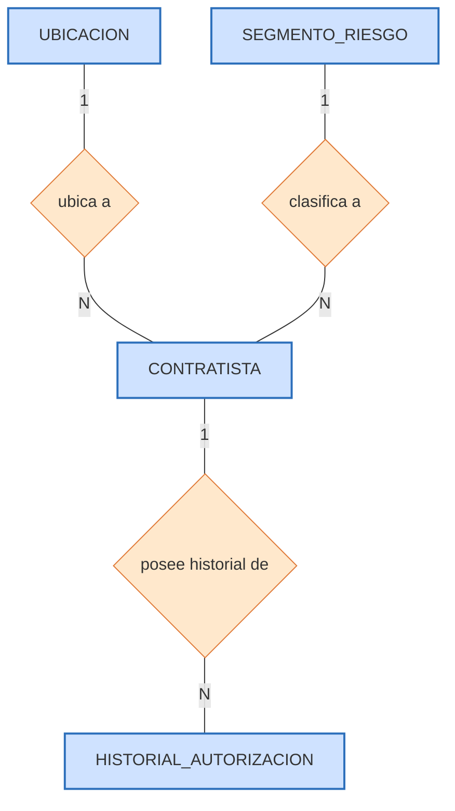

Debe precisarse que la notación Mermaid no reproduce de forma nativa los óvalos de atributos propios de la notación Chen; el esquema anterior documenta, por tanto, únicamente la estructura de entidades, relaciones y cardinalidades, mientras que la representación gráfica completa —incluyendo los óvalos de atributos— se elabora en un software de diagramación dedicado, conforme se indica en el marcador de figura precedente.

### 2.4.3 Cardinalidades y su sustento empírico

Las cardinalidades del modelo no se postulan de manera arbitraria, sino que se verifican directamente sobre el dataset real. La relación entre `UBICACION` y `CONTRATISTA` se estableció como de uno a muchos, sustentada en que cada RUC mantiene un único departamento, provincia y distrito estable en el 100% de los casos con múltiples registros —ninguna de las 76 empresas con historial múltiple cambió de departamento— y en que las 216 ubicaciones únicas agrupan, en promedio, a casi doce contratistas cada una. La relación entre `CONTRATISTA` y `HISTORIAL_AUTORIZACION` se estableció como de uno a muchos, con un mínimo obligatorio de una autorización por contratista, sustentada en que los 2,521 contratistas generan 2,618 autorizaciones históricas, de las cuales 76 contratistas concentran más de un registro; el mínimo de uno es obligatorio porque no puede existir, por definición del propio caso de negocio, un contratista sin al menos una resolución directoral que lo habilite. La relación entre `SEGMENTO_RIESGO` y `CONTRATISTA`, finalmente, se estableció como de uno a muchos pero opcional en la etapa de modelado de datos: en dicha etapa ningún contratista tiene un segmento asignado, y la cardinalidad se vuelve obligatoria únicamente cuando, en la etapa analítica del proyecto, se ejecuta el modelo de clustering y se puebla la entidad correspondiente.

### 2.4.4 Análisis crítico del modelo conceptual

La normalización adoptada resuelve dos problemas reales, verificados directamente sobre el archivo fuente. El primero es la redundancia geográfica: sin la entidad `Ubicacion`, la misma combinación de distrito, provincia y departamento se repetiría, en promedio, cerca de doce veces por cada ubicación única. El segundo es la inconsistencia del representante legal: dado que este atributo cambia en el 50% de las empresas con historial múltiple, mantenerlo como atributo estático de `Contratista` produciría valores contradictorios entre los distintos registros de una misma empresa, error que la separación en `HistorialAutorizacion` elimina por construcción. La contrapartida teórica de esta normalización es, sin embargo, el incremento del número de operaciones de unión necesarias para reconstruir el perfil completo de una empresa a partir de sus componentes normalizados —un costo bien conocido en el diseño relacional clásico—. Dicha contrapartida se neutraliza, en la fase de modelado físico descrita en la sección siguiente, mediante el embebido documental del historial de autorizaciones dentro del propio documento del contratista, lo que permite conservar la disciplina de normalización en el nivel conceptual sin trasladar su penalización de lectura al nivel físico. Esta combinación —normalización conceptual seguida de una implementación física que atenúa deliberadamente su costo de lectura— constituye, en sí misma, el argumento central que sostiene la elección de una arquitectura híbrida frente a una arquitectura exclusivamente relacional o exclusivamente documental.

## 2.5 Diseño lógico-físico: modelo de colecciones documentales y reglas de negocio de integración

### 2.5.1 Traducción del modelo conceptual al modelo documental

El modelo conceptual de cuatro entidades descrito en la sección 2.4 se traduce a un modelo físico de tres colecciones en MongoDB. La reducción de cuatro entidades a tres colecciones se explica porque `HistorialAutorizacion` no se materializa como una colección independiente, sino que se embebe como un arreglo dentro de cada documento de la colección `contratistas`. La decisión de qué información embeber y qué información referenciar constituye el núcleo del diseño físico documental, y se sustentó en dos criterios cuantitativos derivados directamente de la evidencia empírica del dataset, y no en una preferencia estilística por uno u otro patrón de modelado. El criterio de embebido se aplicó al historial de autorizaciones porque se trata de una lista pequeña y acotada —el máximo observado en el padrón es de siete autorizaciones para una misma empresa— que, además, se consulta casi siempre junto con los datos generales del contratista, por ejemplo, para calcular su antigüedad o su número de autorizaciones; embeberla elimina la necesidad de una operación de unión para el caso de uso dominante del sistema. La alternativa de modelar el historial como una colección independiente y referenciada habría obligado a ejecutar una operación de tipo `$lookup` en cada lectura del perfil de un contratista, penalizando precisamente el patrón de consulta más frecuente. El criterio de referenciación, en cambio, se aplicó a los catálogos `ubicaciones` y `segmentos_riesgo`, por tratarse de catálogos compartidos por un número elevado de contratistas —una misma ubicación agrupa, en promedio, a cerca de doce contratistas, y un mismo segmento de riesgo agrupará, tras la etapa analítica, a cientos de ellos—; embeber estos catálogos habría duplicado la misma información cientos de veces y habría dificultado su actualización centralizada, dado que corregir, por ejemplo, el nombre de un distrito habría exigido modificar todos los documentos de contratistas asociados a él.

**[Figura 2. Diagrama de colecciones MongoDB.** La figura debe mostrar la colección central `contratistas`, con su arreglo embebido `historial_autorizaciones[]`, y las referencias `ubicacion_id → ubicaciones` y `segmento_id → segmentos_riesgo`.]**

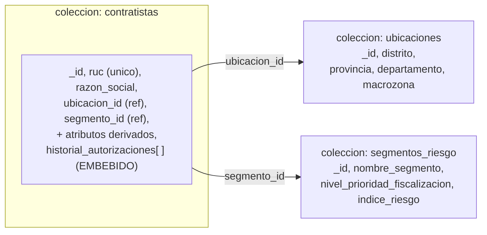

### 2.5.2 Estructura física de las colecciones

La colección `contratistas` constituye el eje del modelo documental. Cada documento almacena el perfil consolidado de una empresa y embebe, como arreglo, la totalidad de su historial de autorizaciones, según se ilustra en el siguiente fragmento representativo, correspondiente a un contratista con dos autorizaciones históricas:

```json
{
  "_id": ObjectId,
  "ruc": "20100094135",
  "razon_social": "EXSA S.A.",
  "ubicacion_id": 3,
  "telefono_referencia": null,
  "representante_actual": "…",
  "fecha_primer_registro": ISODate("2009-04-06"),
  "fecha_ultimo_registro": ISODate("2017-05-31"),
  "antiguedad_anios": 17.2,
  "recencia_anios": 9.06,
  "num_autorizaciones": 2,
  "amplitud_actividad_actual": 3,
  "perfil_actividad": "multi_actividad_parcial",
  "indice_completitud_contacto": false,
  "segmento_id": null,
  "historial_autorizaciones": [
    { "numero_resolucion": "…", "fecha_resolucion": ISODate("2009-04-06"),
      "registro_origen_minem": "…", "representante_legal": "…",
      "actividades": { "exploracion": true, "explotacion": true,
                       "desarrollo": true, "beneficio": false },
      "amplitud_actividad": 3, "orden_cronologico": 1,
      "es_autorizacion_vigente": false },
    { "numero_resolucion": "…", "fecha_resolucion": ISODate("2017-05-31"),
      "orden_cronologico": 2, "es_autorizacion_vigente": true }
  ]
}
```

La colección `ubicaciones` almacena el catálogo normalizado de combinaciones distrito-provincia-departamento, con su atributo derivado `macrozona`. La colección `segmentos_riesgo` almacena el catálogo de perfiles de riesgo, y se inicializa vacía en la etapa de modelado de datos, a la espera de ser poblada en la etapa analítica del proyecto.

### 2.5.3 Reglas de negocio para la integración de las colecciones

Una diferencia estructural entre el modelo relacional y el modelo documental es que este último no impone, a nivel del motor de base de datos, restricciones de llave foránea (*foreign key constraints*) que garanticen automáticamente la coherencia entre colecciones. En ausencia de dicho mecanismo, la coherencia del modelo se gobierna, por diseño, mediante un conjunto explícito de reglas de negocio de integración, que la implementación del sistema respeta de manera consistente. La primera regla establece que el arreglo `historial_autorizaciones` se embebe en cada documento de `contratistas`, precisamente por ser de volumen acotado y por consultarse siempre junto con los datos del contratista, con el efecto de eliminar operaciones de unión en el caso de uso dominante del sistema. La segunda regla establece que el campo `ubicacion_id` de cada documento de `contratistas` referencia lógicamente al identificador de un documento de la colección `ubicaciones`, resolución que se materializa mediante una operación `$lookup` únicamente cuando la consulta requiere el detalle geográfico completo, evitando así la duplicación de la información de ubicación en cada uno de los contratistas asociados a ella. La tercera regla establece que el campo `segmento_id` referencia de igual manera a la colección `segmentos_riesgo`, lo que permite mantener y actualizar dicho catálogo de forma centralizada. La cuarta regla establece la integridad de la llave natural mediante un índice único sobre el campo `ruc`, que impide la inserción de dos contratistas con el mismo RUC y garantiza, adicionalmente, que el proceso de carga descrito en la sección 2.6 pueda ejecutarse de forma idempotente. La quinta regla, finalmente, establece que el campo `segmento_id` nace con valor nulo en la etapa de modelado de datos y se puebla, en la etapa analítica, mediante una simple operación de actualización sobre cada documento existente, sin que ello requiera alterar el esquema de la colección.

### 2.5.4 Diseño de índices

El diseño físico contempla, además del índice de integridad ya mencionado, un conjunto de índices alineados con los patrones de consulta que la etapa analítica ejecuta realmente sobre el modelo. Sobre la colección `contratistas` se define un índice único sobre `ruc`, indispensable para la integridad de la llave natural y para la carga idempotente del modelo; un índice compuesto sobre `amplitud_actividad_actual` e `indice_completitud_contacto`, orientado a acelerar el filtro de priorización que identifica a los contratistas de alta exposición operativa y baja contactabilidad, base de la consulta que aísla el subconjunto prioritario de fiscalización; y un índice simple sobre `segmento_id`, orientado a acelerar las agregaciones que agrupan a los contratistas por el segmento de riesgo que el clustering les asigna. Sobre la colección `ubicaciones` se define un índice simple sobre `id_ubicacion`, cuya justificación merece una precisión técnica que distingue un diseño de índices correcto de uno solo aparente: las consultas que requieren el detalle geográfico resuelven la relación entre ambas colecciones mediante una operación `$lookup` que enlaza el campo local `contratistas.ubicacion_id` con el campo foráneo `ubicaciones.id_ubicacion`; dado que el motor de MongoDB materializa cada unión ejecutando una búsqueda sobre la colección foránea, el índice que evita el recorrido completo de dicha colección en cada una de las uniones debe definirse sobre el campo foráneo `id_ubicacion` y no sobre el campo local, error de diseño frecuente que indexaría el lado equivocado de la unión sin obtener ninguna mejora efectiva sobre el `$lookup`. La implementación de referencia crea el índice único sobre `ruc` y el índice compuesto de priorización durante la carga descrita en la sección siguiente, y el índice sobre `segmento_id` una vez que la etapa analítica puebla ese campo; la efectividad de esta configuración se verificó mediante el plan de ejecución (`explain`) de las consultas, que confirma el uso de recorridos por índice (`IXSCAN`) y la resolución indexada de la unión geográfica, sin recorridos completos de colección (`COLLSCAN`) residuales.

## 2.6 Proceso de Extracción, Transformación y Carga (ETL)

### 2.6.1 Fundamento y arquitectura general del pipeline

El poblado de la base de datos diseñada en las secciones 2.3 a 2.5 se ejecuta mediante un proceso de Extracción, Transformación y Carga (ETL), implementado íntegramente en el lenguaje R. Un proceso ETL constituye, desde el punto de vista de la ingeniería de datos, el mecanismo estándar mediante el cual un conjunto de datos de origen —heterogéneo, no normalizado y potencialmente inconsistente— se convierte en un conjunto de datos de destino que respeta el esquema, los tipos y las reglas de integridad de un modelo previamente diseñado. En el caso particular de este proyecto, el proceso ETL cumple una función adicional a la meramente operativa: es el mecanismo que materializa, mediante código ejecutable, cada una de las decisiones de diseño argumentadas en las secciones anteriores de este capítulo, de modo que dichas decisiones dejen de ser una propuesta conceptual y se conviertan en una base de datos real y verificable.

El diseño del pipeline se apoya en dos principios de ingeniería de software que condicionan directamente su estructura. El primero es el principio de responsabilidad única, según el cual cada unidad de procesamiento debe tener una única razón para cambiar. Su aplicación llevó a descartar una implementación monolítica de la transformación —una única función que recibiera el archivo crudo y devolviera la estructura final— en favor de una descomposición en subprocesos independientes, cada uno responsable de una única preocupación de negocio o de calidad de dato. El segundo principio es el de trazabilidad y verificabilidad incremental, según el cual cada etapa de un proceso de transformación de datos debe poder auditarse de forma aislada, sin necesidad de ejecutar el pipeline completo para detectar en qué punto se introdujo un error. La aplicación conjunta de ambos principios condujo a dividir el proceso en nueve subprocesos encadenados: una extracción, siete transformaciones sucesivas y una carga, en los que la salida de cada subproceso constituye, sin excepción, la entrada exacta del siguiente. En particular, la agregación estadística del perfil del contratista y el armado del documento anidado que MongoDB recibirá —aunque se ejecutan de forma consecutiva— se documentan como dos subprocesos independientes y no como uno solo, precisamente porque resuelven preocupaciones de naturaleza distinta: la primera es un cálculo de atributos derivados sobre datos tabulares, y la segunda es una operación de reestructuración hacia un formato documental jerárquico.

Esta arquitectura no es solamente una conveniencia de organización del código: tiene una consecuencia metodológica directa sobre la calidad del resultado. Durante la implementación del proyecto, la posibilidad de verificar cada subproceso de forma aislada —mediante pruebas de escritorio específicas para cada etapa— permitió detectar y corregir cifras que, en una versión preliminar de la documentación, habían sido calculadas de forma incorrecta, entre ellas la proporción real de contratistas concentrados en Lima y Callao y el número exacto de empresas que modificaron su representante legal entre autorizaciones sucesivas. Esta capacidad de detección temprana de errores no habría sido posible con una implementación monolítica, en la cual un error de cálculo en una etapa intermedia solo se manifestaría, de manera difusa, en el resultado final del pipeline completo.

**[Figura 3. Arquitectura general del proceso ETL**, mostrando los tres bloques (Extracción, Transformación, Carga) y sus componentes internos.]**

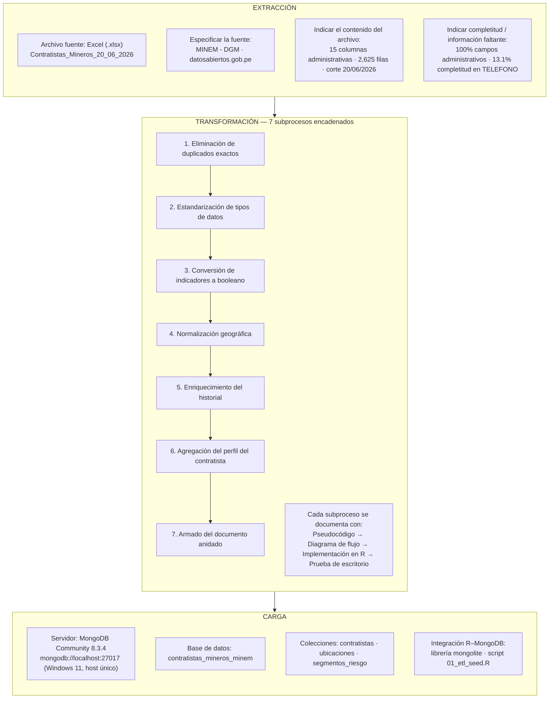

Las secciones 2.6.2 a 2.6.4 desarrollan cada uno de estos nueve subprocesos con la misma estructura: una descripción que integra su objetivo, su fundamento teórico y la justificación de su diseño; el algoritmo empleado, expresado en pseudocódigo y en un diagrama de flujo; un fragmento representativo de su implementación en R; y una prueba de escritorio que documenta, mediante los valores reales obtenidos al ejecutar el código sobre el dataset, el comportamiento efectivo del subproceso.

### 2.6.2 Extracción del archivo fuente

El subproceso de extracción tiene por objetivo leer el archivo fuente oficial `Contratistas_Mineros_20_06_2026.xlsx`, publicado por el MINEM a través del Portal Nacional de Datos Abiertos, y obtener un data frame crudo de 2,625 filas por 15 columnas, fiel al contenido original y sin ninguna transformación de negocio todavía aplicada. Su fundamento es la separación, propia de la ingeniería de datos, entre la validación estructural y la validación semántica de un conjunto de datos: antes de interrogar el significado de negocio de un registro es necesario garantizar que el archivo de origen tiene la forma esperada —que existe, que conserva el esquema de columnas acordado y que contiene al menos un registro—, práctica conocida como *fail-fast validation*, que evita que errores de forma se propaguen silenciosamente hacia etapas posteriores del pipeline. Esta verificación resulta indispensable en este caso concreto porque el archivo publicado por el MINEM antepone cinco filas de título combinado —nombre de la entidad, nombre del conjunto de datos y metadatos de publicación— antes de la fila que contiene los encabezados reales de las quince columnas de negocio; ignorar esta particularidad de formato produciría columnas mal etiquetadas o una primera fila de datos que en realidad es un fragmento de título. Por ello, el subproceso salta explícitamente las cinco filas de título, contrasta el conjunto de columnas resultante contra el esquema de quince columnas esperado y verifica que el data frame contenga al menos una fila, deteniendo la ejecución con un error controlado ante cualquier desviación.

```
INICIO Extraccion
    ruta_archivo <- "Contratistas_Mineros_20_06_2026.xlsx"
    SI NO existe(ruta_archivo) ENTONCES
        DETENER con error "Archivo fuente no encontrado"
    FIN SI

    // El archivo publica 5 filas de título combinado antes del encabezado real
    df_crudo <- leer_excel(ruta_archivo, saltar_filas = 5, usar_primera_fila_como_encabezado = TRUE)

    columnas_esperadas <- ["REGISTRO","R.D","FECHA R.D","CONTRATISTA","RUC","DOMICILIO",
                            "DISTRITO","PROVINCIA","DEPARTAMENTO","TELEFONO","REPRESENTANTE",
                            "EXPLORACION","EXPLOTACION","DESARROLLO","BENEFICIO"]

    SI columnas(df_crudo) != columnas_esperadas ENTONCES
        DETENER con error "El esquema del archivo fuente cambió respecto al esperado"
    FIN SI

    SI filas(df_crudo) == 0 ENTONCES
        DETENER con error "El archivo no contiene registros"
    FIN SI

    persistir(df_crudo, "01_extraido_crudo.rds")
    registrar_log("Extracción completada:", filas(df_crudo), "filas,", columnas(df_crudo), "columnas")
FIN Extraccion
```

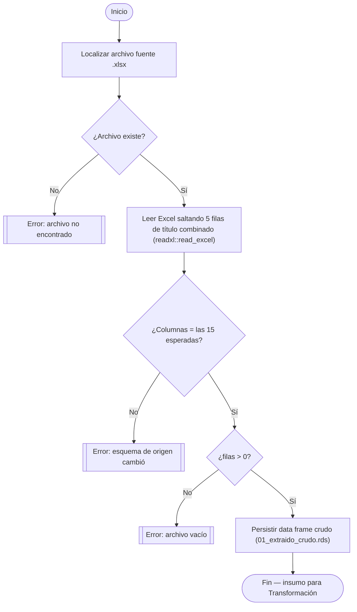

**Fragmento de implementación en R:**

```r
extraer_contratistas_minem <- function(ruta_archivo) {

  if (!file.exists(ruta_archivo)) {
    stop("Archivo fuente no encontrado: ", ruta_archivo)
  }

  # El archivo de datosabiertos.gob.pe publica 5 filas de título
  # combinado antes de la fila real de encabezados (fila 6).
  df_crudo <- read_excel(ruta_archivo, skip = 5, col_names = TRUE)

  columnas_esperadas <- c("REGISTRO", "R.D", "FECHA R.D", "CONTRATISTA", "RUC",
                           "DOMICILIO", "DISTRITO", "PROVINCIA", "DEPARTAMENTO",
                           "TELEFONO", "REPRESENTANTE", "EXPLORACION",
                           "EXPLOTACION", "DESARROLLO", "BENEFICIO")

  if (!all(columnas_esperadas %in% colnames(df_crudo))) {
    stop("El esquema del archivo fuente no coincide con el esperado.")
  }

  if (nrow(df_crudo) == 0) {
    stop("El archivo no contiene registros.")
  }

  saveRDS(df_crudo, "01_extraido_crudo.rds")
  return(df_crudo)
}
```

La función `read_excel` del paquete `readxl` se invoca con el parámetro `skip = 5`, que omite las cinco filas de título antes de interpretar la sexta como encabezado; esta única línea resuelve, sin necesidad de manipulación posterior, la particularidad de formato del archivo del MINEM identificada en el fundamento de diseño. La verificación de columnas mediante `all(columnas_esperadas %in% colnames(df_crudo))` traduce directamente, a código ejecutable, la validación estructural de tipo *fail-fast* descrita previamente.

**Prueba de escritorio**

| # | Entrada | Resultado obtenido al ejecutar el código |
|---|---|---|
| 1 | `Contratistas_Mineros_20_06_2026.xlsx` | Data frame de **2,625 filas × 15 columnas** |
| 2 | Rango de fechas (columna FECHA R.D, aún como texto) | 03/03/2008 a 16/06/2026 |
| 3 | Columna RUC | 11 dígitos iniciados en "20" en el 100% de las filas |
| 4 | Ruta de archivo inexistente | Error controlado: `"Archivo fuente no encontrado"` |

### 2.6.3 Transformación

El subproceso de transformación constituye el núcleo del pipeline ETL, en la medida en que es allí donde el dato administrativo crudo se convierte, mediante una secuencia de siete operaciones encadenadas, en las estructuras que materializan el modelo de datos diseñado en las secciones 2.3 a 2.5. Cada una de las siete operaciones recibe como entrada la salida exacta de la anterior: la eliminación de duplicados exactos depura el data frame crudo antes de cualquier otro procesamiento; la estandarización de tipos de datos corrige las ambigüedades de tipo propias de la lectura de un archivo Excel; la conversión de indicadores de actividad traduce la codificación de texto libre del archivo original a variables booleanas explotables; la normalización geográfica construye el catálogo de ubicaciones y lo enlaza con cada registro; el enriquecimiento del historial de autorizaciones calcula los atributos derivados propios de cada evento de autorización; la agregación del perfil del contratista colapsa el historial por empresa en sus atributos derivados; y el armado del documento anidado construye, a partir de esa agregación, la estructura documental que la etapa de carga insertará sin transformación adicional. Cada una de estas siete operaciones se desarrolla a continuación con la misma profundidad aplicada al subproceso de extracción.

#### 2.6.3.1 Eliminación de duplicados exactos

Este subproceso elimina del data frame crudo las filas cuyo contenido es idéntico en la totalidad de las quince columnas, antes de aplicar cualquier otra transformación que pudiera ocultar o distorsionar dicha duplicidad. Se ejecuta en primer lugar, y con un criterio de coincidencia exacta en todas las columnas —y no un criterio parcial, como mismo RUC y misma fecha—, porque una fila exactamente duplicada sobrerrepresenta a la empresa asociada en cualquier conteo posterior y sesgaría de manera artificial su número de autorizaciones, variable predictora directa del clustering descrito en la sección 2.2; un criterio de coincidencia parcial, en cambio, arriesgaría eliminar por error dos autorizaciones legítimamente distintas que compartieran coincidentemente algunos valores. La verificación directa sobre el archivo real identificó siete filas exactamente duplicadas, correspondientes a GEOTEC S.A., FORTALEZA J.N. S.R.L., INGENIEROS TÉCNICOS CONSTRUCTORES PARA MINERÍA S.C.R.L., F & M MAQUINARIAS S.A.C., MAQUIRENA S.A.C. —duplicada en tres ocasiones— y EMPRESA DE INVERSIONES INNOVA V&C S.A.C. El procedimiento registra el número de filas de entrada, aplica la deduplicación por coincidencia exacta, y registra el número de filas resultante, calculando por diferencia el número de duplicados eliminados.

```
INICIO EliminarDuplicadosExactos(df_crudo)
    filas_iniciales <- CONTAR(df_crudo)
    df_sin_duplicados <- ELIMINAR_FILAS_IDENTICAS(df_crudo)
    filas_finales <- CONTAR(df_sin_duplicados)
    registrar_log("Duplicados eliminados:", filas_iniciales - filas_finales)
    RETORNAR df_sin_duplicados
FIN EliminarDuplicadosExactos
```

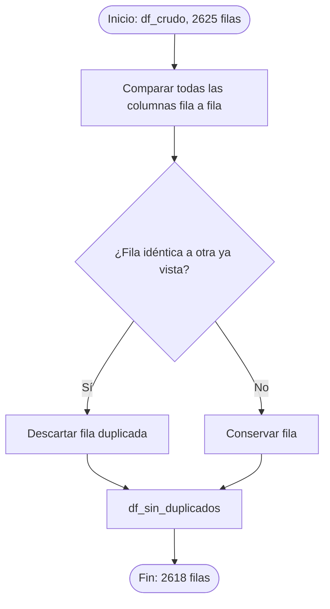

**Fragmento de implementación en R:**

```r
eliminar_duplicados_exactos <- function(df_crudo) {
  filas_iniciales <- nrow(df_crudo)
  df_sin_duplicados <- df_crudo %>% distinct()
  filas_finales <- nrow(df_sin_duplicados)
  message("Duplicados eliminados: ", filas_iniciales - filas_finales,
          " (de ", filas_iniciales, " a ", filas_finales, " filas)")
  return(df_sin_duplicados)
}
```

La función `distinct()` del paquete `dplyr` compara, por defecto, la totalidad de las columnas del data frame y conserva únicamente la primera ocurrencia de cada combinación de valores distinta, lo que traduce directamente el criterio de coincidencia exacta descrito, sin necesidad de especificar manualmente una clave de comparación.

**Prueba de escritorio**

| # | Entrada | Resultado obtenido al ejecutar el código |
|---|---|---|
| 1 | Filas totales del archivo crudo | 2,625 |
| 2 | GEOTEC S.A. (registro 145110708): 2 filas idénticas | Se conserva 1 sola fila |
| 3 | MAQUIRENA S.A.C. (registro 2000000099): 4 filas idénticas | Se conserva 1 sola fila |
| 4 | Filas totales tras `distinct()` | **2,618** (7 duplicados eliminados) |

#### 2.6.3.2 Estandarización de tipos de datos

Este subproceso convierte las columnas `FECHA R.D` y `RUC` —leídas por defecto como texto o como numérico ambiguo durante la extracción desde el archivo Excel— a los tipos de dato correctos, fecha y texto respectivamente, y elimina los espacios en blanco sobrantes en los campos `R.D`, `CONTRATISTA` y `REPRESENTANTE`, sin alterar todavía el significado de negocio de ninguna columna. Su fundamento es que la lectura de un archivo Excel no garantiza, por sí sola, que cada columna quede representada con el tipo semánticamente correcto: un motor de lectura genérico puede interpretar una fecha como texto en un formato ambiguo, o un identificador numérico largo como el RUC aplicando notación científica o eliminando ceros a la izquierda; esta clase de inconsistencia, si no se corrige de forma temprana, se propaga silenciosamente hacia el cálculo posterior de antigüedad y recencia, que depende de una aritmética correcta sobre fechas. Por ello, el campo `FECHA R.D` —publicado en formato día/mes/año— se convierte especificando explícitamente dicho orden, evitando la ambigüedad frente al formato mes/día/año; el campo `RUC` se fuerza a tipo texto, dado que el sistema RUC peruano no admite operaciones aritméticas sobre el propio identificador; y los campos de texto se recortan de espacios en blanco como medida preventiva frente a un problema de captura manual frecuente en fuentes administrativas, que de no corregirse podría hacer fallar silenciosamente operaciones posteriores de agrupamiento por razón social o representante legal. El procedimiento aplica estas tres conversiones y verifica si la conversión de fechas produjo algún valor no interpretable, emitiendo una advertencia sin detener la ejecución del pipeline.

```
INICIO EstandarizarTipos(df_sin_duplicados)
    df_tipado <- df_sin_duplicados
    df_tipado.fecha_resolucion <- CONVERTIR_A_FECHA(df_tipado."FECHA R.D", formato = "DD/MM/AAAA")
    df_tipado.ruc <- CONVERTIR_A_TEXTO(df_tipado.RUC)
    df_tipado."R.D" <- RECORTAR_ESPACIOS(df_tipado."R.D")
    df_tipado.CONTRATISTA <- RECORTAR_ESPACIOS(df_tipado.CONTRATISTA)
    df_tipado.REPRESENTANTE <- RECORTAR_ESPACIOS(df_tipado.REPRESENTANTE)

    SI EXISTE fecha_resolucion NULA TRAS CONVERSION ENTONCES
        registrar_advertencia("Fecha no parseable en al menos una fila")
    FIN SI

    RETORNAR df_tipado
FIN EstandarizarTipos
```

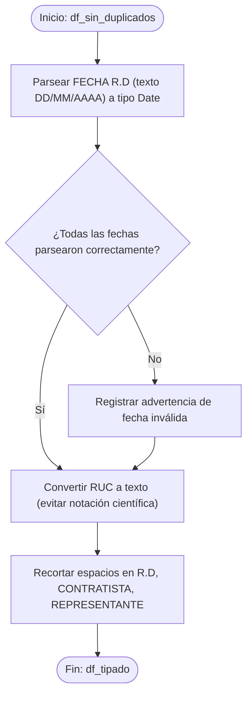

**Fragmento de implementación en R:**

```r
estandarizar_tipos <- function(df_sin_duplicados) {
  df_tipado <- df_sin_duplicados %>%
    mutate(
      fecha_resolucion = dmy(`FECHA R.D`),
      ruc = as.character(RUC),
      `R.D` = str_trim(`R.D`),
      CONTRATISTA = str_trim(CONTRATISTA),
      REPRESENTANTE = str_trim(REPRESENTANTE)
    )

  n_fechas_invalidas <- sum(is.na(df_tipado$fecha_resolucion))
  if (n_fechas_invalidas > 0) {
    warning(n_fechas_invalidas, " fecha(s) no pudieron ser convertidas.")
  }

  return(df_tipado)
}
```

La función `dmy()` del paquete `lubridate` interpreta explícitamente el orden día-mes-año, resolviendo de raíz la ambigüedad de formato regional señalada; una fecha que no logre interpretarse bajo ese formato queda registrada como valor ausente (`NA`), lo que permite contabilizar de forma explícita cualquier fecha problemática en lugar de dejarla pasar inadvertida.

**Prueba de escritorio**

| # | Entrada | Resultado obtenido al ejecutar el código |
|---|---|---|
| 1 | `"03/03/2008"` (FECHA R.D, registro más antiguo) | `Date` = 2008-03-03 |
| 2 | `20503180449` (RUC, leído como numérico por Excel) | `"20503180449"` (texto, sin notación científica) |
| 3 | Rango de `fecha_resolucion` sobre las 2,618 filas | mínimo 2008-03-03, máximo 2026-06-16 |
| 4 | Fechas no convertibles (`NA`) tras `dmy()` | 0 (100% de las fechas parseables) |

#### 2.6.3.3 Conversión de indicadores de actividad a variables booleanas

Este subproceso transforma las cuatro columnas EXPLORACION, EXPLOTACION, DESARROLLO y BENEFICIO —codificadas en el archivo original mediante la marca de texto "X" o una celda vacía— en cuatro variables booleanas (`autoriza_exploracion`, `autoriza_explotacion`, `autoriza_desarrollo`, `autoriza_beneficio`), condición indispensable para poder sumarlas numéricamente en el subproceso de enriquecimiento del historial. La codificación mediante una marca de texto condicional es habitual en hojas de cálculo administrativas orientadas a la lectura humana, pero no es apta para operaciones aritméticas: no es posible sumar directamente el texto "X" para obtener la amplitud de actividad de un contratista, mientras que un valor lógico sí se comporta como 0 o 1 en un contexto aritmético, habilitando dicha suma y, por extensión, la variable de amplitud identificada como central en el caso de negocio de la sección 2.2. Se decidió interpretar la ausencia de la marca "X" como valor booleano falso, y no como un valor ausente que requiriera imputación, porque el MINEM no distingue, dentro de estas cuatro columnas, entre "no se sabe si está autorizado" y "no está autorizado": una celda vacía significa, de manera inequívoca, que la actividad no fue autorizada en esa resolución. Tratar estas columnas como variables con valores perdidos habría sido un error conceptual, al introducir incertidumbre donde el dato original está, en realidad, perfectamente determinado. El procedimiento recorre las cuatro columnas y genera, para cada una, una columna booleana verdadera si la celda original no está vacía, y falsa en caso contrario.

```
INICIO ConvertirIndicadoresBooleanos(df_tipado)
    df_booleano <- df_tipado
    PARA CADA actividad EN [EXPLORACION, EXPLOTACION, DESARROLLO, BENEFICIO]
        nombre_bool <- "autoriza_" + minusculas(actividad)
        df_booleano[nombre_bool] <- NO_ES_NULO(df_tipado[actividad])
    FIN PARA
    RETORNAR df_booleano
FIN ConvertirIndicadoresBooleanos
```

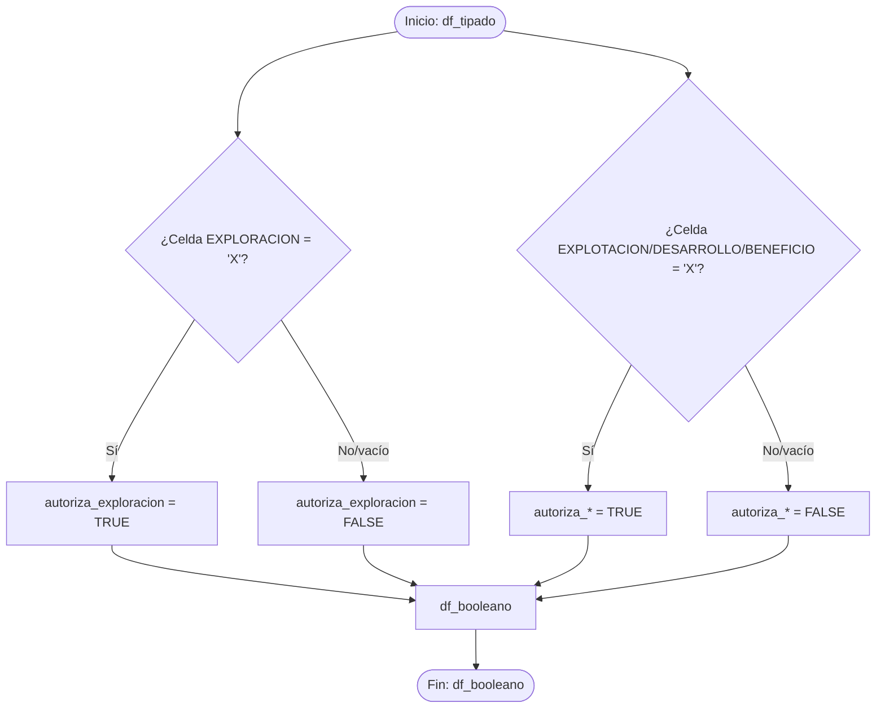

**Fragmento de implementación en R:**

```r
convertir_indicadores_booleanos <- function(df_tipado) {
  df_booleano <- df_tipado %>%
    mutate(
      autoriza_exploracion = !is.na(EXPLORACION),
      autoriza_explotacion = !is.na(EXPLOTACION),
      autoriza_desarrollo  = !is.na(DESARROLLO),
      autoriza_beneficio   = !is.na(BENEFICIO)
    )
  return(df_booleano)
}
```

El operador `!is.na(...)` evalúa a verdadero cuando la celda original contiene cualquier valor no ausente —en la práctica, la marca "X"— y a falso cuando la celda está vacía, lo que traduce de manera directa la regla de negocio descrita, sin necesidad de comparar explícitamente contra la cadena de texto "X".

**Prueba de escritorio**

| # | Entrada | Resultado obtenido al ejecutar el código |
|---|---|---|
| 1 | Fila con `EXPLORACION = "X"` | `autoriza_exploracion = TRUE` |
| 2 | Fila con `BENEFICIO` vacío | `autoriza_beneficio = FALSE` |
| 3 | % autorizado sobre las 2,618 autorizaciones depuradas | Exploración 85.0% · Explotación 90.1% · Desarrollo 76.5% · Beneficio 56.2% |
| 4 | Comparación contra el archivo crudo (2,625 filas) | 85.0% / 90.1% / 76.5% / 56.3% (variación < 0.1%, por los 7 duplicados eliminados) |

#### 2.6.3.4 Normalización geográfica

Este subproceso construye el catálogo `ubicaciones` a partir de las combinaciones únicas de las columnas DISTRITO, PROVINCIA y DEPARTAMENTO, calcula sobre dicho catálogo el atributo derivado `macrozona`, y enlaza cada fila del historial con el identificador de ubicación correspondiente. Aplica, sobre el flujo de transformación, el principio de normalización descrito en la sección 2.3.3: una dimensión que se repite de manera sistemática a lo largo del dataset debe extraerse como un catálogo independiente, referenciado mediante un identificador, en lugar de mantenerse como texto libre duplicado en cada fila —una construcción equivalente a una tabla de dimensión dentro de un esquema analítico—. La regla de macrozonificación —"Lima_Callao" para los departamentos de Lima y Callao, "Regiones" en cualquier otro caso— se definió en función de la relevancia identificada en el caso de negocio de la sección 2.2: la complejidad logística de una inspección presencial es sustancialmente distinta entre la capital, con alta concentración de personal de fiscalización, y el resto del territorio nacional. Una macrozonificación más granular, a nivel de cada uno de los 21 departamentos, se descartó como variable predictora directa del clustering por introducir una dimensionalidad excesiva para un algoritmo basado en distancia euclídea, sin un aporte proporcional de valor discriminante frente a la distinción binaria adoptada. El procedimiento obtiene las combinaciones únicas de distrito/provincia/departamento, calcula la macrozona y asigna un identificador secuencial a cada una, y finalmente une el data frame original con el catálogo mediante la tripleta geográfica como clave.

```
INICIO NormalizarGeografia(df_booleano)
    ubicaciones <- DISTINCT(df_booleano[DISTRITO, PROVINCIA, DEPARTAMENTO])
    ubicaciones.macrozona <- SI(DEPARTAMENTO EN [LIMA, CALLAO], "Lima_Callao", "Regiones")
    ubicaciones.id_ubicacion <- generar_id_secuencial()

    df_con_ubicacion <- UNIR(df_booleano, ubicaciones, POR = [DISTRITO, PROVINCIA, DEPARTAMENTO])

    RETORNAR (ubicaciones, df_con_ubicacion)
FIN NormalizarGeografia
```

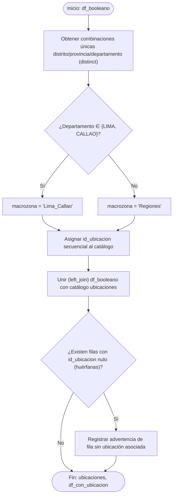

**Fragmento de implementación en R:**

```r
normalizar_geografia <- function(df_booleano) {
  ubicaciones <- df_booleano %>%
    distinct(DISTRITO, PROVINCIA, DEPARTAMENTO) %>%
    mutate(
      macrozona = if_else(DEPARTAMENTO %in% c("LIMA", "CALLAO"),
                           "Lima_Callao", "Regiones"),
      id_ubicacion = row_number()
    ) %>%
    rename(distrito = DISTRITO, provincia = PROVINCIA, departamento = DEPARTAMENTO)

  df_con_ubicacion <- df_booleano %>%
    left_join(ubicaciones, by = c("DISTRITO" = "distrito",
                                   "PROVINCIA" = "provincia",
                                   "DEPARTAMENTO" = "departamento"))

  return(list(ubicaciones = ubicaciones, df_con_ubicacion = df_con_ubicacion))
}
```

La combinación de `distinct()` sobre las tres columnas geográficas seguida de `row_number()` reproduce, en dos líneas, la construcción completa de una tabla de dimensión; la posterior operación `left_join()` garantiza que ninguna fila del historial se pierda durante el enlace, incluso si —por un eventual error de captura— alguna combinación geográfica no encontrara correspondencia exacta en el catálogo.

**Prueba de escritorio**

| # | Entrada | Resultado obtenido al ejecutar el código |
|---|---|---|
| 1 | Combinaciones únicas distrito/provincia/departamento | **216 ubicaciones** (209 distritos, 81 provincias, 21 departamentos) |
| 2 | Fila con `DEPARTAMENTO = "LIMA"` | `macrozona = "Lima_Callao"` |
| 3 | Fila con `DEPARTAMENTO = "CAJAMARCA"` | `macrozona = "Regiones"` |
| 4 | Proporción por macrozona (nivel autorización, 2,618) | 58.2% Lima_Callao (1,524) / 41.8% Regiones (1,094) |
| 5 | Filas con `id_ubicacion` nulo tras el `left_join` | 0 (ninguna fila huérfana) |

#### 2.6.3.5 Enriquecimiento del historial de autorizaciones

Este subproceso calcula, sobre cada fila del historial —cada resolución directoral individual—, los atributos derivados `amplitud_actividad`, `orden_cronologico` y `es_autorizacion_vigente`, dando forma final a la entidad `HistorialAutorizacion` descrita en la sección 2.3.4. El cálculo de `orden_cronologico` y `es_autorizacion_vigente` constituye una operación de tipo *window function* (función de ventana), en la que un valor derivado de una fila depende de su posición relativa dentro de un grupo —en este caso, el grupo de todas las autorizaciones de una misma empresa, ordenadas por fecha—, lo que exige agrupar previamente el conjunto por RUC antes de calcular cualquier posición relativa. La necesidad de identificar la autorización vigente de cada contratista surge directamente del segundo hallazgo empírico de la sección 2.3.1: dado que el representante legal y las actividades autorizadas cambian entre autorizaciones sucesivas en el 50% de las empresas con historial múltiple, el perfil que debe alimentar el clustering —amplitud de actividad actual, representante actual— debe construirse a partir del estado más reciente conocido, y no de un promedio o de la primera autorización registrada. El procedimiento calcula primero la amplitud de actividad de cada fila como la suma de las cuatro variables booleanas del subproceso anterior; agrupa después por RUC y ordena por fecha de resolución para asignar un orden cronológico ascendente; y finalmente marca como vigente únicamente a la fila cuyo orden coincide con el máximo del grupo.

```
INICIO EnriquecerHistorial(df_con_ubicacion)
    historial <- df_con_ubicacion
    historial.amplitud_actividad <- SUMA(autoriza_exploracion, autoriza_explotacion,
                                          autoriza_desarrollo, autoriza_beneficio)

    historial <- ORDENAR_POR(ruc, fecha_resolucion)
    PARA CADA grupo_ruc EN AGRUPAR(historial, ruc)
        grupo_ruc.orden_cronologico <- RANK_ASCENDENTE(fecha_resolucion)
        grupo_ruc.es_autorizacion_vigente <- (orden_cronologico == MAX(orden_cronologico))
    FIN PARA

    RETORNAR historial
FIN EnriquecerHistorial
```

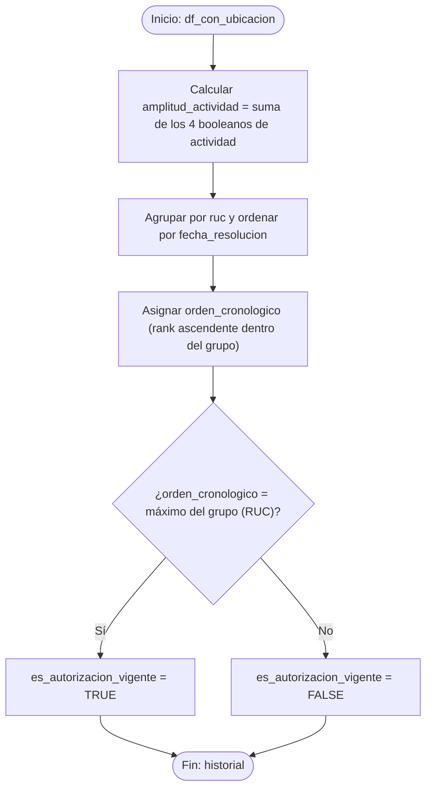

**Fragmento de implementación en R:**

```r
enriquecer_historial <- function(df_con_ubicacion) {
  historial <- df_con_ubicacion %>%
    mutate(
      amplitud_actividad = autoriza_exploracion + autoriza_explotacion +
                            autoriza_desarrollo + autoriza_beneficio
    ) %>%
    group_by(ruc) %>%
    arrange(fecha_resolucion, .by_group = TRUE) %>%
    mutate(
      orden_cronologico = row_number(),
      es_autorizacion_vigente = orden_cronologico == max(orden_cronologico)
    ) %>%
    ungroup()

  return(historial)
}
```

La suma directa de cuatro variables lógicas (`autoriza_exploracion + autoriza_explotacion + ...`) es posible porque, en R, los valores lógicos se coercionan automáticamente a 0 y 1 en un contexto aritmético. La secuencia `group_by(ruc) %>% arrange(...) %>% mutate(orden_cronologico = row_number())` es el idioma estándar de `dplyr` para calcular una función de ventana ordenada dentro de cada grupo, y la llamada final a `ungroup()` evita que el agrupamiento se propague hacia los subprocesos posteriores.

**Prueba de escritorio**

| # | Entrada | Resultado obtenido al ejecutar el código |
|---|---|---|
| 1 | Fila con las 4 actividades autorizadas | `amplitud_actividad = 4` |
| 2 | EXSA S.A. (RUC 20100094135): autorizaciones 06/04/2009 y 31/05/2017 | `orden_cronologico = 1, 2`; `es_autorizacion_vigente = FALSE, TRUE` |
| 3 | Contratista con una sola autorización | `orden_cronologico = 1`; `es_autorizacion_vigente = TRUE` |
| 4 | Total de filas antes/después del subproceso | 2,618 / 2,618 (no elimina ni añade filas) |

#### 2.6.3.6 Agregación del perfil del contratista

Este subproceso agrupa el historial de autorizaciones por RUC para construir la entidad `Contratista`, calculando `antiguedad_anios`, `recencia_anios`, `num_autorizaciones`, `amplitud_actividad_actual`, `perfil_actividad`, `representante_actual` e `indice_completitud_contacto`. Se trata de una agregación estadística clásica —reducir múltiples filas de un grupo a una única fila de resumen mediante mínimo, máximo y conteo—, la misma operación que en SQL correspondería a un `GROUP BY` con funciones de agregado. La fecha de corte empleada para calcular antigüedad y recencia —20 de junio de 2026— corresponde a la fecha de descarga oficial del dataset, y no a la fecha de ejecución del pipeline, de modo que las métricas sean reproducibles con independencia del momento en que este se reejecute. El procedimiento agrupa el historial por RUC; toma de cada grupo la razón social, la ubicación, el último teléfono conocido, el representante y la amplitud de la autorización vigente, y las fechas extremas y el número de autorizaciones; y deriva de ello la antigüedad, la recencia, el perfil de actividad y la completitud de contacto, inicializando en nulo el segmento de riesgo, que la etapa analítica poblará más adelante.

```
INICIO AgregarPerfilContratista(historial)
    fecha_corte <- FECHA("2026-06-20")

    contratistas <- AGRUPAR_POR(historial, ruc)
    contratistas.razon_social <- PRIMERO(razon_social)
    contratistas.id_ubicacion <- PRIMERO(id_ubicacion)
    contratistas.telefono_referencia <- ULTIMO_NO_NULO(telefono_registro)
    contratistas.representante_actual <- representante_legal DONDE es_autorizacion_vigente = VERDADERO
    contratistas.fecha_primer_registro <- MIN(fecha_resolucion)
    contratistas.fecha_ultimo_registro <- MAX(fecha_resolucion)
    contratistas.num_autorizaciones <- CONTAR(filas del grupo)
    contratistas.amplitud_actividad_actual <- amplitud_actividad DONDE es_autorizacion_vigente = VERDADERO

    contratistas.antiguedad_anios <- DIAS_ENTRE(fecha_primer_registro, fecha_corte) / 365.25
    contratistas.recencia_anios <- DIAS_ENTRE(fecha_ultimo_registro, fecha_corte) / 365.25
    contratistas.perfil_actividad <- CLASIFICAR(amplitud_actividad_actual)
    contratistas.indice_completitud_contacto <- NO_ES_NULO(telefono_referencia)
    contratistas.id_segmento_riesgo <- NULO   // se asigna en la etapa analítica

    RETORNAR contratistas
FIN AgregarPerfilContratista
```

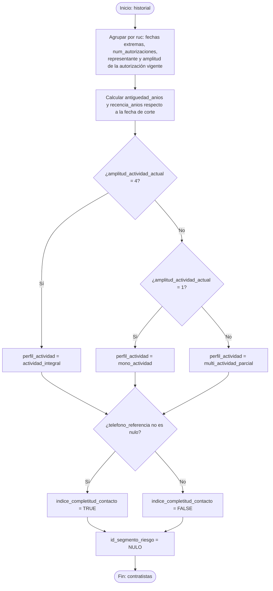

**Fragmento de implementación en R:**

```r
agregar_perfil_contratista <- function(historial) {
  fecha_corte <- as.Date("2026-06-20")

  contratistas <- historial %>%
    group_by(ruc) %>%
    summarise(
      razon_social              = first(razon_social),
      id_ubicacion              = first(id_ubicacion),
      telefono_referencia       = last(na.omit(c(telefono_registro, NA))[1]),
      representante_actual      = representante_legal[es_autorizacion_vigente][1],
      fecha_primer_registro     = min(fecha_resolucion),
      fecha_ultimo_registro     = max(fecha_resolucion),
      num_autorizaciones        = n(),
      amplitud_actividad_actual = amplitud_actividad[es_autorizacion_vigente][1],
      .groups = "drop"
    ) %>%
    mutate(
      antiguedad_anios = as.numeric(fecha_corte - fecha_primer_registro) / 365.25,
      recencia_anios    = as.numeric(fecha_corte - fecha_ultimo_registro) / 365.25,
      perfil_actividad  = case_when(
        amplitud_actividad_actual == 4 ~ "actividad_integral",
        amplitud_actividad_actual == 1 ~ "mono_actividad",
        TRUE ~ "multi_actividad_parcial"
      ),
      indice_completitud_contacto = !is.na(telefono_referencia),
      id_segmento_riesgo = NA_character_
    )

  return(contratistas)
}
```

La expresión `representante_legal[es_autorizacion_vigente][1]` ilustra la aplicación práctica del hallazgo empírico de la sección 2.3.1: filtra explícitamente por la marca de vigencia, garantizando que `representante_actual` refleje siempre el estado más reciente de la empresa.

**Prueba de escritorio**

| # | Entrada | Resultado obtenido al ejecutar el código |
|---|---|---|
| 1 | 2,618 autorizaciones agrupadas por RUC | **2,521 registros de contratista** |
| 2 | Contratista con `fecha_primer_registro = 2008-03-03` (corte 2026-06-20) | `antiguedad_anios ≈ 18.3` |
| 3 | Contratista sin teléfono registrado | `indice_completitud_contacto = FALSE` (86.8% de los casos) |
| 4 | Contratista con `amplitud_actividad_actual = 4` | `perfil_actividad = "actividad_integral"` (47.9% del padrón, 1,208 empresas) |

#### 2.6.3.7 Armado del documento anidado

Este subproceso construye, a partir de la entidad `Contratista` recién agregada, la estructura documental anidada —el contratista junto con su arreglo `historial_autorizaciones` embebido— que la carga insertará en MongoDB sin transformación adicional. A diferencia del subproceso anterior, no es una agregación sino una operación de armado de documento propia del paradigma orientado a documentos, en la que una estructura tabular normalizada se reconfigura como un árbol de datos anidado: la operación inversa al aplanamiento (*flattening*) que exigiría, en cambio, un motor relacional estricto. Este armado se ejecuta en la etapa de transformación, y no en la de carga, como consecuencia directa de la regla de negocio RI-1 (sección 2.5.3): dado que el historial se embebe en cada documento, la estructura que MongoDB recibe debe llegar ya completamente formada, evitando así mezclar la responsabilidad de transformar datos con la de persistirlos. El procedimiento recorre cada contratista de la entidad agregada, filtra del historial completo las autorizaciones correspondientes a su RUC, y las anida como arreglo de subdocumentos bajo la clave `historial_autorizaciones`, junto con los demás campos del contratista y el campo `segmento_id` inicializado en nulo.

```
INICIO ArmarDocumentoAnidado(contratistas, historial)
    PARA CADA empresa EN contratistas
        historial_empresa <- FILTRAR(historial, ruc == empresa.ruc)
        documento <- { ...campos de empresa..., segmento_id: NULO,
                        historial_autorizaciones: MAPEAR(historial_empresa, fila -> {...campos de fila...}) }
        acumular(documentos_mongo, documento)
    FIN PARA

    RETORNAR documentos_mongo
FIN ArmarDocumentoAnidado
```

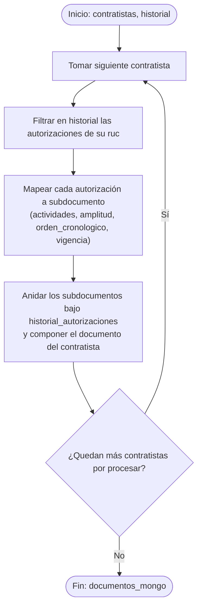

**Fragmento de implementación en R:**

```r
armar_documento_anidado <- function(contratistas, historial) {
  documentos_mongo <- contratistas %>%
    split(seq(nrow(.))) %>%
    map(function(empresa) {
      hist_empresa <- historial %>%
        filter(ruc == empresa$ruc) %>%
        transmute(
          numero_resolucion, fecha_resolucion,
          registro_origen_minem = as.character(registro_origen_minem),
          representante_legal,
          actividades = list(list(
            exploracion = autoriza_exploracion, explotacion = autoriza_explotacion,
            desarrollo  = autoriza_desarrollo,  beneficio   = autoriza_beneficio
          )),
          amplitud_actividad, orden_cronologico, es_autorizacion_vigente
        )
      list(ruc = empresa$ruc, razon_social = empresa$razon_social,
           ubicacion_id = empresa$id_ubicacion, segmento_id = NA,
           historial_autorizaciones = hist_empresa)   # + demás campos de empresa
    })

  return(documentos_mongo)
}
```

La función `map()` del paquete `purrr`, aplicada sobre la lista de contratistas obtenida mediante `split()`, construye la estructura documental anidada de manera funcional, evitando un bucle explícito en R aun cuando la lógica que representa —descrita en el diagrama de flujo anterior— es, conceptualmente, una iteración por cada contratista.

**Prueba de escritorio**

| # | Entrada | Resultado obtenido al ejecutar el código |
|---|---|---|
| 1 | 2,521 contratistas agregados | **2,521 documentos** en `documentos_mongo` |
| 2 | Contratista con `num_autorizaciones = 2` | `length(historial_autorizaciones) == 2` |
| 3 | Contratista con una sola autorización | `length(historial_autorizaciones) == 1` |

### 2.6.4 Carga en la base de datos documental

Este subproceso inserta en MongoDB las estructuras que la agregación anterior dejó ya completamente armadas —el catálogo `ubicaciones` y los documentos de `contratistas`, con el historial de cada empresa embebido— e inicializa vacía la colección `segmentos_riesgo`, garantizando la integridad mínima del modelo mediante un índice único sobre `ruc`. En la arquitectura de un ETL clásico, la carga se distingue deliberadamente de la transformación por un principio de responsabilidad: una vez que los datos han sido depurados y estructurados conforme al modelo de destino, la carga no debe introducir lógica de negocio adicional, sino limitarse a persistir lo ya construido y a hacer cumplir las restricciones de integridad del diseño físico; mezclar ambas responsabilidades dificultaría la trazabilidad del pipeline y complicaría la depuración de errores. El único índice que este subproceso crea de manera obligatoria es el índice único sobre `ruc`, consistente con la regla de negocio RI-4 (sección 2.5.3): impide la existencia de dos documentos de contratista para la misma empresa y habilita una carga idempotente. Los índices adicionales de optimización analítica documentados en la sección 2.5.4 quedan fuera del alcance obligatorio de esta etapa y se activan según los patrones de consulta reales observados durante la explotación del modelo. El procedimiento conecta con la base `contratistas_mineros_minem`, inserta el catálogo de ubicaciones, inicializa sin contenido `segmentos_riesgo`, inserta la totalidad de los documentos de contratistas, y finalmente crea el índice único sobre `ruc`.

```
INICIO Carga(ubicaciones, documentos_mongo)
    conexion <- conectar_mongodb(uri_base_datos, "contratistas_mineros_minem")

    insertar_muchos(conexion.coleccion("ubicaciones"), ubicaciones)

    SI conexion.coleccion("segmentos_riesgo").contar() == 0 ENTONCES
        registrar_log("Colección segmentos_riesgo inicializada sin datos")
    FIN SI

    insertar_muchos(conexion.coleccion("contratistas"), documentos_mongo)
    crear_indice_unico(conexion.coleccion("contratistas"), campo = "ruc")

    registrar_log("Carga completada:", contar(conexion.coleccion("contratistas")), "contratistas insertados")
FIN Carga
```

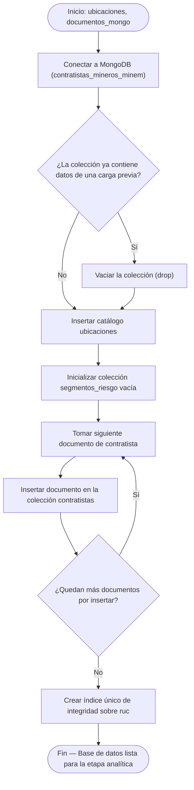

**Fragmento de implementación en R:**

```r
cargar_contratistas_minem <- function(ubicaciones, documentos_mongo,
                                       uri_mongo = "mongodb://localhost:27017",
                                       base_datos = "contratistas_mineros_minem") {

  col_ubicaciones <- mongo(collection = "ubicaciones", db = base_datos, url = uri_mongo)
  col_ubicaciones$drop()
  col_ubicaciones$insert(ubicaciones)

  col_segmentos <- mongo(collection = "segmentos_riesgo", db = base_datos, url = uri_mongo)
  col_segmentos$drop()

  col_contratistas <- mongo(collection = "contratistas", db = base_datos, url = uri_mongo)
  col_contratistas$drop()
  for (doc in documentos_mongo) {
    col_contratistas$insert(toJSON(doc, auto_unbox = TRUE, na = "null"))
  }

  col_contratistas$run('{"createIndexes": "contratistas",
                          "indexes": [{"key": {"ruc": 1}, "name": "ruc_1", "unique": true}]}')

  invisible(list(ubicaciones = col_ubicaciones$count(),
                  contratistas = col_contratistas$count(),
                  segmentos_riesgo = col_segmentos$count()))
}
```

La inserción de los documentos de contratistas se realiza documento por documento, mediante `toJSON(doc, auto_unbox = TRUE, na = "null")`, porque cada documento contiene un arreglo anidado de longitud variable —el historial de autorizaciones—; `auto_unbox = TRUE` garantiza que los campos escalares no queden envueltos innecesariamente en arreglos de un solo elemento, preservando la forma del documento diseñada en la sección 2.5.2. La creación del índice único se ejecuta mediante el comando nativo `createIndexes` a través de `$run()`, y no mediante el método `$index()` de versiones anteriores de `mongolite`, cuya interfaz para índices únicos fue modificada en la versión 4.0 del paquete empleada en este proyecto.

**Prueba de escritorio**

| # | Entrada | Resultado obtenido al ejecutar el código |
|---|---|---|
| 1 | 2,521 documentos de contratistas armados | Colección `contratistas`: **2,521 documentos** |
| 2 | Intento de insertar un RUC ya existente | Error de índice único (duplicidad rechazada) |
| 3 | Colección `segmentos_riesgo` tras la carga | 0 documentos (pendiente de la etapa analítica) |
| 4 | Catálogo `ubicaciones` cargado | 216 documentos |

