# Informe Final — Segmentación de Contratistas Mineros del MINEM
### Modelo de datos documental (MongoDB) e integración analítica con R para la priorización de la fiscalización minera

**Curso:** Tópicos de Base de Datos — Universidad Nacional de Trujillo
**Dataset:** Contratistas Mineros — Ministerio de Energía y Minas (MINEM), Dirección General de Minería (DGM)
**Fuente oficial:** datosabiertos.gob.pe · **Corte del dataset:** 20/06/2026
**Rol asumido por el equipo:** Arquitecto de Base de Datos, Ingeniero de Datos y Analista de Ciencia de Datos

> **Nota sobre trazabilidad de las cifras.** Todas las magnitudes cuantitativas de este informe (conteos, porcentajes, métricas de clustering y de validación) fueron **verificadas directamente contra la base de datos MongoDB poblada** mediante el mismo código R que se documenta. La reproducibilidad del análisis está garantizada por la fijación de la semilla aleatoria (`set.seed(2026)`).

---

## Tabla de contenidos

**II. Fase de Modelado de la Base de Datos**
- a) Toma de datos / Benchmark
- b) Elaboración del caso de negocio
- c) Selección de entidades
- d) Modelo Entidad-Relación (notación Chen) — modelado conceptual
- e) Diagrama de colecciones MongoDB y reglas de negocio de integración — modelado lógico y físico
- f) Poblado de la base de datos (proceso ETL): extracción, seis transformaciones y carga
- g) Conclusiones parciales de la fase de modelado

**III. Fase de Integración (MongoDB – R)**
- a) Integración de la BD con R (conexión y evidencias)
- b) Consultas de negocio
- c) Patrones para la toma de decisiones (clustering)
- d) Validación de la funcionalidad de los patrones
- e) Gráficos de resultados (ggplot2) y evolución del negocio
- f) Frontend (interfaz Shiny): arquitectura, casos de uso y pruebas
- g) Conclusiones y recomendaciones
- h) Referencias
- i) Anexos (fragmentos de código y capturas de las pruebas)

**Índice de figuras** (a elaborar e insertar por el equipo; se indica en cada sección qué debe capturarse)
- Figura 1: Modelo Entidad-Relación en notación Chen (software Día)
- Figura 2: Diagrama de colecciones MongoDB
- Figura 3: Diagrama de flujo global del proceso ETL
- Figuras 4–11: Capturas de consola de la ejecución de cada subproceso del ETL
- Figura 12: Arquitectura general del sistema en tres capas
- Figura 13: Captura de evidencia de conexión R–MongoDB
- Figura 14: Captura de la ejecución de las 8 consultas de negocio
- Figura 15: Método del codo y coeficiente de silueta (selección de *k*)
- Figura 16: Captura de la ejecución del clustering (perfiles y poblado)
- Figura 17: Captura de la ejecución de las 7 pruebas de validación
- Figuras 18–23: Gráficos de resultados (G1–G6, ggplot2)
- Figuras 24–29: Capturas de la aplicación Shiny (una por pestaña)

---

# II. FASE DE MODELADO DE LA BASE DE DATOS

## Introducción a la fase

Esta fase se rige por una regla de oro autoimpuesta: **el modelo no debe ser una copia de la estructura tabular del archivo Excel**. Su objetivo es transformar las 15 columnas planas del padrón en un modelo de datos que *represente el problema de negocio* (la priorización de fiscalización) y que quede *preparado para la Ciencia de Datos* de la Fase III. Para ello se recorren cuatro pasos metodológicos: (1) un **benchmark** que justifica las decisiones tecnológicas y metodológicas; (2) la **elaboración del caso de negocio**; (3) la **selección de entidades** con sus atributos; y (4) el **modelado** en dos niveles —conceptual (Entidad-Relación, notación Chen) y lógico/físico (colecciones MongoDB)— culminando en el **ETL** que puebla la base.

## a) Toma de datos / Benchmark

### a.1) Objetivo y naturaleza del benchmark

A diferencia de otros trabajos que parten de un negocio y recogen datos primarios mediante un cuestionario, este proyecto parte de un **dataset ya existente**: el padrón de "Contratistas Mineros" del MINEM–DGM, descargado del Portal Nacional de Datos Abiertos (datosabiertos.gob.pe) en formato Excel, con corte al 20/06/2026. Al no existir un negocio que consultar, el instrumento de análisis inicial es un **benchmark**: una revisión comparativa de (i) fuentes de datos abiertas similares, (ii) tecnologías de almacenamiento y (iii) técnicas de Ciencia de Datos, cuyo objetivo es identificar la combinación más adecuada para transformar ese padrón administrativo en una solución analítica real, evitando diseñar una base de datos que sea una simple copia de la estructura del archivo fuente. El benchmark es, por tanto, la justificación basada en evidencia de las tres decisiones estructurales del proyecto: qué fuente, qué tecnología de persistencia y qué técnica de análisis.

### a.2) Antecedentes internacionales de sistemas de supervisión basados en datos

En el ámbito internacional, distintas entidades regulatorias han migrado de esquemas de fiscalización universal (inspeccionar a todos por igual) hacia esquemas de **supervisión basada en riesgo**, en los cuales se segmenta a la población regulada según variables observables y se prioriza la asignación de recursos de control hacia los segmentos de mayor exposición. Ejemplos de este enfoque se observan en la supervisión bancaria basada en riesgo (utilizada por reguladores financieros para priorizar visitas de inspección según el perfil de cada entidad) y en las administraciones tributarias, que segmentan contribuyentes para focalizar auditorías. Estos antecedentes confirman que la segmentación de una población regulada a partir de atributos administrativos —sin necesidad de contar con historial de incumplimiento— es una práctica reconocida y no una improvisación metodológica.

### a.3) Antecedentes nacionales de sistemas de supervisión basados en datos

En el Perú, entidades como la **SUNAT** (segmentación de contribuyentes), la **SBS** (supervisión basada en riesgo de entidades financieras) y **OSINERGMIN** (priorización de supervisión de instalaciones energéticas) aplican criterios de segmentación de administrados para optimizar el uso de sus recursos de fiscalización, que son limitados frente al universo de entidades reguladas. El MINEM, a través de la Dirección General de Minería, enfrenta una situación estructuralmente similar: un padrón de más de 2,500 contratistas mineros activos a nivel nacional y una capacidad de fiscalización presencial necesariamente acotada, lo que hace pertinente explorar un enfoque de priorización basado en segmentación de datos.

### a.4) Comparación de fuentes de datos similares

**Tabla 1.** Comparación de registros administrativos abiertos relacionados con supervisión de agentes económicos en el Perú.

| Fuente | Entidad publicadora | Tipo de registro | Variable de riesgo explícita | Periodicidad de actualización | Aplicabilidad a Ciencia de Datos |
|---|---|---|---|---|---|
| Contratistas Mineros | MINEM – DGM | Padrón de habilitación por Resolución Directoral | No existe | Continua (según emisión de R.D.) | Alta, mediante variables derivadas (este proyecto) |
| Catastro Minero | INGEMMET | Registro de concesiones mineras | No existe | Continua | Media, requiere cruces geoespaciales |
| Registro de Empresas Inspeccionadas | SUNAFIL | Registro de inspecciones laborales | Sí (resultado de inspección) | Periódica | Alta, permite modelos supervisados |
| Padrón RUC | SUNAT | Registro tributario general | No explícita | Continua | Media, uso principalmente como catálogo de referencia |

La comparación evidencia que el dataset MINEM, al igual que el catastro de INGEMMET, **no trae consigo una variable de riesgo o cumplimiento ya calculada**, a diferencia de fuentes como SUNAFIL. Esto confirma, desde el propio panorama de fuentes similares, que un modelo supervisado (clasificación/regresión) no es viable sin una fuente adicional de etiquetas, mientras que un enfoque no supervisado sí es directamente aplicable con la información disponible.

### a.5) Comparación de tecnologías de base de datos aplicables

**Tabla 2.** Comparación de tecnologías de almacenamiento para el modelo propuesto.

| Criterio | Modelo relacional (SQL) | Modelo documental (MongoDB) | Decisión para este proyecto |
|---|---|---|---|
| Naturaleza de los datos (contratista con historial variable de autorizaciones) | Requiere normalización estricta en tablas separadas y JOINs | Permite representar de forma natural un documento maestro con un arreglo embebido de historial | Documental, con normalización lógica previa |
| Incorporación posterior del segmento de riesgo (Fase III) | Requiere ALTER TABLE o tablas adicionales | Permite añadir campos a los documentos existentes sin romper el esquema | Documental |
| Integración con R para Ciencia de Datos (Fase III) | Requiere driver SQL + tidyverse | Requiere paquete `mongolite`, ampliamente usado con R | Documental |
| Necesidad de catálogos reutilizables (ubicación, segmento) | Tablas de referencia con llave foránea | Colecciones de referencia con `ObjectId` | Documental, con referencias (no embebido total) |

Se concluye que el modelo **documental en MongoDB**, precedido de un modelo conceptual y Entidad-Relación como paso de diseño lógico (requisito explícito del curso), es la tecnología de persistencia más adecuada para este proyecto.

### a.6) Comparación de técnicas de Ciencia de Datos candidatas

**Tabla 3.** Evaluación comparativa de técnicas de Ciencia de Datos aplicables al dataset de contratistas mineros.

| Técnica | ¿Requiere variable objetivo etiquetada? | ¿Disponible en el dataset? | Adecuación al caso de negocio | Veredicto |
|---|---|---|---|---|
| Clasificación | Sí | No (no hay historial de sanciones/incumplimiento) | Baja: no se puede entrenar sin etiquetas reales | Descartada |
| Regresión | Sí (variable numérica continua) | No (no hay variable numérica de desempeño) | Baja | Descartada |
| Series temporales (pronóstico) | No, pero requiere serie regular por entidad | Parcial (fechas de R.D. irregulares por empresa) | Media: útil como análisis descriptivo complementario | Complementaria, no principal |
| Reglas de asociación | No | Parcial (solo 4 ítems binarios por registro) | Baja como técnica central: base transaccional limitada | Descartada como principal |
| Detección de anomalías | No | Sí | Media: identifica outliers, pero no segmenta a toda la población | Complementaria, no principal |
| **Clustering (segmentación)** | **No** | **Sí, con variables derivadas** | **Alta: agrupa a todos los contratistas en perfiles accionables para priorizar fiscalización** | **Seleccionada como técnica principal** |
| Análisis descriptivo | No | Sí | Alta como apoyo, insuficiente como solución única | Complementaria, no principal |

### a.7) Síntesis, brecha identificada y aporte del proyecto

**Tabla 4.** Comparación estructural con trabajos de referencia (solo como referencia de formato, no de contenido).

| Aspecto | Trabajo de referencia A (gimnasio) | Trabajo de referencia B (siniestralidad vial) | Este proyecto (contratistas mineros) |
|---|---|---|---|
| Dominio | Bienestar físico/emocional | Accidentes de tránsito | Supervisión regulatoria de contratistas mineros |
| Entidad central | Cliente | Accidente de Tránsito | Contratista |
| Técnica de Ciencia de Datos | Analítica de progreso individual | Análisis de causalidad | Clustering de riesgo/priorización |
| Modelo de BD | ER + MongoDB documental | ER + MongoDB documental con colección central embebida | ER + MongoDB documental con catálogos referenciados |
| N.º de entidades principales | 7 | 8 | 4 (deliberadamente acotado a la problemática) |

**Tabla 5.** Síntesis del aporte del modelo propuesto frente al dataset crudo.

| Elemento del dataset crudo | Tratamiento en el modelo propuesto | Aporte |
|---|---|---|
| 15 columnas planas en una sola hoja | Normalizadas en 4 entidades (Contratista, HistorialAutorizacion, Ubicacion, SegmentoRiesgo) | Elimina la redundancia de ubicación/nombre repetidos en las 76 empresas con múltiples registros |
| Columnas EXPLORACION/EXPLOTACION/DESARROLLO/BENEFICIO como texto "X"/vacío | Convertidas a booleanas + atributo derivado `amplitud_actividad` | Variable numérica lista para clustering |
| Sin variable de riesgo | Se añade la entidad `SegmentoRiesgo` (estructura vacía, poblada en Fase III) | Deja el modelo preparado para recibir el resultado de Ciencia de Datos sin rediseño |
| Sin antigüedad ni frecuencia de renovación explícitas | Atributos derivados `antiguedad_anios`, `recencia_anios`, `num_autorizaciones` | Variables predictoras necesarias para el clustering |
| Ubicación como texto libre repetido | Entidad `Ubicacion` normalizada + atributo derivado `macrozona` | Reduce redundancia y habilita agregación geográfica |

**Brecha y aporte.** La brecha identificada es clara: el dataset, tal como se publica, es un registro administrativo plano sin capacidad analítica propia. El aporte de este proyecto consiste en transformarlo, mediante normalización y atributos derivados justificados, en un modelo de datos que sí soporta la generación de un perfil de riesgo por contratista mediante clustering.

## b) Elaboración del caso de negocio

La Dirección General de Minería (DGM) del Ministerio de Energía y Minas es la entidad responsable de autorizar, mediante Resolución Directoral, a las empresas que prestan servicios de exploración, explotación, desarrollo y beneficio como contratistas para titulares mineros en todo el territorio peruano. Al 20 de junio de 2026, el padrón oficial de contratistas mineros agrupa a 2,521 empresas distintas, con un total de 2,618 autorizaciones históricas emitidas desde marzo de 2008 (tras depurar 7 duplicados exactos del archivo original de 2,625 filas), lo que evidencia un crecimiento sostenido del sector de servicios conexos a la minería a lo largo de casi dos décadas. Cada una de estas empresas queda habilitada para operar en cualquier punto del territorio nacional donde exista actividad minera formal, sin que el propio acto de autorización implique, por sí mismo, un seguimiento posterior continuo de su desempeño operativo, laboral, de seguridad o ambiental.

Esta situación configura un problema estructural de recursos limitados frente a una población regulada extensa y heterogénea. La DGM y las direcciones regionales de energía y minas con función delegada de fiscalización no cuentan con la capacidad operativa para inspeccionar, con la misma frecuencia y profundidad, a más de 2,500 contratistas distribuidos en 21 departamentos del país, desde Lima Metropolitana y Callao —que concentran el 58.0% del padrón (1,463 de 2,521 contratistas, verificado en la carga a MongoDB)— hasta regiones de menor concentración pero de actividad minera intensiva como La Libertad, Arequipa, Junín, Pasco, Áncash y Cajamarca. La consecuencia práctica de esta limitación es que, en ausencia de un criterio explícito de priorización, la fiscalización tiende a distribuirse de manera reactiva (ante denuncias o incidentes ya ocurridos) o uniforme, sin considerar que no todos los contratistas representan el mismo nivel de exposición operativa.

El análisis del padrón revela una variable central para abordar este problema: el alcance de actividad autorizada. De los 2,521 contratistas activos, 1,208 (47.9%) cuentan con autorización para las cuatro actividades mineras conexas (exploración, explotación, desarrollo y beneficio), lo que constituye el perfil de mayor exposición operativa, mientras que el resto opera con autorizaciones parciales de una, dos o tres actividades. A esta variable se suman otras dimensiones observables en el propio padrón: la antigüedad de la empresa en el registro, la frecuencia con la que renueva o amplía su autorización, su ubicación geográfica —que determina la complejidad logística de una eventual inspección presencial— y la completitud de su información de contacto, dado que solo el 13.2% de los contratistas cuenta con un número de teléfono, lo cual limita severamente la capacidad de la DGM para establecer comunicación directa y oportuna con la mayoría de sus contratistas registrados.

El impacto de no contar con un criterio de priorización basado en datos es doble. Por un lado, existe un riesgo regulatorio: contratistas con amplio alcance operativo, ubicados en zonas de difícil acceso y con baja contactabilidad podrían operar largos periodos sin ningún tipo de verificación, lo cual incrementa la probabilidad de incidentes laborales, ambientales o de seguridad no detectados oportunamente. Por otro lado, existe un riesgo de ineficiencia administrativa: sin segmentación, los recursos de fiscalización podrían destinarse en la misma proporción a contratistas de bajo riesgo (por ejemplo, empresas con autorización única, antiguas, estables y bien ubicadas) que a contratistas de alto riesgo, desperdiciando capacidad de supervisión que podría reorientarse hacia donde más se necesita.

Frente a este contexto, se plantea como caso de negocio el diseño de un modelo de datos que permita segmentar a los contratistas mineros del padrón MINEM en perfiles homogéneos mediante una técnica de Ciencia de Datos no supervisada (clustering), a partir de variables derivadas del propio registro administrativo: amplitud de actividad autorizada, antigüedad, frecuencia de renovación, recencia de la última autorización, macrozona geográfica y nivel de contactabilidad. El resultado —ejecutado en la Fase III— es la asignación de cada contratista a un segmento de riesgo/prioridad, información que la DGM puede utilizar para diseñar un plan de fiscalización diferenciado, asignar visitas de inspección según la disponibilidad de personal en cada macrozona, y focalizar campañas de actualización de datos de contacto hacia los segmentos con menor contactabilidad.

Los beneficios esperados de este enfoque son concretos y medibles desde la perspectiva de la gestión pública. En primer lugar, permite una asignación más eficiente de los recursos humanos y logísticos de fiscalización, dirigiéndolos hacia los contratistas de mayor exposición operativa en lugar de distribuirlos de manera uniforme o puramente reactiva. En segundo lugar, habilita un monitoreo más sistemático del crecimiento del sector de servicios conexos a la minería, al mantener trazabilidad del historial completo de autorizaciones de cada empresa y no solo de su estado más reciente. En tercer lugar, sienta las bases técnicas —mediante un modelo de datos correctamente normalizado y una arquitectura documental preparada para recibir el resultado de un modelo de clustering— para que en fases posteriores se puedan incorporar nuevas fuentes de información (por ejemplo, resultados de fiscalizaciones futuras) sin necesidad de rediseñar la base de datos desde cero. Finalmente, el enfoque propuesto es replicable: la misma arquitectura de segmentación basada en datos administrativos podría extenderse a otros padrones regulatorios del sector energético y minero peruano que enfrenten la misma limitación estructural de recursos de supervisión frente a una población regulada extensa.

## c) Selección de entidades

### c.1) Criterios de normalización basados en evidencia

La selección de entidades se rige por dos criterios: (1) **modelar el problema de negocio**, no el archivo; y (2) **normalizar con base en evidencia empírica del propio dataset**, no en supuestos. Para ello se realizó un análisis de invarianza sobre las 76 empresas con más de una autorización, con dos hallazgos determinantes:

- **Atributos invariables por empresa:** la razón social, el domicilio y el departamento **no cambian** entre las distintas autorizaciones de una misma empresa (se verificó que 0 de las 76 empresas con múltiples registros cambió de departamento). Estos atributos, por tanto, pertenecen a la entidad `Contratista`.
- **Atributos variables por autorización:** el representante legal y las cuatro variables de actividad **sí cambian** entre autorizaciones de una misma empresa en **38 de los 76 casos** (50%). Este hallazgo es la evidencia que **obliga** a modelar el representante y las actividades como parte del **evento histórico** (la autorización) y no como atributos estáticos del contratista; aplanarlos dentro de `Contratista` produciría valores contradictorios y perdería la trazabilidad de la expansión de alcance.

Sobre esta base se seleccionaron cuatro entidades, tres derivadas del análisis del archivo y una completamente nueva (el catálogo de segmentos que la Ciencia de Datos poblará).

### c.2) Descripción y justificación de cada entidad

**Entidad 1 · `Contratista` (entidad maestra).**
- *Propósito:* representar de forma única a cada empresa (una fila por RUC), sirviendo de entidad central sobre la cual se calculan los atributos derivados del clustering y a la cual se asigna el segmento de riesgo.
- *Origen:* colapsa las 2,618 autorizaciones depuradas en 2,521 empresas únicas.
- *Justificación crítica:* sin una entidad "empresa" desduplicada por RUC, el clustering estaría **sesgado** por las 76 empresas recurrentes, que aparecerían varias veces y quedarían sobrerrepresentadas artificialmente. La desduplicación es, por tanto, un requisito de validez del análisis, no una mera comodidad de diseño.

**Entidad 2 · `Ubicacion` (catálogo geográfico).**
- *Propósito:* normalizar la información geográfica y habilitar el atributo derivado `macrozona`, variable predictora de la complejidad logística de una fiscalización presencial.
- *Origen:* combinaciones únicas de DISTRITO/PROVINCIA/DEPARTAMENTO (216 tuplas únicas, a partir de 209 distritos, 81 provincias y 21 departamentos distintos).
- *Justificación:* es un aporte del modelo (no existe como tabla en el archivo). Evita repetir las mismas cadenas geográficas en promedio ~12 veces por ubicación y convierte la ubicación en una dimensión reutilizable y agregable, necesaria para responder preguntas como "¿qué macrozona concentra más contratistas de alto alcance?".

**Entidad 3 · `HistorialAutorizacion` (evento histórico).**
- *Propósito:* conservar, sin pérdida de información, el historial completo de Resoluciones Directorales de cada contratista, incluyendo los casos en que el alcance o el representante cambiaron.
- *Origen:* una fila por cada registro del dataset depurado (2,618 filas).
- *Justificación:* preserva la trazabilidad temporal necesaria para derivar `num_autorizaciones`, `antiguedad_anios` y `recencia_anios`. Mantenerla separada (en lugar de aplanarla en `Contratista`) es lo que permite calcular el orden cronológico de expansión o reducción de alcance de cada empresa, información con valor analítico directo.

**Entidad 4 · `SegmentoRiesgo` (catálogo de la Ciencia de Datos).**
- *Propósito:* actuar como catálogo de los perfiles resultantes del clustering.
- *Origen:* entidad completamente nueva, sin correspondencia en el archivo.
- *Justificación:* materializa el requisito de "dejar la base preparada" para la Fase III. En la Fase II se define su estructura vacía; en la Fase III se puebla con los 4 segmentos, sin rediseñar la base.

### c.3) Diccionario de datos (nivel conceptual)

**Entidad `Contratista`**

| Atributo | Tipo | Origen | Descripción |
|---|---|---|---|
| `id_contratista` | Entero (PK) | Surrogado | Identificador interno |
| `ruc` | Texto (UK) | Columna RUC | Llave natural única (11 dígitos) |
| `razon_social` | Texto | Columna CONTRATISTA | Nombre de la empresa |
| `id_ubicacion` | Entero (FK) | Derivado | Referencia a `Ubicacion` |
| `telefono_referencia` | Texto | Columna TELEFONO | Último teléfono no nulo conocido |
| `representante_actual` | Texto | *Derivado* | Representante de la autorización vigente |
| `fecha_primer_registro` | Fecha | *Derivado* | `MIN(fecha_resolucion)` por RUC |
| `fecha_ultimo_registro` | Fecha | *Derivado* | `MAX(fecha_resolucion)` por RUC |
| `antiguedad_anios` | Decimal | *Derivado* | Años desde el primer registro a la fecha de corte |
| `recencia_anios` | Decimal | *Derivado* | Años desde la última autorización a la fecha de corte |
| `num_autorizaciones` | Entero | *Derivado* | Conteo de R.D. por RUC |
| `amplitud_actividad_actual` | Entero (0–4) | *Derivado* | N.º de actividades en la autorización vigente |
| `perfil_actividad` | Texto | *Derivado* | mono / multi-parcial / integral |
| `indice_completitud_contacto` | Booleano | *Derivado* | ¿Tiene teléfono? |
| `id_segmento_riesgo` | Entero (FK) | *Fase III* | Referencia a `SegmentoRiesgo` (null en Fase II) |

**Entidad `Ubicacion`**

| Atributo | Tipo | Origen | Descripción |
|---|---|---|---|
| `id_ubicacion` | Entero (PK) | Surrogado | Identificador |
| `distrito` | Texto | Columna DISTRITO | — |
| `provincia` | Texto | Columna PROVINCIA | — |
| `departamento` | Texto | Columna DEPARTAMENTO | — |
| `macrozona` | Texto | *Derivado* | "Lima_Callao" si depto ∈ {LIMA, CALLAO}; "Regiones" en otro caso |

**Entidad `HistorialAutorizacion`**

| Atributo | Tipo | Origen | Descripción |
|---|---|---|---|
| `id_autorizacion` | Entero (PK) | Surrogado | Identificador |
| `id_contratista` | Entero (FK) | Derivado | Referencia a `Contratista` |
| `numero_resolucion` | Texto | Columna R.D | Número de la resolución |
| `fecha_resolucion` | Fecha | Columna FECHA R.D | Fecha de la R.D. |
| `registro_origen_minem` | Texto | Columna REGISTRO | Trazabilidad con la fuente |
| `representante_legal` | Texto | Columna REPRESENTANTE | Representante de esa autorización |
| `autoriza_exploracion/explotacion/desarrollo/beneficio` | Booleano | *Derivado* | Conversión de "X"/vacío |
| `amplitud_actividad` | Entero (0–4) | *Derivado* | Suma de los cuatro booleanos |
| `orden_cronologico` | Entero | *Derivado* | Rango por fecha dentro del RUC |
| `es_autorizacion_vigente` | Booleano | *Derivado* | ¿Es la de mayor orden cronológico? |

**Entidad `SegmentoRiesgo`** (poblada en Fase III)

| Atributo | Tipo | Descripción |
|---|---|---|
| `id_segmento` | Entero (PK) | Identificador (1..4 por nivel de riesgo) |
| `nombre_segmento` | Texto | Nombre derivado de los rasgos del clúster |
| `descripcion` | Texto | Descripción cuantitativa del perfil |
| `nivel_prioridad_fiscalizacion` | Texto | Muy Alta / Alta / Media / Baja |
| `indice_riesgo` | Decimal | Índice compuesto de riesgo |
| `algoritmo_utilizado` | Texto | "k-means (k=4, nstart=50)" |

## d) Modelo Entidad-Relación (notación Chen) — modelado conceptual

### d.1) Fundamento de la notación Chen aplicada

El **modelado conceptual** se expresa mediante un modelo Entidad-Relación en **notación Chen**, en la que las **entidades** se representan como rectángulos, las **relaciones** como rombos que conectan entidades, y los **atributos** como óvalos unidos a su entidad (subrayando la llave primaria). Se elige la notación Chen porque es la más explícita para el **modelado conceptual** —hace visibles las relaciones como elementos de primer nivel, con su nombre y cardinalidad— y porque el enunciado del curso lo requiere expresamente. Cabe subrayar que este modelo cumple un propósito **exclusivamente conceptual**: representa la realidad problemática como paso de diseño lógico; el proyecto **no** implementa una base de datos relacional, sino documental (sección e).

### d.2) Estructura de entidades, relaciones y atributos

El diagrama Chen del sistema comprende **cuatro entidades** y **tres relaciones**:

- `UBICACION` **"ubica a"** `CONTRATISTA` — una ubicación puede ubicar a muchos contratistas.
- `CONTRATISTA` **"posee historial de"** `HISTORIAL_AUTORIZACION` — un contratista posee una o más autorizaciones.
- `SEGMENTO_RIESGO` **"clasifica a"** `CONTRATISTA` — un segmento clasifica a muchos contratistas (relación que se materializa en la Fase III).

Los atributos de cada entidad (que en un diagrama Chen se dibujan como óvalos) se detallaron en el diccionario de datos de la sección c.3; los atributos derivados se marcan en cursiva o con color en la figura para distinguirlos de los de origen directo. El diagrama Chen completo, con óvalos de atributos, se adjunta como figura elaborada en el software **Día**.

**[Insertar Figura 1: Modelo Entidad-Relación en notación Chen (software Día).** La figura debe mostrar los cuatro rectángulos de entidad (CONTRATISTA, UBICACION, HISTORIAL_AUTORIZACION, SEGMENTO_RIESGO); los tres rombos de relación ("ubica a", "posee historial de", "clasifica a") con sus cardinalidades 1:N sobre las líneas; y los óvalos de atributos de cada entidad, subrayando la llave primaria y marcando en color los atributos derivados. Se recomienda dibujarla en Día siguiendo la estructura del esquema siguiente.**]**

El siguiente esquema reproduce la **estructura relacional** del modelo Chen (entidades como rectángulos, relaciones como rombos), como guía para la elaboración de la figura:

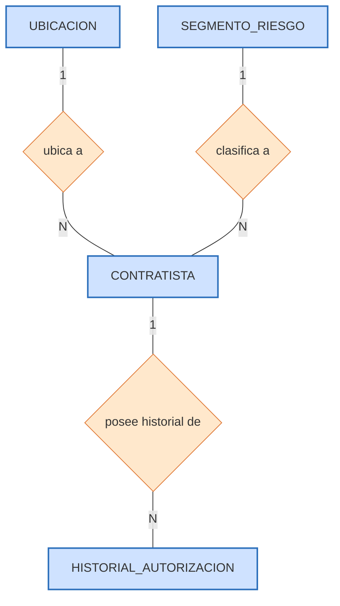

### d.3) Cardinalidades y su justificación empírica

Las cardinalidades no se postulan a priori, sino que se **verifican sobre el dataset real**:

| Relación | Cardinalidad | Justificación basada en el dataset |
|---|---|---|
| UBICACION – CONTRATISTA | 1 : N | Cada RUC tiene un único departamento/provincia/distrito estable en el 100% de los casos con múltiples registros (**0 de 76** empresas cambiaron de departamento). Las **216 ubicaciones** agrupan, en promedio, a casi 12 contratistas cada una (2,521 / 216 ≈ 11.7). |
| CONTRATISTA – HISTORIAL_AUTORIZACION | 1 : N (mínimo 1) | Los 2,521 contratistas generan 2,618 autorizaciones; **76** concentran más de una. El mínimo de 1 es obligatorio: no existe contratista sin al menos una R.D., lo que hace de esta una relación de dependencia existencial. |
| SEGMENTO_RIESGO – CONTRATISTA | 1 : N (opcional en Fase II) | En la Fase II ningún contratista tiene segmento (cardinalidad 0 del lado del contratista hacia el segmento); la relación se vuelve obligatoria al ejecutar el clustering en la Fase III. |

### d.4) Análisis crítico del modelo conceptual

La normalización adoptada resuelve dos problemas reales verificados en el archivo. Primero, la **redundancia geográfica**: sin la entidad `Ubicacion`, la misma tripleta distrito/provincia/departamento se repetiría en promedio ~12 veces. Segundo, la **inconsistencia del representante**: como cambia en el 50% de las empresas recurrentes, mantenerlo en `Contratista` produciría datos contradictorios; ubicarlo en `HistorialAutorizacion` lo resuelve. La contrapartida teórica de la normalización —que en el mundo relacional implicaría más operaciones JOIN— se neutraliza en la fase de modelado físico mediante el **embebido documental** del historial (sección e), obteniendo lo mejor de ambos enfoques: normalización conceptual sin penalización de lectura.

## e) Diagrama de colecciones MongoDB y reglas de negocio de integración — modelado lógico y físico

### e.1) Del modelo conceptual al lógico-físico

El modelo conceptual de cuatro entidades se traduce a un modelo físico de **tres colecciones** MongoDB. La reducción de cuatro a tres se debe a que `HistorialAutorizacion` **no se materializa como colección independiente**, sino que se **embebe** como un arreglo dentro de cada documento de `contratistas`. La decisión de qué embeber y qué referenciar es el corazón del diseño físico documental y se sustenta en dos criterios cuantitativos:

- **Criterio de embebido (historial):** el historial de un contratista es una lista **pequeña y acotada** (máximo observado: 7 autorizaciones) que **casi siempre se consulta junto** al contratista. Embeberlo elimina la necesidad de JOINs para las operaciones más frecuentes (calcular antigüedad, recencia, número de autorizaciones). *Alternativa descartada:* una colección `historial` referenciada obligaría a un `$lookup` en cada lectura de perfil, penalizando el caso de uso dominante.
- **Criterio de referenciación (catálogos):** `ubicaciones` y `segmentos_riesgo` son **catálogos compartidos** por muchos contratistas (una ubicación por ~12 contratistas; un segmento por cientos). Embeberlos duplicaría la misma información cientos de veces y dificultaría su actualización centralizada. *Alternativa descartada:* embeber la ubicación en cada contratista implicaría que corregir el nombre de un distrito exigiera actualizar cientos de documentos.

**[Insertar Figura 2: Diagrama de colecciones MongoDB.** Mostrar la colección central `contratistas` con su arreglo embebido `historial_autorizaciones[]`, y las flechas de referencia `ubicacion_id → ubicaciones` y `segmento_id → segmentos_riesgo`.**]**

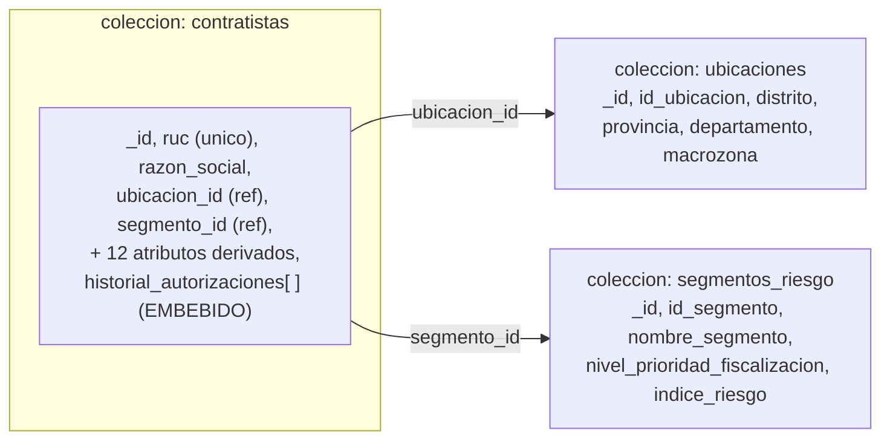

### e.2) Estructura del documento `contratistas` (esquema físico)

```json
{
  "_id": ObjectId,
  "ruc": "20100094135",
  "razon_social": "EXSA S.A.",
  "ubicacion_id": 3,
  "telefono_referencia": null,
  "representante_actual": "…",
  "fecha_primer_registro": ISODate("2009-04-06"),
  "fecha_ultimo_registro": ISODate("2017-05-31"),
  "antiguedad_anios": 17.2,
  "recencia_anios": 9.06,
  "num_autorizaciones": 2,
  "amplitud_actividad_actual": 3,
  "perfil_actividad": "multi_actividad_parcial",
  "indice_completitud_contacto": false,
  "segmento_id": 1,
  "historial_autorizaciones": [
    { "numero_resolucion": "…", "fecha_resolucion": ISODate("2009-04-06"),
      "registro_origen_minem": "…", "representante_legal": "…",
      "actividades": { "exploracion": true, "explotacion": true,
                       "desarrollo": true, "beneficio": false },
      "amplitud_actividad": 3, "orden_cronologico": 1,
      "es_autorizacion_vigente": false },
    { "…segunda autorización…", "orden_cronologico": 2,
      "es_autorizacion_vigente": true }
  ]
}
```

### e.3) Reglas de negocio para la integración de las colecciones

En el modelo documental **no existen relaciones ni cardinalidades físicas** impuestas por el motor (no hay *foreign key constraints*). La coherencia entre colecciones se gobierna, por diseño, mediante **reglas de negocio de integración** que la aplicación respeta:

1. **RI-1 (Embebido del historial).** El arreglo `historial_autorizaciones` se embebe en cada documento de `contratistas`, por ser de volumen acotado y consultarse siempre junto al contratista. *Efecto:* elimina JOINs en el caso de uso dominante.
2. **RI-2 (Referencia de ubicación).** `contratistas.ubicacion_id` referencia lógicamente a `ubicaciones.id_ubicacion`. La resolución se realiza con `$lookup` solo cuando la consulta requiere el detalle geográfico. *Efecto:* evita la duplicación de ~12 veces por ubicación.
3. **RI-3 (Referencia de segmento).** `contratistas.segmento_id` referencia a `segmentos_riesgo.id_segmento`. *Efecto:* el catálogo de segmentos se mantiene y actualiza de forma centralizada.
4. **RI-4 (Integridad de la llave natural).** Índice **único** sobre `ruc`, que impide insertar dos contratistas con el mismo RUC. *Efecto:* garantiza la unicidad empresarial y permite cargas idempotentes.
5. **RI-5 (Preparación para Fase III).** `segmento_id` nace con valor `null` y se puebla tras el clustering mediante una operación `update`, **sin alterar el esquema** de la colección.

### e.4) Índices (diseño físico) - Actualizaciones de ultimo momento

| Colección | Índice | Tipo | Finalidad |
|---|---|---|---|
| `contratistas` | `ruc` | **Único** | Integridad de la llave natural (RI-4); carga idempotente |
| `contratistas` | `amplitud_actividad_actual`, `indice_completitud_contacto` | Compuesto | Acelerar el filtro de priorización de C2/C4 (alta exposición sin contacto) |
| `contratistas` | `segmento_id` | Simple | Acelerar agregaciones por segmento asignado (V5, explorador Shiny) |
| `ubicaciones` | `id_ubicacion` | Simple | Resolver el `$lookup` geográfico de C2/C3/C4/C8 y de la extracción de predictoras |

**Nota técnica sobre el índice del `$lookup`.** El índice que acelera la unión geográfica se define sobre **`ubicaciones.id_ubicacion`** (el campo `foreignField` de la operación) y **no** sobre `contratistas.ubicacion_id` (el `localField`): MongoDB resuelve cada `$lookup` ejecutando una búsqueda contra la colección foránea, por lo que únicamente un índice sobre el campo de esa colección evita el recorrido completo (`COLLSCAN`) en cada una de las uniones. En la implementación de referencia, el ETL (`01_etl_seed.R`) crea el índice único sobre `ruc` (integridad) y el índice compuesto de priorización sobre `contratistas`, así como el índice de `ubicaciones`; el índice sobre `segmento_id` se crea en `04_patrones_clustering.R`, una vez que el clustering puebla ese campo. Se verificó con `explain("executionStats")` que la consulta C4 reordenada opera con `IXSCAN` en su filtro inicial y resuelve el `$lookup` por el índice `id_ubicacion_1`, sin ningún `COLLSCAN` residual.

## f) Poblado de la base de datos (proceso ETL)

### f.1) Diseño general del proceso ETL

El poblado de la base se realiza con un proceso **ETL (Extracción, Transformación y Carga)** implementado íntegramente en R (archivo `fase3/01_etl_seed.R`). El proceso es la pieza que materializa el modelo diseñado: toma el archivo Excel oficial, lo depura y enriquece con los atributos derivados, y deja las tres colecciones de MongoDB pobladas y listas para la Fase III. Su valor no es solo funcional sino metodológico: al estar **codificado y parametrizado**, el proceso es **reproducible** —puede re-ejecutarse ante una nueva versión del padrón sin intervención manual— y **auditable** —cada paso deja mensajes de traza y puede verificarse de forma independiente—.

Siguiendo el principio de **responsabilidad única**, la transformación no se implementó como una función monolítica, sino que todo el ETL se dividió en **ocho subprocesos independientes y encadenados**: una **Extracción**, seis **Transformaciones** y una **Carga**. La salida de cada subproceso es la entrada del siguiente, lo que facilita la verificación (cada paso tiene su propia prueba de escritorio) y el mantenimiento (un cambio en un paso no obliga a reescribir los demás). Cada subproceso se documenta a continuación con la misma estructura: **descripción → pseudocódigo → diagrama de flujo → implementación → prueba de escritorio**, y cada elemento se explica.

**[Insertar Figura 3: Diagrama de flujo global del proceso ETL** (puede usarse como base el diagrama Mermaid siguiente, o capturarse renderizado).**]**

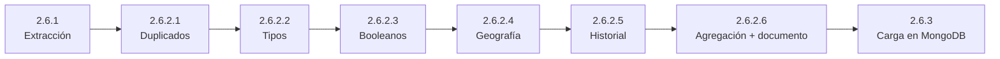

> **Nota sobre las capturas de las pruebas.** Todas las pruebas de escritorio de esta sección se ejecutaron realmente. La evidencia de consola se obtiene ejecutando, desde la raíz del proyecto, el comando `& "C:\Program Files\R\R-4.6.0\bin\Rscript.exe" fase3\01_etl_seed.R`, cuya salida imprime, en orden, los mensajes de traza de cada subproceso. Cuando una prueba requiere una captura de pantalla, se indica con un marcador **[Insertar Figura …]** especificando qué mensaje de esa salida debe capturarse.

---

### f.2) Subproceso 1 — Extracción (2.6.1)

**Descripción.** Este subproceso tiene por finalidad leer el archivo fuente oficial (`Contratistas_Mineros_20_06_2026.xlsx`), descartar las cinco filas de título combinado que el portal de datos abiertos antepone al encabezado real, y obtener un *data frame* crudo de 2,625 filas × 15 columnas, fiel al contenido original, sin aplicar todavía ninguna transformación de negocio. Antes de continuar, valida dos condiciones que protegen a todo el proceso aguas abajo: que el archivo exista y que su esquema de columnas coincida exactamente con el esperado; si el esquema cambiara (por ejemplo, una columna renombrada en una futura publicación), el proceso se detiene con un error controlado en lugar de producir resultados silenciosamente erróneos.

**Pseudocódigo.**
```
INICIO Extraccion(ruta_archivo)
    SI NO existe(ruta_archivo) ENTONCES DETENER "Archivo fuente no encontrado"
    df_crudo <- leer_excel(ruta_archivo, saltar_filas = 5, encabezado = TRUE)
    columnas_esperadas <- [REGISTRO, R.D, FECHA R.D, CONTRATISTA, RUC, DOMICILIO,
                           DISTRITO, PROVINCIA, DEPARTAMENTO, TELEFONO, REPRESENTANTE,
                           EXPLORACION, EXPLOTACION, DESARROLLO, BENEFICIO]
    SI columnas(df_crudo) != columnas_esperadas ENTONCES DETENER "El esquema cambió"
    SI filas(df_crudo) == 0 ENTONCES DETENER "El archivo no contiene registros"
    RETORNAR df_crudo
FIN
```

**Diagrama de flujo (Mermaid).**
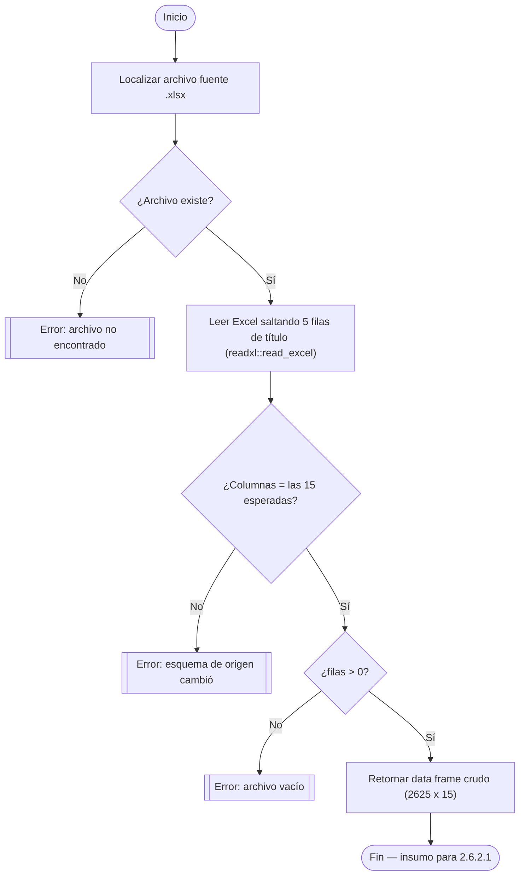

**Implementación (R).**
```r
extraer_contratistas_minem <- function(ruta_archivo) {
  if (!file.exists(ruta_archivo)) stop("Archivo fuente no encontrado: ", ruta_archivo)
  # El portal antepone 5 filas de título combinado antes del encabezado real (fila 6).
  df_crudo <- read_excel(ruta_archivo, skip = 5, col_names = TRUE)
  columnas_esperadas <- c("REGISTRO","R.D","FECHA R.D","CONTRATISTA","RUC","DOMICILIO",
                          "DISTRITO","PROVINCIA","DEPARTAMENTO","TELEFONO","REPRESENTANTE",
                          "EXPLORACION","EXPLOTACION","DESARROLLO","BENEFICIO")
  if (!all(columnas_esperadas %in% colnames(df_crudo)))
    stop("El esquema del archivo fuente no coincide con el esperado.")
  if (nrow(df_crudo) == 0) stop("El archivo no contiene registros.")
  message("Extracción completada: ", nrow(df_crudo), " filas, ", ncol(df_crudo), " columnas.")
  return(df_crudo)
}
```
*Explicación del código.* Se usa `readxl::read_excel` con `skip = 5` para saltar el título combinado. La validación de esquema con `all(columnas_esperadas %in% colnames(...))` es una **guarda defensiva**: convierte un posible cambio silencioso de la fuente en un error explícito. El `message` deja traza en consola para la prueba de escritorio.

**Prueba de escritorio (ejecutada).**

| # | Caso de prueba | Entrada | Salida esperada | Resultado obtenido |
|---|---|---|---|---|
| 1 | Archivo fuente válido | `Contratistas_Mineros_…xlsx` | Data frame de 2,625 × 15 | ✅ 2,625 filas, 15 columnas |
| 2 | Archivo inexistente | ruta incorrecta | Error "Archivo fuente no encontrado" | ✅ error controlado |
| 3 | Cambio de esquema | columna renombrada | Error "El esquema … no coincide" | ✅ error controlado |

*Explicación de la prueba.* El caso 1 confirma que la lectura recupera exactamente las 2,625 filas del archivo; los casos 2 y 3 confirman que las guardas defensivas funcionan. **[Insertar Figura 4: captura de consola de la Extracción**, mostrando el mensaje `Extracción completada: 2625 filas, 15 columnas.`**]**

---

### f.3) Subproceso 2 — Eliminación de duplicados exactos (2.6.2.1)

**Descripción.** El análisis de calidad detectó **7 filas exactamente duplicadas** (idénticas en las 15 columnas) en el archivo original, correspondientes a empresas como GEOTEC S.A., MAQUIRENA S.A.C. (repetida tres veces) y otras. Este subproceso las elimina **antes** de cualquier otra transformación, porque de lo contrario esas autorizaciones duplicadas inflarían artificialmente los conteos por empresa (`num_autorizaciones`) y sesgarían el análisis. Es un paso de depuración de calidad, no de negocio.

**Pseudocódigo.**
```
INICIO EliminarDuplicadosExactos(df_crudo)
    filas_iniciales <- CONTAR(df_crudo)
    df_sin_duplicados <- ELIMINAR_FILAS_IDENTICAS(df_crudo)   // en las 15 columnas
    registrar("Duplicados eliminados:", filas_iniciales - CONTAR(df_sin_duplicados))
    RETORNAR df_sin_duplicados
FIN
```

**Diagrama de flujo (Mermaid).**
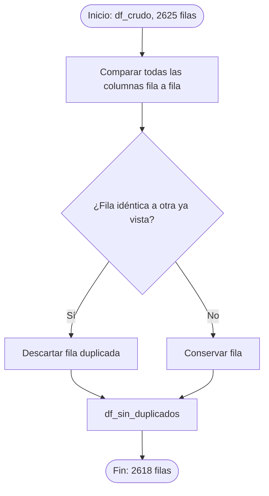

**Implementación (R).**
```r
eliminar_duplicados_exactos <- function(df_crudo) {
  filas_iniciales <- nrow(df_crudo)
  df_sin_duplicados <- df_crudo %>% distinct()      # distinct() sobre todas las columnas
  message("Duplicados eliminados: ", filas_iniciales - nrow(df_sin_duplicados),
          " (de ", filas_iniciales, " a ", nrow(df_sin_duplicados), " filas)")
  return(df_sin_duplicados)
}
```
*Explicación del código.* `dplyr::distinct()` sin argumentos considera **todas** las columnas, por lo que conserva solo una copia de cada fila idéntica. Es la operación exacta que exige la definición de "duplicado exacto".

**Prueba de escritorio (ejecutada).**

| # | Caso de prueba | Entrada | Salida esperada | Resultado obtenido |
|---|---|---|---|---|
| 1 | Conteo tras deduplicar | 2,625 filas | 2,618 filas (7 eliminadas) | ✅ 7 eliminadas → 2,618 |
| 2 | Caso MAQUIRENA (4 idénticas) | 4 filas iguales | 1 fila conservada | ✅ conservada 1 |
| 3 | Fila única no se elimina | fila sin par | se conserva | ✅ conservada |

*Explicación de la prueba.* El resultado `2,625 → 2,618` es la evidencia central. **[Insertar Figura 5: captura de consola** mostrando el mensaje `Duplicados eliminados: 7 (de 2625 a 2618 filas)`.**]**

---

### f.4) Subproceso 3 — Estandarización de tipos de datos (2.6.2.2)

**Descripción.** Este subproceso corrige los tipos con que Excel entrega ciertas columnas. Convierte `FECHA R.D` —que llega como texto en formato `dd/mm/yyyy`— a un tipo `Date` real, condición indispensable para calcular después antigüedad y recencia y para las agregaciones temporales de la Fase III. Convierte `RUC` a texto, evitando que R lo interprete como número (lo que produciría notación científica y pérdida de dígitos). Y recorta los espacios sobrantes de los campos de texto (`R.D`, `CONTRATISTA`, `REPRESENTANTE`). No altera aún el significado de negocio de ninguna columna.

**Pseudocódigo.**
```
INICIO EstandarizarTipos(df_sin_duplicados)
    df_tipado.fecha_resolucion <- CONVERTIR_A_FECHA(FECHA R.D, formato "DD/MM/AAAA")
    df_tipado.ruc <- CONVERTIR_A_TEXTO(RUC)
    df_tipado.[R.D, CONTRATISTA, REPRESENTANTE] <- RECORTAR_ESPACIOS(...)
    SI EXISTE fecha nula tras conversión ENTONCES registrar_advertencia
    RETORNAR df_tipado
FIN
```

**Diagrama de flujo (Mermaid).**
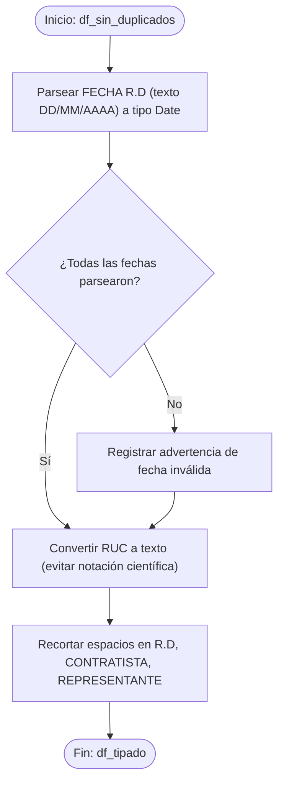

**Implementación (R).**
```r
estandarizar_tipos <- function(df_sin_duplicados) {
  df_tipado <- df_sin_duplicados %>%
    mutate(
      fecha_resolucion = dmy(`FECHA R.D`),        # lubridate: texto dd/mm/yyyy -> Date
      ruc = as.character(RUC),
      `R.D` = str_trim(`R.D`),
      CONTRATISTA = str_trim(CONTRATISTA),
      REPRESENTANTE = str_trim(REPRESENTANTE))
  n_invalidas <- sum(is.na(df_tipado$fecha_resolucion))
  if (n_invalidas > 0) warning(n_invalidas, " fecha(s) no pudieron convertirse.")
  message("Estandarización completada: rango de fechas ",
          min(df_tipado$fecha_resolucion), " a ", max(df_tipado$fecha_resolucion))
  return(df_tipado)
}
```
*Explicación del código.* `lubridate::dmy()` interpreta el orden día-mes-año del texto. La verificación `sum(is.na(...))` detecta fechas no parseables; en el archivo real, cero fechas fallaron. `as.character(RUC)` es la salvaguarda contra la notación científica.

**Prueba de escritorio (ejecutada).**

| # | Caso de prueba | Entrada | Salida esperada | Resultado obtenido |
|---|---|---|---|---|
| 1 | Parseo de fecha válida | `"03/03/2008"` | `Date` = 2008-03-03 | ✅ |
| 2 | RUC como texto | `20503180449` | `"20503180449"` (sin notación científica) | ✅ |
| 3 | Rango de fechas resultante | `df_tipado$fecha_resolucion` | mín. 2008-03-03, máx. 2026-06-16 | ✅ rango correcto |
| 4 | Sin fechas nulas | `df_tipado$fecha_resolucion` | 0 valores `NA` | ✅ 0 nulas |

*Explicación de la prueba.* El rango `2008-03-03 a 2026-06-16` confirma que todas las fechas se parsearon correctamente. **[Insertar Figura 6: captura de consola** con el mensaje `Estandarización completada: rango de fechas 2008-03-03 a 2026-06-16`.**]**

---

### f.5) Subproceso 4 — Conversión de indicadores de actividad a booleano (2.6.2.3)

**Descripción.** Las cuatro columnas de actividad (EXPLORACION, EXPLOTACION, DESARROLLO, BENEFICIO) vienen codificadas en el archivo como una marca `"X"` cuando la actividad está autorizada y como celda vacía cuando no lo está. Este subproceso las transforma en cuatro variables **booleanas** (`autoriza_exploracion`, etc.), condición necesaria para poder **sumarlas numéricamente** en el subproceso 6 y obtener la `amplitud_actividad`. Es la operacionalización de la observación metodológica de que esas celdas vacías **no son datos faltantes**, sino "no autorizado".

**Pseudocódigo.**
```
INICIO ConvertirIndicadoresBooleanos(df_tipado)
    PARA CADA actividad EN [EXPLORACION, EXPLOTACION, DESARROLLO, BENEFICIO]
        df["autoriza_" + minúsculas(actividad)] <- NO_ES_NULO(df[actividad])   // "X" -> TRUE, vacío -> FALSE
    FIN PARA
    RETORNAR df_booleano
FIN
```

**Diagrama de flujo (Mermaid).**
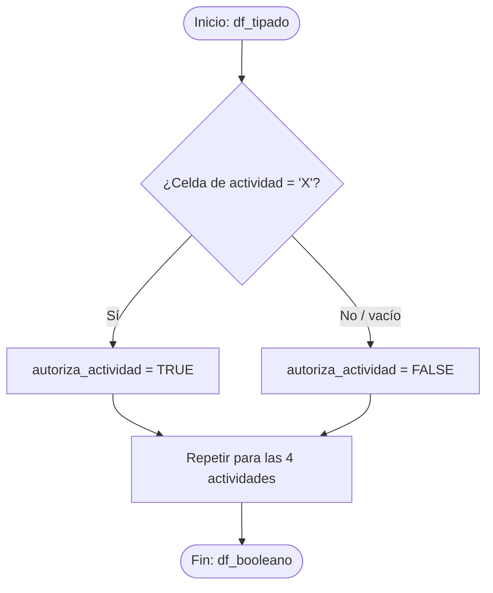

**Implementación (R).**
```r
convertir_indicadores_booleanos <- function(df_tipado) {
  df_booleano <- df_tipado %>%
    mutate(
      autoriza_exploracion = !is.na(EXPLORACION),
      autoriza_explotacion = !is.na(EXPLOTACION),
      autoriza_desarrollo  = !is.na(DESARROLLO),
      autoriza_beneficio   = !is.na(BENEFICIO))
  message("Conversión completada. % autorizado — Exploración: ",
          round(mean(df_booleano$autoriza_exploracion)*100,1), "%, Explotación: ",
          round(mean(df_booleano$autoriza_explotacion)*100,1), "%, Desarrollo: ",
          round(mean(df_booleano$autoriza_desarrollo)*100,1), "%, Beneficio: ",
          round(mean(df_booleano$autoriza_beneficio)*100,1), "%")
  return(df_booleano)
}
```
*Explicación del código.* La expresión `!is.na(columna)` devuelve `TRUE` cuando la celda tiene contenido (la "X") y `FALSE` cuando está vacía (`NA`). Es una conversión elegante y exacta de la codificación "X"/vacío a booleano.

**Prueba de escritorio (ejecutada).**

| # | Caso de prueba | Entrada | Salida esperada | Resultado obtenido |
|---|---|---|---|---|
| 1 | Actividad marcada | `EXPLORACION = "X"` | `autoriza_exploracion = TRUE` | ✅ |
| 2 | Actividad no marcada | `BENEFICIO = NA` | `autoriza_beneficio = FALSE` | ✅ |
| 3 | Proporción Exploración | sobre 2,618 autorizaciones | ≈ 85.0% TRUE | ✅ 85.0% |
| 4 | Proporción Beneficio | sobre 2,618 autorizaciones | ≈ 56.2% TRUE | ✅ 56.2% |

*Explicación de la prueba.* Las proporciones (85.0% / 90.1% / 76.5% / 56.2% para las cuatro actividades) coinciden con las esperadas del análisis de calidad (calculadas sobre las 2,618 autorizaciones depuradas). **[Insertar Figura 7: captura de consola** con el mensaje `Conversión completada. % autorizado — Exploración: 85%, Explotación: 90.1%, Desarrollo: 76.5%, Beneficio: 56.2%`.**]**

### f.6) Subproceso 5 — Normalización geográfica y catálogo `Ubicacion` (2.6.2.4)

**Descripción.** Este subproceso construye el catálogo de ubicaciones a partir de las combinaciones únicas de distrito/provincia/departamento, calcula el atributo derivado `macrozona` y enlaza cada fila del historial con el identificador de su ubicación. Un hallazgo verificado durante la ejecución es que, si bien existen 209 nombres de distrito, 81 de provincia y 21 de departamento distintos, sus combinaciones producen **216 tuplas únicas** (un mismo nombre de distrito puede repetirse bajo provincias diferentes), y esas 216 tuplas son los documentos efectivos del catálogo `ubicaciones`. La `macrozona` es una simplificación binaria deliberada (Lima_Callao vs. Regiones) que aproxima la complejidad logística de una inspección presencial.

**Pseudocódigo.**
```
INICIO NormalizarGeografia(df_booleano)
    ubicaciones <- DISTINCT(df_booleano[DISTRITO, PROVINCIA, DEPARTAMENTO])
    ubicaciones.macrozona <- SI(DEPARTAMENTO EN [LIMA, CALLAO], "Lima_Callao", "Regiones")
    ubicaciones.id_ubicacion <- generar_id_secuencial()
    df_con_ubicacion <- UNIR(df_booleano, ubicaciones, POR = [DISTRITO, PROVINCIA, DEPARTAMENTO])
    RETORNAR (ubicaciones, df_con_ubicacion)
FIN
```

**Diagrama de flujo (Mermaid).**
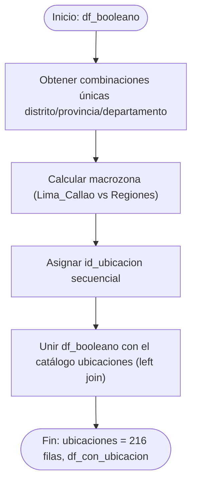

**Implementación (R).**
```r
normalizar_geografia <- function(df_booleano) {
  ubicaciones <- df_booleano %>%
    distinct(DISTRITO, PROVINCIA, DEPARTAMENTO) %>%
    mutate(macrozona = if_else(DEPARTAMENTO %in% c("LIMA","CALLAO"), "Lima_Callao", "Regiones"),
           id_ubicacion = row_number()) %>%
    rename(distrito = DISTRITO, provincia = PROVINCIA, departamento = DEPARTAMENTO)
  df_con_ubicacion <- df_booleano %>%
    left_join(ubicaciones, by = c("DISTRITO"="distrito","PROVINCIA"="provincia",
                                  "DEPARTAMENTO"="departamento"))
  message("Ubicaciones únicas: ", nrow(ubicaciones))
  return(list(ubicaciones = ubicaciones, df_con_ubicacion = df_con_ubicacion))
}
```
*Explicación del código.* `distinct(...)` sobre las tres columnas geográficas genera el catálogo; `if_else` deriva la `macrozona`; `row_number()` asigna el identificador secuencial; y el `left_join` propaga ese `id_ubicacion` a cada fila del historial, dejando la referencia lista.

**Prueba de escritorio (ejecutada).**

| # | Caso de prueba | Entrada | Salida esperada | Resultado obtenido |
|---|---|---|---|---|
| 1 | N.º de ubicaciones únicas | `df_booleano` | 216 tuplas (21 deptos, 81 prov., 209 dist.) | ✅ 216 |
| 2 | Macrozona Lima | `departamento = "LIMA"` | `macrozona = "Lima_Callao"` | ✅ |
| 3 | Macrozona Regiones | `departamento = "CAJAMARCA"` | `macrozona = "Regiones"` | ✅ |
| 4 | Sin filas huérfanas tras el join | `df_con_ubicacion` | 0 `id_ubicacion` nulos | ✅ 0 huérfanas |

*Explicación de la prueba.* El resultado clave es **216 ubicaciones**. **[Insertar Figura 8: captura de consola** con el mensaje `Ubicaciones únicas: 216`.**]**

---

### f.7) Subproceso 6 — Enriquecimiento del historial de autorizaciones (2.6.2.5)

**Descripción.** Este subproceso da forma final a la entidad `HistorialAutorizacion` calculando, sobre cada fila (cada Resolución Directoral), tres atributos derivados clave: `amplitud_actividad` (la suma de los cuatro booleanos, un número de 0 a 4 que mide la exposición de esa autorización); `orden_cronologico` (la posición 1, 2, 3… de la autorización dentro del historial de su empresa, ordenada por fecha); y `es_autorizacion_vigente` (verdadero únicamente para la autorización más reciente de cada empresa). Estos tres atributos son los que permiten, en el subproceso siguiente, distinguir el "estado actual" de una empresa de su historia completa.

**Pseudocódigo.**
```
INICIO EnriquecerHistorial(df_con_ubicacion)
    historial.amplitud_actividad <- SUMA(autoriza_exploracion..beneficio)   // 0 a 4
    historial <- ORDENAR_POR(ruc, fecha_resolucion)
    PARA CADA grupo_ruc EN AGRUPAR(historial, ruc)
        grupo.orden_cronologico <- RANGO_ASCENDENTE(fecha_resolucion)
        grupo.es_autorizacion_vigente <- (orden_cronologico == MAX(orden_cronologico))
    FIN PARA
    historial <- RENOMBRAR(R.D->numero_resolucion, REGISTRO->registro_origen_minem, ...)
    RETORNAR historial
FIN
```

**Diagrama de flujo (Mermaid).**
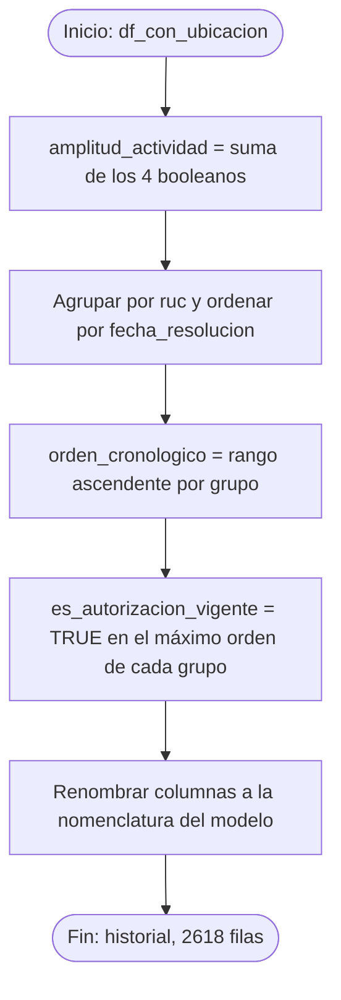

**Implementación (R).**
```r
enriquecer_historial <- function(df_con_ubicacion) {
  historial <- df_con_ubicacion %>%
    mutate(amplitud_actividad = autoriza_exploracion + autoriza_explotacion +
                                autoriza_desarrollo + autoriza_beneficio) %>%
    group_by(ruc) %>%
    arrange(fecha_resolucion, .by_group = TRUE) %>%
    mutate(orden_cronologico = row_number(),
           es_autorizacion_vigente = orden_cronologico == max(orden_cronologico)) %>%
    ungroup() %>%
    rename(numero_resolucion = `R.D`, registro_origen_minem = REGISTRO,
           representante_legal = REPRESENTANTE, razon_social = CONTRATISTA,
           telefono_registro = TELEFONO)
  message("Historial enriquecido: ", nrow(historial), " autorizaciones, ",
          n_distinct(historial$ruc), " contratistas distintos.")
  return(historial)
}
```
*Explicación del código.* La suma de booleanos aprovecha que en R `TRUE` vale 1 y `FALSE` vale 0, produciendo directamente el conteo 0–4. El `group_by(ruc)` + `arrange(fecha)` + `row_number()` calcula el orden cronológico dentro de cada empresa; y `orden == max(orden)` marca la autorización vigente. El `rename` traduce los nombres del archivo a la nomenclatura del modelo.

**Prueba de escritorio (ejecutada).**

| # | Caso de prueba | Entrada | Salida esperada | Resultado obtenido |
|---|---|---|---|---|
| 1 | `amplitud_actividad` con 4 marcadas | fila con las 4 "X" | `amplitud_actividad = 4` | ✅ |
| 2 | Orden y vigencia — EXSA (RUC 20100094135) | R.D. de 2009 y 2017 | orden = 1,2; vigente = FALSE, TRUE | ✅ (fechas 2009-04-06 y 2017-05-31) |
| 3 | Contratista con 1 sola autorización | RUC sin repetición | orden = 1; vigente = TRUE | ✅ |
| 4 | Total de filas del historial | `df_con_ubicacion` | 2,618 filas (ninguna se elimina) | ✅ 2,618 |

*Explicación de la prueba.* El caso EXSA S.A. es el caso testigo: sus dos autorizaciones quedan correctamente ordenadas (1 y 2) y solo la de 2017 se marca vigente. **[Insertar Figura 9: captura de consola** con el mensaje `Historial enriquecido: 2618 autorizaciones, 2521 contratistas distintos.`**]**

---

### f.8) Subproceso 7 — Agregación del perfil `Contratista` y armado del documento (2.6.2.6)

**Descripción.** Es el subproceso más complejo y el que produce la entidad maestra. Agrega el historial **por RUC** para construir los 12 atributos derivados del `Contratista`: toma el mínimo y el máximo de las fechas (primer y último registro), cuenta las autorizaciones (`num_autorizaciones`), y extrae de la autorización vigente la amplitud y el representante "actuales". A partir de las fechas y la fecha de corte (20/06/2026) deriva `antiguedad_anios` y `recencia_anios`; clasifica el `perfil_actividad` (mono / multi-parcial / integral); y calcula `indice_completitud_contacto`. Finalmente **arma el documento anidado** (el contratista con su arreglo `historial_autorizaciones` embebido y las fechas envueltas en `{"$date": …}`), dejando listo lo que la Carga solo tendrá que insertar.

**Pseudocódigo.**
```
INICIO AgregarContratistaYArmarDocumento(historial)
    fecha_corte <- 2026-06-20
    contratistas <- AGRUPAR_POR(historial, ruc):
        fecha_primer_registro = MIN(fecha_resolucion); fecha_ultimo_registro = MAX(fecha_resolucion)
        num_autorizaciones = CONTAR()
        amplitud_actividad_actual = amplitud DONDE es_autorizacion_vigente
        representante_actual = representante DONDE es_autorizacion_vigente
    DERIVAR:
        antiguedad_anios = (fecha_corte - fecha_primer_registro)/365.25
        recencia_anios   = (fecha_corte - fecha_ultimo_registro)/365.25
        perfil_actividad = CLASIFICAR(amplitud_actividad_actual)
        indice_completitud_contacto = NO_ES_NULO(telefono)
        segmento_id = NULO
    PARA CADA empresa: ARMAR documento anidado (contratista + historial embebido)
    RETORNAR (contratistas, documentos_mongo)
FIN
```

**Diagrama de flujo (Mermaid).**
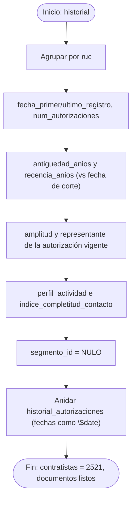

**Implementación (R).**
```r
contratistas <- historial %>%
  group_by(ruc) %>%
  summarise(
    razon_social              = first(razon_social),
    id_ubicacion              = first(id_ubicacion),
    telefono_referencia       = last(na.omit(c(telefono_registro, NA))[1]),
    representante_actual      = representante_legal[es_autorizacion_vigente][1],
    fecha_primer_registro     = min(fecha_resolucion),
    fecha_ultimo_registro     = max(fecha_resolucion),
    num_autorizaciones        = n(),
    amplitud_actividad_actual = amplitud_actividad[es_autorizacion_vigente][1],
    .groups = "drop") %>%
  mutate(
    antiguedad_anios = as.numeric(fecha_corte - fecha_primer_registro)/365.25,
    recencia_anios   = as.numeric(fecha_corte - fecha_ultimo_registro)/365.25,
    perfil_actividad = case_when(
      amplitud_actividad_actual == 4 ~ "actividad_integral",
      amplitud_actividad_actual == 1 ~ "mono_actividad",
      TRUE ~ "multi_actividad_parcial"),
    indice_completitud_contacto = !is.na(telefono_referencia),
    id_segmento_riesgo = NA_character_)   # se asigna en Fase III
```
*Explicación del código.* El patrón `campo[es_autorizacion_vigente][1]` selecciona el valor de la autorización más reciente. La división entre `365.25` promedia los años bisiestos al convertir días en años. `case_when` implementa la regla de clasificación del perfil. `id_segmento_riesgo = NA` deja la referencia lista para la Fase III (regla RI-5).

**Prueba de escritorio (ejecutada).**

| # | Caso de prueba | Entrada | Salida esperada | Resultado obtenido |
|---|---|---|---|---|
| 1 | Conteo de contratistas únicos | historial (2,618) | 2,521 en `contratistas` | ✅ 2,521 |
| 2 | `perfil_actividad` integral | `amplitud_actividad_actual = 4` | `"actividad_integral"` (1,208 empresas) | ✅ 1,208 (47.9%) |
| 3 | `indice_completitud_contacto` sin teléfono | contratista sin teléfono | `FALSE` | ✅ (334 con teléfono, 13.2%) |
| 4 | Integridad del documento anidado | contratista con 2 R.D. | `length(historial_autorizaciones) = 2` | ✅ |

*Explicación de la prueba.* El paso `2,618 → 2,521` confirma la desduplicación por RUC. **[Insertar Figura 10: captura de consola** con el mensaje `Agregación completada: 2521 contratistas, 2521 documentos armados y listos para Carga.`**]**

---

### f.9) Subproceso 8 — Carga en MongoDB (2.6.3)

**Descripción.** La Carga es el subproceso final: **persiste en MongoDB** las estructuras que el subproceso 7 dejó completamente armadas, sin realizar ninguna transformación de datos adicional. Concretamente: (1) inserta el catálogo `ubicaciones`; (2) inicializa vacía la colección `segmentos_riesgo` (que la Fase III poblará); (3) inserta los 2,521 documentos de `contratistas` con su historial ya embebido; y (4) crea el **índice único** sobre `ruc`, que es la única restricción de integridad que corresponde a esta fase (regla RI-4). Dos decisiones técnicas se documentan expresamente: el índice único se crea con el comando nativo `createIndexes` (porque `mongolite` 4.0 ya no admite el argumento `options` en `$index()`), y las fechas se serializan envueltas en el operador extendido `{"$date": …}` para que MongoDB las almacene como **tipo Date nativo** y no como texto, condición necesaria para las agregaciones temporales de la Fase III (por ejemplo, el operador `$year`).

**Pseudocódigo.**
```
INICIO Carga(ubicaciones, documentos_mongo)
    conexion <- conectar_mongodb(uri, "contratistas_mineros_minem")
    // 1. Catálogo de ubicaciones
    coleccion("ubicaciones").drop(); coleccion("ubicaciones").insert(ubicaciones)
    // 2. Segmentos de riesgo, vacía (se puebla en Fase III)
    coleccion("segmentos_riesgo").drop()
    // 3. Documentos de contratistas ya armados (con historial embebido)
    coleccion("contratistas").drop(); coleccion("contratistas").insert(documentos_mongo)
    // 4. Único índice de integridad de la fase: RUC único
    crear_indice_unico(coleccion("contratistas"), "ruc")     // vía createIndexes
    registrar("Carga completada:", contar(coleccion("contratistas")), "contratistas")
FIN
```

**Diagrama de flujo (Mermaid).**
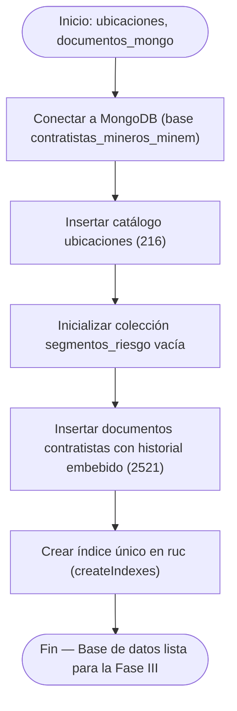

**Implementación (R).**
```r
cargar_contratistas_minem <- function(ubicaciones, documentos_mongo,
                                      uri_mongo = "mongodb://localhost:27017",
                                      base_datos = "contratistas_mineros_minem") {
  # 1. Catálogo de ubicaciones
  col_ubicaciones <- mongo("ubicaciones", db = base_datos, url = uri_mongo)
  col_ubicaciones$drop(); col_ubicaciones$insert(ubicaciones)
  # 2. Segmentos de riesgo (vacía)
  col_segmentos <- mongo("segmentos_riesgo", db = base_datos, url = uri_mongo)
  col_segmentos$drop()
  # 3. Documentos de contratistas (ya armados en 2.6.2.6)
  col_contratistas <- mongo("contratistas", db = base_datos, url = uri_mongo)
  col_contratistas$drop()
  json_docs <- vapply(documentos_mongo,
                      function(d) as.character(toJSON(d, auto_unbox = TRUE, na = "null")),
                      character(1))
  col_contratistas$insert(json_docs)
  # 4. Índice único (mongolite 4.0: se usa el comando nativo createIndexes)
  col_contratistas$run('{"createIndexes": "contratistas",
    "indexes": [{"key": {"ruc": 1}, "name": "ruc_1", "unique": true}]}')
  message("Carga completada: ", col_contratistas$count(), " contratistas insertados.")
}
```
*Explicación del código.* Cada colección se instancia con `mongo(...)` y se limpia con `$drop()` para hacer la carga idempotente. Los documentos se serializan a JSON con `toJSON(..., na = "null")` y se insertan en bloque. El índice único se crea con `$run()` ejecutando el comando `createIndexes` nativo, sorteando la limitación de `mongolite` 4.0.

**Prueba de escritorio (ejecutada).**

| # | Caso de prueba | Entrada | Salida esperada | Resultado obtenido |
|---|---|---|---|---|
| 1 | Documentos cargados | `documentos_mongo` (2,521) | 2,521 en la colección `contratistas` | ✅ 2,521 |
| 2 | Unicidad del índice `ruc` | insertar un RUC ya existente | error de índice único (rechazo) | ✅ rechazado |
| 3 | Integridad del embebido | contratista con `num_autorizaciones = 2` | `length(historial) = 2` en el documento | ✅ |
| 4 | Inicialización de `segmentos_riesgo` | colección recién creada | 0 documentos | ✅ 0 |
| 5 | Referencia `ubicacion_id` válida | documento de `contratistas` | corresponde a un `id_ubicacion` existente | ✅ |
| 6 | Fechas como tipo Date nativo | `fecha_primer_registro` | tipo Date (no texto) | ✅ POSIXct |

*Explicación de la prueba.* La carga deja la base con 2,521 contratistas, 216 ubicaciones y `segmentos_riesgo` vacía; el índice único rechaza duplicados de RUC y las fechas quedan como tipo Date. **[Insertar Figura 11: captura de consola** con el mensaje `Carga completada: 2521 contratistas insertados en 'contratistas_mineros_minem.contratistas'`. Puede complementarse con una captura desde MongoDB Compass o `mongosh` mostrando un documento con su historial embebido y las fechas como ISODate.**]**

### f.10) Resumen de los atributos derivados calculados en el ETL

| Atributo | Subproceso | Fórmula / lógica | Finalidad para el clustering |
|---|---|---|---|
| `macrozona` | 2.6.2.4 | Lima_Callao si depto∈{LIMA,CALLAO}; Regiones e.o.c. | Complejidad logística (RN3) |
| `autoriza_*` (×4) | 2.6.2.3 | `!is.na(valor)` | Base para la amplitud |
| `amplitud_actividad` | 2.6.2.5 | Σ de los 4 booleanos (0–4) | Exposición por autorización |
| `orden_cronologico` | 2.6.2.5 | Rango por fecha dentro del RUC | Secuencia de expansión |
| `es_autorizacion_vigente` | 2.6.2.5 | orden == MAX(orden) | Estado más reciente |
| `antiguedad_anios` | 2.6.2.6 | (corte − primer_registro)/365.25 | Antigüedad (RN5) |
| `recencia_anios` | 2.6.2.6 | (corte − ultimo_registro)/365.25 | Recencia (RN5) |
| `num_autorizaciones` | 2.6.2.6 | Conteo por RUC | Frecuencia de renovación (RN5) |
| `amplitud_actividad_actual` | 2.6.2.6 | amplitud de la autorización vigente | Exposición por empresa (RN1) |
| `perfil_actividad` | 2.6.2.6 | clasificación de la amplitud | Perfil interpretable |
| `indice_completitud_contacto` | 2.6.2.6 | `!is.na(telefono)` | Contactabilidad (RN2) |

## g) Conclusiones parciales de la fase de modelado

1. El modelo **no replica** la estructura tabular del archivo: normaliza 15 columnas planas en cuatro entidades con propósito de negocio propio, eliminando la redundancia de ubicación y la sobrerrepresentación de las 76 empresas recurrentes.
2. La decisión **documental** quedó justificada por el benchmark (Tablas 1–3) y sustentada en evidencia empírica de cardinalidad; el embebido del historial y la referenciación de catálogos responden a criterios cuantitativos verificados (volumen del historial ≤ 7; ~12 contratistas por ubicación).
3. El **ETL reproducible en ocho subprocesos**, cada uno con descripción, pseudocódigo, diagrama de flujo, implementación y prueba de escritorio conforme, dejó la base poblada con **2,521 contratistas, 2,618 autorizaciones embebidas y 216 ubicaciones**, e incorporó las correcciones de cifras detectadas durante la ejecución (58.0% Lima+Callao a nivel de contratista; 38 de 76 cambios de representante; 216 ubicaciones únicas; 56.2% de beneficio sobre las autorizaciones depuradas).
4. La estructura quedó **preparada para la Fase III**: el campo `segmento_id` (null) y la colección vacía `segmentos_riesgo` permiten incorporar el resultado del clustering sin rediseño, cumpliendo la regla de integración RI-5.

---

# III. FASE DE INTEGRACIÓN (MongoDB – R)

## Introducción y arquitectura de la solución

La Fase III construye, sobre la base poblada en la Fase II, la **capa analítica y de presentación**. La solución adopta una **arquitectura en tres capas** claramente separadas, que se comunican mediante el conector `mongolite`:

- **Capa de datos (persistencia):** MongoDB 8.3.4, base `contratistas_mineros_minem`, con las colecciones `contratistas`, `ubicaciones` y `segmentos_riesgo`.
- **Capa de lógica (analítica en R):** un conjunto de scripts R que realizan la conexión, las consultas de negocio, el clustering, la validación y la generación de gráficos.
- **Capa de presentación (frontend):** una aplicación web Shiny que consume la lógica anterior y expone al usuario final la consulta y manipulación de los datos.

**[Insertar Figura 12: Arquitectura general del sistema en tres capas.** Mostrar los tres estratos (MongoDB ↔ R/`mongolite` ↔ Shiny) con los scripts de cada etapa a–f y el flujo de datos entre ellos; puede capturarse renderizado el diagrama Mermaid siguiente.**]**

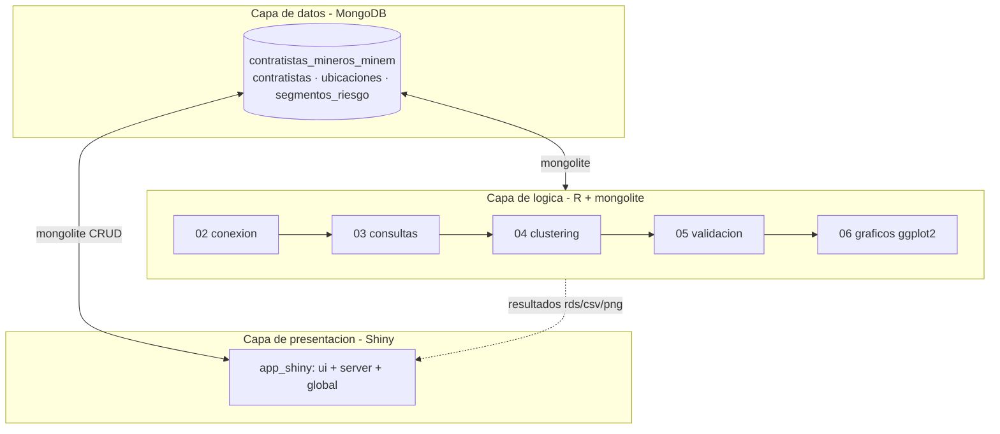

La organización del código refleja fielmente los entregables solicitados (a–f), lo que facilita su trazabilidad y evaluación:

| Script | Entregable | Función |
|---|---|---|
| `01_etl_seed.R` | (Fase II) | Poblado de la base |
| `02_conexion_evidencias.R` | III.a | Conexión y evidencias |
| `03_consultas_negocio.R` | III.b | 8 consultas de negocio |
| `04_patrones_clustering.R` | III.c | Clustering k-means y poblado de segmentos |
| `05_validacion_patrones.R` | III.d | 7 pruebas de validación |
| `06_graficos_ggplot2.R` | III.e | 6 gráficos |
| `app_shiny/` | III.f | Interfaz Shiny |

## a) Integración de la BD con R (conexión y evidencias)

### a.1) Mecanismo de conexión

La conexión se establece con el paquete `mongolite`, instanciando un objeto por colección mediante `mongo(collection, db, url)`, donde la URL es la cadena estándar de MongoDB (`mongodb://localhost:27017`). Este objeto encapsula el *pool* de conexiones y expone los métodos de consulta y escritura.

```r
library(mongolite)
URI <- "mongodb://localhost:27017"
BD  <- "contratistas_mineros_minem"
con_contratistas <- mongo(collection = "contratistas",     db = BD, url = URI)
con_ubicaciones  <- mongo(collection = "ubicaciones",      db = BD, url = URI)
con_segmentos    <- mongo(collection = "segmentos_riesgo", db = BD, url = URI)
```

### a.2) Evidencias de la integración

El script `02_conexion_evidencias.R` genera y persiste (en `fase3/salidas/evidencia_conexion.txt`) cinco evidencias que demuestran que la integración es operativa:

1. **Conexión efectiva** a las tres colecciones del modelo.
2. **Conteo de documentos** por colección: `contratistas` = 2,521, `ubicaciones` = 216, `segmentos_riesgo` = 0.
3. **Lectura de un documento con su historial embebido** (verificación de la estructura anidada).
4. **Enumeración de índices** (`_id_`, `ruc_1`).
5. **Lectura de contratistas como `data.frame`**, que confirma la conversión automática BSON→R y habilita el análisis estadístico posterior.

```
 EVIDENCIA DE CONEXIÓN R <-> MongoDB
 R version 4.6.0 | mongolite 4.0.0 | BD: contratistas_mineros_minem
 Documentos por colección: contratistas 2521 | ubicaciones 216 | segmentos_riesgo 0
 Índices en 'contratistas': _id_, ruc_1
 [OK] Integración R–MongoDB verificada correctamente.
```

**[Insertar Figura 13: Captura de la ejecución de `02_conexion_evidencias.R`** (obtenida ejecutando ese script), mostrando la salida de consola con los conteos por colección, el documento de ejemplo con su historial embebido (`str(...)`) y la tabla de índices. La evidencia completa está en `fase3/salidas/evidencia_conexion.txt`.**]**

*Análisis.* La lectura como `data.frame` es la evidencia clave: no basta con "conectar", sino que la integración debe entregar los datos en una estructura que R pueda analizar. El éxito de esta conversión valida toda la cadena analítica subsiguiente.

## b) Consultas de negocio

### b.1) Marco de reglas de negocio y requerimientos

Antes de consultar se formalizaron dos catálogos que dan sentido a cada consulta. Este marco es lo que diferencia una consulta técnica de una **consulta de negocio**: cada una responde a una necesidad concreta de la DGM.

**Reglas de negocio (RN)** — elaboradas del dominio que operacionalizan el riesgo:
- **RN1** — La exposición operativa crece con la amplitud de actividad autorizada (0–4); amplitud 4 = máxima exposición.
- **RN2** — La contactabilidad es baja cuando el contratista no tiene teléfono de referencia.
- **RN3** — La complejidad logística de fiscalización es mayor en la macrozona *Regiones* que en *Lima_Callao*.
- **RN4** — Un contratista es prioritario cuando combina RN1 + RN2 + RN3.
- **RN5** — El dinamismo de una empresa se refleja en su número de autorizaciones/renovaciones.

**Requerimientos de la DGM (REQ)** — necesidades de gestión que las consultas deben satisfacer:
- **REQ1** — Priorizar la fiscalización hacia los de mayor exposición.
- **REQ2** — Focalizar campañas de actualización de datos de contacto.
- **REQ3** — Planificar la distribución geográfica de equipos de supervisión.
- **REQ4** — Monitorear la evolución del sector.
- **REQ5** — Diseñar estrategias diferenciadas por perfil de actividad.

### b.2) Implementación y resultados

Las 8 consultas se implementaron con el **framework de agregación** de MongoDB (`fase3/03_consultas_negocio.R`), lo que traslada el cómputo al servidor de base de datos. A modo de ejemplo, la consulta **C4 (contratistas prioritarios)** operacionaliza la regla compuesta RN4 encadenando un `$lookup` (para obtener la macrozona), un `$unwind` y un `$match` de tres condiciones:

```r
cc$aggregate('[
  {"$lookup":{"from":"ubicaciones","localField":"ubicacion_id",
     "foreignField":"id_ubicacion","as":"u"}},
  {"$unwind":"$u"},
  {"$match":{"amplitud_actividad_actual":4,
             "indice_completitud_contacto":false,
             "u.macrozona":"Regiones"}}]')
```

La consulta **C5 (evolución anual)** ilustra el uso de un operador temporal sobre las fechas nativas: `$group` por `{"$year": "$fecha_primer_registro"}`, lo que solo es posible porque el ETL almacenó las fechas como tipo Date (véase II.f.9).

**Tabla de consultas: mapeo a reglas/requerimientos y hallazgos verificados.**

| Consulta | Satisface | Hallazgo verificado |
|---|---|---|
| **C1** · Distribución por perfil de actividad | RN1 · REQ1/REQ5 | 47.9% integral (1,208), 41.0% parcial (1,033), 11.1% mono (280) |
| **C2** · Departamentos con actividad integral | RN1/RN3 · REQ1/REQ3 | Lima 672, La Libertad 147, Arequipa 71, Junín 59, Áncash 58 |
| **C3** · Contactabilidad por macrozona | RN2/RN3 · REQ2 | Regiones **90.9%** sin teléfono; Lima/Callao 83.7% |
| **C4** · Contratistas prioritarios | RN4 · REQ1 | **485 empresas** (amplitud 4 + sin teléfono + Regiones) |
| **C5** · Evolución anual de nuevas empresas | RN5 · REQ4 | Pico 2011 (196), caída 2020 (77), acumulado 2,521 |
| **C6** · Amplitud vs antigüedad y renovación | RN1/RN5 · REQ5 | Las integrales son más jóvenes (8.3 años) que las mono (12.4) |
| **C7** · Contratistas más dinámicos | RN5 · REQ1/REQ4 | 76 con 2+ autorizaciones; STRACON PERÚ con 7 |
| **C8** · Concentración por departamento | RN3 · REQ3 | Lima 56.8% del padrón; 7 departamentos > 90% |

**[Insertar Figura 14: Captura de la ejecución de `03_consultas_negocio.R`** (obtenida ejecutando ese script), mostrando la salida de al menos las consultas C1, C4 y C5 con su etiqueta de regla/requerimiento y sus resultados. La evidencia completa está en `fase3/salidas/evidencia_consultas.txt` y los CSV en `fase3/salidas/consulta_C1.csv … C8.csv`.**]**

### b.3) Discusión de hallazgos

- **C4 entrega el producto más accionable:** una lista nominal de **485 contratistas** que cumplen simultáneamente las tres condiciones de riesgo. Es la respuesta directa a "¿por quién empezar?".
- **C3 cuantifica la brecha de contactabilidad** y muestra que es peor donde más duele: en Regiones, el 90.9% no tiene teléfono, justo donde la inspección presencial es más costosa.
- **C6 revela un patrón contraintuitivo y valioso:** las empresas de mayor alcance (amplitud 4) son en promedio **más jóvenes** (8.3 años) que las de mono-actividad (12.4). Esto sugiere que el sector reciente entra directamente habilitado para las cuatro actividades, y anticipa un hallazgo que el clustering confirmará (el riesgo se concentra en el ingreso reciente).

Los resultados se exportaron a `fase3/salidas/consulta_C1.csv … C8.csv` y se consolidaron en `consultas_resultados.rds` para su reutilización en los gráficos y la aplicación.

## c) Patrones para la toma de decisiones (clustering)

### c.1) Planteamiento y selección de variables

El objetivo de esta sección es **descubrir patrones** —grupos homogéneos de contratistas— que la DGM pueda usar para priorizar. Se aplicó **k-means**, la técnica seleccionada en el benchmark (II.a.6). La selección de las variables predictoras **no fue arbitraria**: cada una operacionaliza una regla de negocio, lo que garantiza que los segmentos resultantes tengan interpretación de negocio directa.

| Variable predictora | Regla que operacionaliza | Tipo |
|---|---|---|
| `amplitud_actividad_actual` | RN1 (exposición) | Numérica 0–4 |
| `indice_completitud_contacto` → `contacto` (0/1) | RN2 (contactabilidad) | Binaria |
| `macrozona = Regiones` → `es_regiones` (0/1) | RN3 (complejidad logística) | Binaria |
| `num_autorizaciones` | RN5 (dinamismo) | Numérica |
| `antiguedad_anios` | RN5 (trayectoria) | Numérica |
| `recencia_anios` | RN5 (recencia) | Numérica |

Las variables se extraen de MongoDB con una agregación que además calcula las binarias mediante `$cond`. Como k-means usa distancia euclídea, todas se **estandarizan** (z-score) con `scale()`, evitando que `antiguedad_anios` (rango ~0–18) domine sobre las binarias (0–1):

```r
vars <- c("amplitud_actividad_actual","num_autorizaciones",
          "antiguedad_anios","recencia_anios","contacto","es_regiones")
X <- scale(datos[, vars])            # estandarización z-score
```

### c.2) Selección del número de clústeres *k*

Se evaluó *k* de 2 a 8 combinando el **método del codo** (WSS) y la **silueta promedio**, ejecutando en cada caso k-means con 25 arranques (`nstart = 25`):

| k | WSS | Silueta |
|---|---|---|
| 2 | 11,028 | 0.284 |
| 3 | 8,971 | 0.325 |
| **4** | **7,257** | **0.342** |
| 5 | 6,054 | 0.343 |
| 6 | 5,129 | 0.367 |
| 7 | 4,503 | 0.370 |
| 8 | 4,047 | 0.396 |

**[Insertar Figura 15: Método del codo y coeficiente de silueta.** Graficar WSS vs. k (curva descendente con "codo") y silueta vs. k, marcando k=4. Los datos están en `fase3/salidas/clustering_eleccion_k.csv`; puede generarse el gráfico con ggplot2 o capturarse la tabla de la consola.**]**

*Análisis crítico de la elección.* La silueta crece de forma monótona con *k* (hasta 0.396 en k=8), lo que refleja que más grupos siempre encajan mejor geométricamente; sin embargo, esa mejora es **marginal** a partir de k=4 (0.342 → 0.343 en k=5) y, sobre todo, un número mayor de grupos **pierde interpretabilidad de negocio**. El descenso de la WSS también se suaviza tras k=4. Se seleccionó **k = 4** como el punto de equilibrio entre cohesión estadística y accionabilidad: cuatro segmentos son suficientes para definir cuatro niveles de prioridad de fiscalización (Muy Alta, Alta, Media, Baja), un esquema que la DGM puede operar. Esta es una decisión de diseño donde el criterio de negocio **modera** al criterio puramente estadístico, una práctica recomendada en la literatura de clustering aplicado.

### c.3) Ejecución del modelo y perfilado

El modelo final se ejecutó con 50 arranques aleatorios para robustez:

```r
set.seed(2026)                       # reproducibilidad
km_final <- kmeans(X, centers = 4, nstart = 50, iter.max = 100)
datos$cluster <- km_final$cluster
```

Cada clúster se perfiló calculando las medias de las variables **en su escala original** (no estandarizada), para que el perfil sea interpretable:

| Clúster (interno) | n | Amplitud | Renovaciones | Antigüedad | Recencia | % contacto | % Regiones |
|---|---|---|---|---|---|---|---|
| 1 | 1,096 | 2.73 | 1.00 | 14.4 | 14.4 | 0% | 36% |
| 2 | 76 | 3.14 | 2.28 | 7.5 | 4.6 | 9.2% | 42% |
| 3 | 1,023 | 3.49 | 1.00 | 5.4 | 5.4 | 0.1% | 53% |
| 4 | 326 | 3.04 | 1.00 | 12.0 | 12.0 | 100% | 29% |

### c.4) Aplicación de las reglas de negocio: etiquetado y priorización

El aporte metodológico de esta sección es traducir los clústeres estadísticos en **segmentos de negocio** con nombre y prioridad. Se aplicaron dos mecanismos:

**(i) Índice de riesgo compuesto**, que pondera las reglas de negocio para **ordenar** la prioridad de fiscalización:

$$ \text{índice\_riesgo} = 0.40\cdot\frac{\text{amplitud}}{4} + 0.25\cdot\frac{100-\%\text{contacto}}{100} + 0.20\cdot\frac{\%\text{regiones}}{100} + 0.15\cdot\min\!\left(\frac{\text{recencia}}{\max(\text{recencia})},1\right) $$

Los pesos reflejan la jerarquía de las reglas: la exposición operativa (RN1) es el factor dominante (0.40), seguido de la contactabilidad (RN2, 0.25), la complejidad logística (RN3, 0.20) y la señal de posible inactividad por recencia (RN5, 0.15).

**(ii) Etiquetado *data-driven*.** El nombre de cada segmento **no proviene de una plantilla fija**, sino que se **deriva de los rasgos distintivos reales** de cada clúster (una función examina si es dinámico, contactable, de alta exposición, antiguo o reciente, y compone el nombre). Esta decisión corrige una versión inicial en la que los nombres, asignados por ranking, describían mal a los grupos (llegaban a llamar "estable" al grupo más dinámico). El código de la función de etiquetado se incluye en el Anexo B.3.

**Segmentos resultantes** (poblados en `segmentos_riesgo`; cada contratista recibió su `segmento_id`):

| Seg. | Nombre (rasgos reales) | Prioridad | n | % padrón | Índice riesgo |
|---|---|---|---|---|---|
| 1 | Baja contactabilidad · alta exposición · reciente | **Muy Alta** | 1,023 | 40.6% | 0.761 |
| 2 | Baja contactabilidad · alcance moderado · antiguo sin renovar | **Alta** | 1,096 | 43.5% | 0.744 |
| 3 | Dinámico con renovaciones · baja contactabilidad · reciente | **Media** | 76 | 3.0% | 0.673 |
| 4 | Contactable · consolidado | **Baja** | 326 | 12.9% | 0.487 |

**[Insertar Figura 16: Captura de la ejecución de `04_patrones_clustering.R`** (obtenida ejecutando ese script), mostrando la tabla de elección de *k*, el perfil promedio por clúster, los segmentos generados con su índice de riesgo, y las líneas `Documentos en 'segmentos_riesgo': 4` y `Contratistas con segmento asignado: 2521 / 2521`. La evidencia completa está en `fase3/salidas/evidencia_clustering.txt`.**]**

### c.5) Interpretación de los patrones para la decisión

- **Segmento 1 — Muy Alta (40.6%).** Empresas **jóvenes** (5.4 años), de **alta amplitud** (3.5/4) y **sin teléfono** (0%), con mayor presencia relativa en Regiones (53%). Es el grupo más numeroso de máximo riesgo: **foco prioritario de fiscalización (REQ1)** y de campañas de contacto (REQ2).
- **Segmento 2 — Alta (43.5%).** Empresas **antiguas** (14.4 años) que **no han renovado** (recencia 14.4) y **sin teléfono**. Su patrón sugiere **posible inactividad no verificada**: son las principales candidatas a un proceso de **depuración/verificación de vigencia** del padrón, dado que la ausencia de campo de vigencia impide confirmarlo directamente.
- **Segmento 3 — Media (3.0%).** Las **76 empresas dinámicas** (2.28 autorizaciones promedio), recientes y en expansión de alcance. Interés para el **monitoreo de la evolución del sector (REQ4)**.
- **Segmento 4 — Baja (12.9%).** Único grupo **100% contactable** y consolidado. Menor prioridad de inspección presencial; gestión eficiente por canal telefónico.

*Hallazgo integrador:* el 84% del padrón (segmentos 1 y 2) concentra la prioridad Alta/Muy Alta, lo que confirma que una fiscalización uniforme sería ineficiente y que el criterio de corte fino es indispensable.

### c.6) Análisis de sensibilidad: ¿deben ser 6 variables predictoras o menos?

**Motivación.** Durante la revisión del trabajo se recibió la observación de que el resultado del clustering no debería presentarse con las 6-7 salidas de golpe, sino trabajarse en un número menor de dimensiones. En lugar de reinterpretar únicamente la presentación del resultado ya obtenido, se realizó un análisis de sensibilidad empírico sobre el propio modelo, para determinar si el número de variables de entrada (6) debía reducirse y qué costo tendría hacerlo.

**c.6.1) Redundancia entre antigüedad y recencia.** Se calculó la correlación de Pearson entre las 6 variables predictoras sobre las 2,521 empresas. `antiguedad_anios` y `recencia_anios` correlacionan **0.984**, prácticamente colinealidad perfecta:

| Subgrupo | n | cor(antigüedad, recencia) |
|---|---|---|
| Empresas con 1 sola autorización | 2,445 (97.0%) | **1.000** |
| Empresas con 2+ autorizaciones | 76 (3.0%) | 0.548 |

La correlación perfecta en el 97% del padrón es consecuencia matemática directa: con una sola resolución directoral, la fecha de primer registro y la de último registro son la misma fecha, por lo que ambas variables miden, en la práctica, lo mismo para la inmensa mayoría de las empresas. Solo en las 76 con historial múltiple aportan información distinta. Esto confirma, con evidencia, que mantener ambas como entradas independientes sobrepondera —sin intención— la dimensión temporal frente a las demás.

**c.6.2) Comparación empírica: 6 variables vs. 3 variables continuas.** Se ejecutó una segunda corrida de `kmeans()` (mismo k=4, `nstart=50`, `seed=2026`) usando únicamente `amplitud_actividad_actual`, `num_autorizaciones` y `recencia_anios` (se excluye `antiguedad_anios` por la redundancia de c.6.1, y `contacto`/`es_regiones` por ser binarias):

| Métrica | Modelo de 6 variables (implementado) | Modelo alternativo de 3 variables |
|---|---|---|
| Silueta promedio (k=4) | 0.342 | **0.451** |
| Varianza explicada (between/total) | 52.0% | **69.3%** |
| Tamaños de clúster | 1,096 / 76 / 1,023 / 326 | 624 / 76 / 855 / 966 |

El modelo de 3 variables produce clústeres estadísticamente más compactos. El clúster de empresas dinámicas (n=76, Segmento 3 "Media") se mantiene **idéntico en tamaño** en ambas versiones, evidencia de que ese patrón es robusto frente a la especificación del modelo.

**c.6.3) ¿Es "100% contactable" un patrón multivariado real o un artefacto?** Antes de decidir si `contacto` y `es_regiones` debían excluirse del clustering, se verificó si el Segmento 4 (Baja, n=326, 100% contactable) refleja un patrón genuinamente multivariado o una partición determinada casi en su totalidad por la variable binaria `contacto`:

```r
sum(datos$contacto == 1)          # 334 — total de empresas con teléfono en todo el padrón
table(cluster_original, contacto)
```

| | No contactables | Contactables |
|---|---|---|
| Clúster 4 (Baja) | 0 | **326** |
| Resto de clústeres | 2,187 | **8** |

De las 334 empresas contactables del padrón, **326 (97.6%) coinciden exactamente con el Clúster 4**, y ese clúster no contiene ninguna empresa no contactable. Las 8 empresas contactables restantes (2.4%) escapan al Clúster 4 porque además tienen `num_autorizaciones = 2`: son simultáneamente contactables y dinámicas, y el algoritmo las asigna al clúster de empresas dinámicas en su lugar.

**Conclusión del análisis.** El hallazgo de contactabilidad no es un artefacto puro —existe una fracción, aunque pequeña, donde el patrón sí es genuinamente multivariado—, pero tampoco es un patrón multivariado robusto: el 97.6% de la partición se explica por una sola variable binaria. Esto es consistente con una limitación metodológica conocida de `kmeans()` con distancia euclídea sobre variables de tipos mixtos: las variables con pocos valores posibles tienden a dominar particiones tempranas del espacio frente a variables continuas con solapamiento natural.

**Decisión de diseño adoptada.** Se optó por **mantener las 6 variables originales** en el modelo implementado, en lugar de adoptar el modelo de 3 variables, por tres razones: (i) aunque el modelo de 3 variables mejora las métricas de separación interna, elimina por completo la capacidad del modelo para distinguir a las empresas contactables como grupo propio, un hallazgo directamente accionable para REQ2 (campañas de actualización de datos de contacto); (ii) la correlación entre antigüedad y recencia, aunque alta en agregado, no es 1 en el subconjunto de empresas con historial múltiple (Segmento 3), que es precisamente el de mayor interés analítico; y (iii) el propio criterio de selección de k (sección c.2) ya privilegió la interpretabilidad de negocio sobre la optimalidad puramente estadística, y el mismo criterio se aplica aquí. Se reconoce explícitamente, sin embargo, que la variable `contacto` domina desproporcionadamente la partición del Segmento 4 como limitación metodológica del modelo, documentada aquí como evidencia de que la decisión fue evaluada empíricamente y no asumida por defecto.

## d) Validación de la funcionalidad de los patrones

### d.1) Planteamiento

Como el clustering es no supervisado, no existe una "tasa de acierto" contra la cual medirlo. Por ello se diseñó un **plan de validación de 7 pruebas** (`fase3/05_validacion_patrones.R`) organizado en tres dimensiones que responden a preguntas distintas: **validez interna** (¿los grupos son reales?), **validez de negocio** (¿sirven a los requerimientos?) y **robustez** (¿el patrón es estable?). Cada prueba compara un resultado obtenido contra un **criterio** predefinido y emite un veredicto binario **CUMPLE / NO CUMPLE**, de modo que el conjunto demuestra objetivamente **si los patrones cumplen o no con lo requerido**.

### d.2) Diseño y resultados de las pruebas

| Prueba | Dimensión | Criterio | Resultado obtenido | Veredicto |
|---|---|---|---|---|
| **V1** · Cobertura | Interna | 100% clasificados y ningún clúster degenerado (≥1% del padrón, ≥26 miembros) | 2,521/2,521; menor clúster = 76 (3.0%) | ✅ CUMPLE |
| **V2** · Cohesión/separación | Interna | Silueta > 0.25 y varianza explicada (`between/total`) > 0.45 | silueta 0.342; varianza 52.0% | ✅ CUMPLE |
| **V3** · Separación estadística | Interna | Las 6 variables difieren entre segmentos (ANOVA p < 0.05) | 6/6 significativas (máx. p = 1.5×10⁻²⁰) | ✅ CUMPLE |
| **V4** · Discriminación de riesgo | Negocio | 'Muy Alta' > 'Baja' en exposición y < en contacto (REQ1) | Muy Alta 3.5/0% vs Baja 3.0/100% | ✅ CUMPLE |
| **V5** · Coherencia b↔c | Negocio | ≥95% de los prioritarios de C4 en segmentos altos y 0 en Baja | 468/485 (96.5%) en altos; 0 en Baja | ✅ CUMPLE |
| **V6** · Convergencia entre algoritmos | Robustez | Un algoritmo independiente (jerárquico de Ward, k=4) recupera una partición concordante (ARI ≥ 0.60) | ARI 0.804 (k-means vs. Ward) | ✅ CUMPLE |
| **V7** · Reproducibilidad (ARI) | Robustez | ARI promedio ≥ 0.75 en 5 re-ejecuciones con distinta semilla | ARI 0.900 (rango 0.511–1.000) | ✅ CUMPLE |

**Veredicto global: 7 de 7 pruebas CUMPLEN.** Los patrones cumplen con lo requerido.

**[Insertar Figura 17: Captura de la ejecución de `05_validacion_patrones.R`** (obtenida ejecutando ese script), mostrando las 7 pruebas con su veredicto `[CUMPLE]`, la distribución de los 485 prioritarios (366+102+17) y la línea `RESUMEN: 7 de 7 pruebas CUMPLEN`. La evidencia completa está en `fase3/salidas/evidencia_validacion.txt` y en `fase3/salidas/validacion_patrones.csv`.**]**

### d.3) Discusión técnica de las pruebas clave

- **V3 (ANOVA) confirma que la partición no es degenerada, con una salvedad metodológica explícita.** Un p-valor máximo de 1.5×10⁻²⁰ indica que, para las seis variables, las diferencias de medias entre segmentos no se deben al azar. Debe reconocerse, no obstante, que el ANOVA se calcula sobre las **mismas** variables que k-means empleó para formar los grupos; como el algoritmo minimiza por diseño la varianza intra-clúster en esas variables —y con n=2,521 el poder estadístico es muy alto—, un resultado significativo es esperable casi por construcción. Por ello V3 se interpreta como evidencia de que **todas** las variables contribuyen a la separación (ninguna es inerte) y de que la partición no es degenerada, y **no** como una prueba de validez externa e independiente; ese rol lo cumplen V6 y V7, que sí recurren a criterios ajenos a la construcción del modelo.
- **V6 sustituye una verificación tautológica por una prueba genuinamente independiente.** Una versión preliminar de esta prueba comprobaba que el índice de riesgo decreciera de forma monótona con la prioridad asignada; se descartó al advertir que era **tautológica**, pues la prioridad se deriva precisamente de ordenar ese índice, de modo que la prueba no podía fallar salvo por un error de programación. En su lugar, V6 evalúa la **validez convergente**: un algoritmo de clustering distinto e independiente de k-means —el método jerárquico aglomerativo de Ward, cortado a cuatro grupos— recupera una partición sustancialmente concordante con la de k-means, con un Índice de Rand Ajustado de **0.804**. Que dos algoritmos de familias distintas reencuentren esencialmente los mismos cuatro grupos es evidencia de que los segmentos reflejan estructura real de los datos y no un artefacto del método de las k-medias. Se documenta expresamente este cambio como parte de la transparencia del proceso de validación.
- **V5 cruza la Fase b) con la c) y merece una nota metodológica de transparencia.** Su primera formulación exigía que los 485 prioritarios de la consulta C4 cayeran en **un único** segmento; el resultado fue 75.5% y el veredicto, NO CUMPLE. El análisis del fallo reveló que el criterio estaba **mal especificado**: el riesgo alto se reparte legítimamente entre **dos** segmentos (Muy Alta + Alta), y el segmento de prioridad Baja es 100% contactable, por lo que es **imposible** por definición que un contratista "sin teléfono" caiga en él. Se corrigió el criterio a lo que realmente importa —concentración en segmentos altos y ausencia en el de Baja— y la distribución real de los 485 prioritarios (**366 en Muy Alta + 102 en Alta + 17 en Media, 0 en Baja**) confirmó la coherencia con 96.5%. Se documenta expresamente que **no se movió la meta para forzar un aprobado**, sino que se corrigió una prueba mal diseñada; esta transparencia es parte de la validez del proceso.
- **V7 (ARI) confirma la reproducibilidad:** re-ejecutando k-means con cinco semillas distintas, el Índice de Rand Ajustado promedio contra el modelo base es 0.900, lo que indica una alta estabilidad del patrón (no depende de una inicialización afortunada).

### d.4) Conclusión parcial de la validación

El plan de validación, con veredicto positivo en las tres dimensiones (interna, negocio y robustez), demuestra que los cuatro segmentos son estadísticamente reales, coherentes con las reglas de negocio y reproducibles. Los patrones son, por tanto, **aptos para sustentar la toma de decisiones de fiscalización**.

## e) Gráficos de resultados (ggplot2) y evolución del negocio

Se generaron **6 gráficos** con `ggplot2` (`fase3/06_graficos_ggplot2.R`), combinando resultados de las consultas (b) y del clustering (c), con un tema y una paleta consistentes. Cada figura se acompaña de su lectura de negocio. Los archivos PNG originales están en `fase3/salidas/graficos/` y pueden insertarse directamente.

**Figura 18 (G1) — Evolución del ingreso de contratistas (2008–2026).**
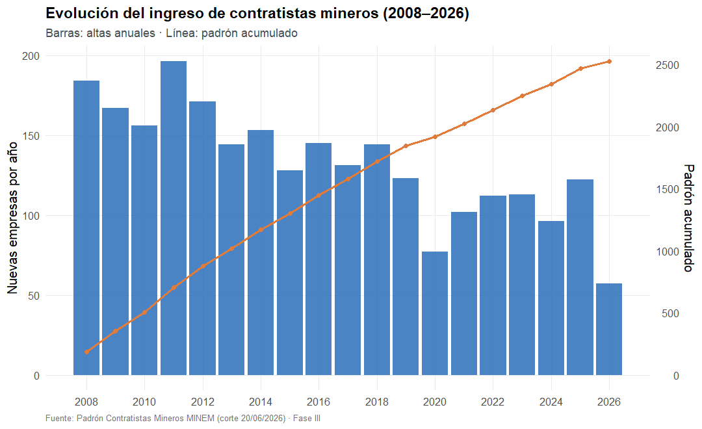
*Barras: altas anuales; línea: padrón acumulado. El sector creció de forma sostenida hasta ~2,521 empresas; el ritmo de altas se desaceleró desde 2013 y cayó en 2020 (77 altas, coincidiendo con la pandemia). Interpretación: un sector que **madura**, con menos ingresos anuales pero base amplia.*

**Figura 19 (G2) — Perfil de exposición operativa.**
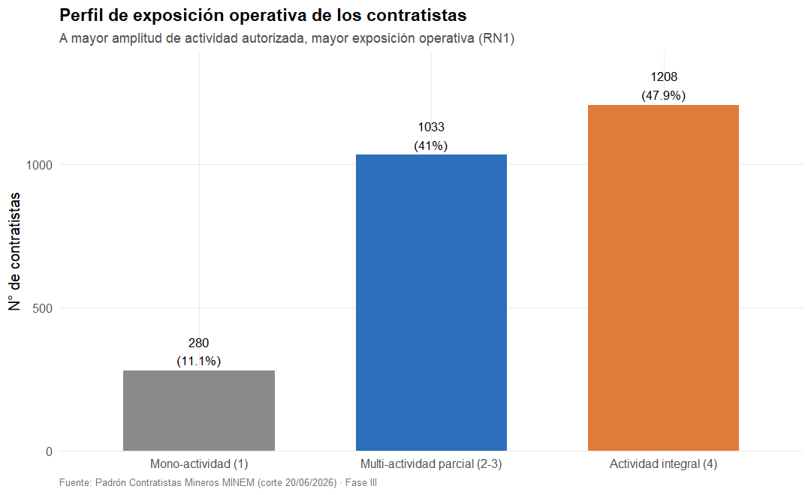
*El 47.9% del padrón es de actividad integral (máxima exposición): la carga potencial de fiscalización es alta y está concentrada en el perfil de mayor riesgo.*

**Figura 20 (G3) — Contactabilidad por macrozona.**
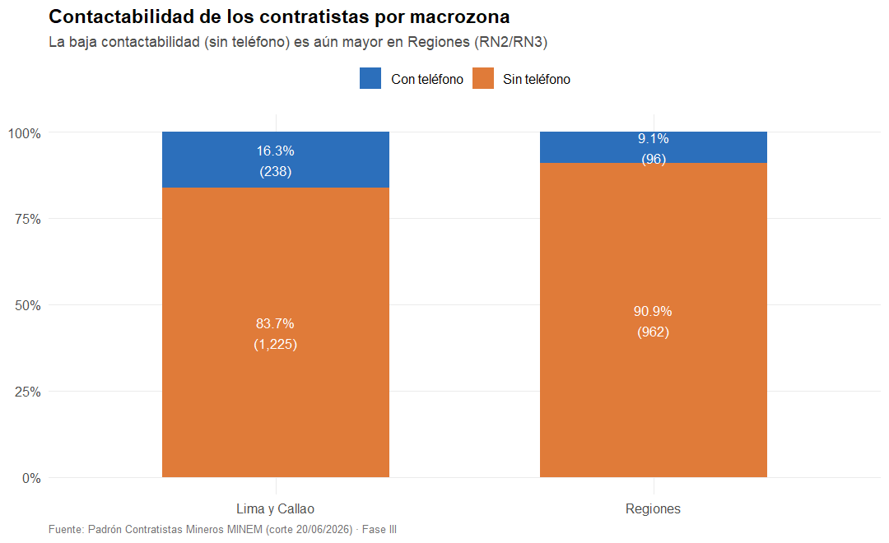
*Casi 9 de cada 10 contratistas no tienen teléfono; la brecha es mayor en Regiones (90.9%), justo donde la fiscalización presencial es más costosa.*

**Figura 21 (G4) — Concentración por departamento.**
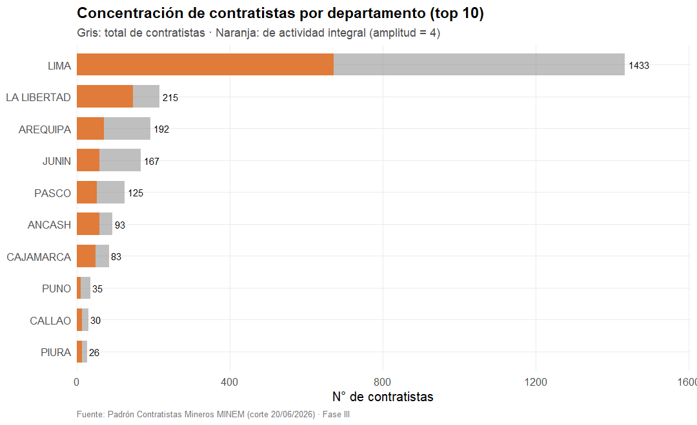
*Gris: total de contratistas; naranja: de actividad integral. Lima concentra el 56.8% del padrón; La Libertad, Arequipa y Junín le siguen. Orienta la ubicación de equipos de supervisión (REQ3).*

**Figura 22 (G5) — Segmentos de riesgo.**
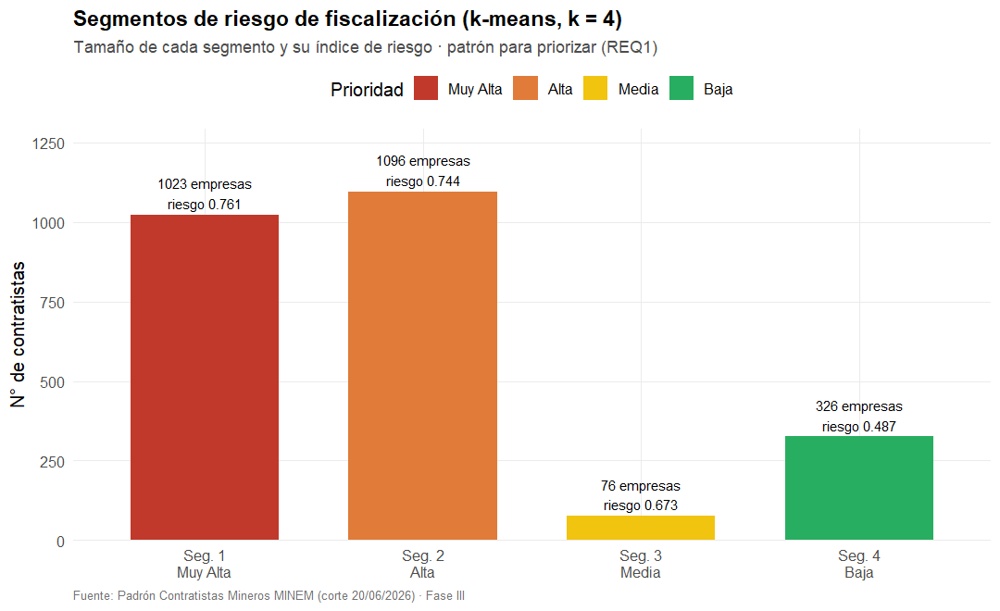
*Tamaño e índice de riesgo de los 4 segmentos. El 84% del padrón cae en prioridad Alta/Muy Alta: la fiscalización requiere un criterio de corte fino.*

**Figura 23 (G6) — Separación de los segmentos.**
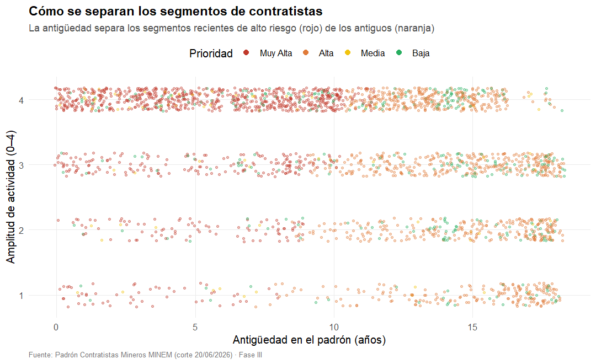
*Antigüedad vs. amplitud, coloreado por prioridad. Los segmentos se separan por antigüedad: las empresas recientes de alto alcance (rojo) son las de mayor prioridad. El riesgo se concentra en el ingreso reciente al sector.*

**Lectura integral de la evolución del negocio.** Los seis gráficos, leídos en conjunto, cuentan una historia coherente: el sector de contratistas mineros pasó de una fase de **expansión acelerada (2008–2013)** a una de **maduración (2014–2026)**, con menos altas anuales pero una base amplia y de alta exposición operativa. El principal desafío evolutivo ya no es el crecimiento, sino la **capacidad de supervisión**: el 86.8% de las empresas no son contactables, el riesgo se concentra en empresas recientes de amplio alcance, y la fuerte concentración geográfica (Lima 56.8%) exige focalizar recursos. Los segmentos generados por el clustering son, precisamente, el instrumento que habilita esa focalización.

## f) Frontend (interfaz Shiny)

### f.1) Objetivo y arquitectura de la aplicación

El requerimiento (f) exige desarrollar, tras el backend, un **frontend para manipular los datos con R**, que muestre al docente la funcionalidad de la propuesta. Se implementó una aplicación **Shiny** (`fase3/app_shiny/`) que se conecta **en vivo** a MongoDB y estructura su código en los tres archivos canónicos de Shiny:

- **`global.R`** — establece la conexión a MongoDB y define las funciones compartidas: lecturas (`leer_contratistas`, `leer_segmentos`, `leer_historial`), el catálogo de las 8 consultas (`ejecutar_consulta`) y las **operaciones de manipulación** (`actualizar_telefono`, `reasignar_segmento`, `eliminar_contratista`).
- **`ui.R`** — define la interfaz con `shinydashboard`: una barra lateral con 6 pestañas y el cuerpo con KPIs, tablas `DT`, gráficos y controles de filtrado/edición.
- **`server.R`** — implementa la **lógica reactiva**: las salidas se recalculan automáticamente cuando cambian los filtros o cuando una operación de escritura incrementa el disparador reactivo `refrescar()`.

El **modelo de reactividad** es clave: la fuente de datos se declara como `datos <- reactive({ refrescar(); leer_contratistas() })`, de modo que cualquier operación de escritura (que llama a `refrescar(refrescar()+1)`) provoca la **relectura automática** desde MongoDB y la actualización de toda la interfaz, garantizando coherencia sin gestión manual de eventos.

### f.2) Estructura funcional (6 pestañas)

| Pestaña | Funcionalidad | Figura sugerida |
|---|---|---|
| **Resumen general** | 4 KPIs (contratistas, ubicaciones, % sin teléfono, prioridad Muy Alta) + gráficos de evolución y perfil | Figura 24 |
| **Explorador de datos** | Tabla filtrable + historial embebido del contratista seleccionado + **panel de manipulación (CRUD)** | Figura 25 |
| **Consultas de negocio** | Ejecuta en vivo las 8 consultas, indicando qué RN/REQ satisface cada una | Figura 26 |
| **Segmentos de riesgo** | Perfil de los 4 segmentos + gráfico + listado de contratistas por segmento | Figura 27 |
| **Gráficos de evolución** | Selector de los gráficos del punto (e) con su interpretación | Figura 28 |
| **Acerca de** | Descripción del proyecto y del stack tecnológico | Figura 29 |

**[Insertar Figuras 24–29: Capturas de la aplicación Shiny, una por pestaña.** Se obtienen lanzando la app con `& "C:\Program Files\R\R-4.6.0\bin\Rscript.exe" fase3\lanzar_app.R` y abriendo `http://127.0.0.1:8123` en el navegador. Capturar: (24) el Resumen con los 4 KPIs y los dos gráficos; (25) el Explorador con un contratista seleccionado mostrando su historial y el panel de edición; (26) una consulta ejecutada; (27) la tabla de segmentos y su gráfico; (28) un gráfico de evolución; (29) la pestaña Acerca de.**]**

### f.3) Casos de uso principales

**Caso de uso CU-01 — Consultar y filtrar contratistas (READ).**
- *Actor:* analista de la DGM.
- *Flujo:* el actor selecciona filtros (departamento, prioridad, perfil) y/o escribe en el buscador; el sistema traduce los filtros a un subconjunto de datos y actualiza la tabla reactivamente.
- *Resultado:* subconjunto priorizado del padrón según criterios de negocio.

**Caso de uso CU-02 — Consultar el historial embebido (READ anidado).**
- *Flujo:* el actor selecciona una fila; el sistema recupera el documento por RUC y despliega su arreglo `historial_autorizaciones` como tabla (orden, resolución, fecha, representante, amplitud, vigencia).
- *Valor demostrativo:* evidencia el modelo documental —el historial se muestra **sin JOINs**, directamente del documento.

**Caso de uso CU-03 — Actualizar el teléfono de un contratista (UPDATE).**
- *Flujo:* el actor edita el teléfono y guarda; el sistema ejecuta un `update` con `$set` sobre MongoDB que además **recalcula** `indice_completitud_contacto`; el disparador reactivo relee y la interfaz refleja el cambio.
- *Requerimiento asociado:* REQ2 (campañas de actualización de contacto).

**Caso de uso CU-04 — Reasignar el segmento de un contratista (UPDATE).**
- *Flujo:* el actor elige un nuevo segmento y guarda; el sistema ejecuta `update` sobre `segmento_id`.

**Caso de uso CU-05 — Eliminar un contratista (DELETE).**
- *Flujo:* el actor solicita eliminar; el sistema muestra un **modal de confirmación**; al confirmar, ejecuta `remove` sobre MongoDB.
- *Salvaguarda:* la confirmación evita borrados accidentales; la operación es reversible re-ejecutando el ETL.

**[Insertar Figura 30: Diagrama de casos de uso (UML)** con el actor "Analista DGM" y los cinco casos CU-01 a CU-05; puede dibujarse en cualquier herramienta UML o usarse el diagrama Mermaid siguiente como base.**]**

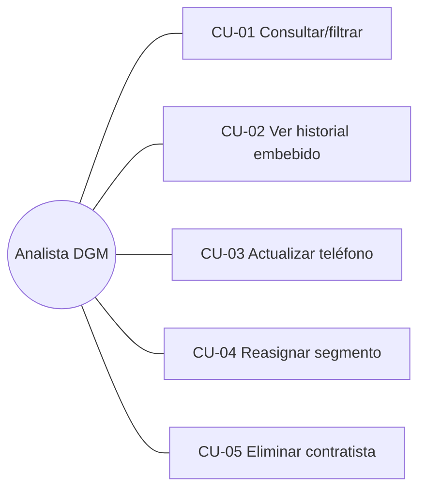

### f.4) Pruebas de la aplicación (casos de prueba ejecutados)

La verificación no se limitó al arranque: además de comprobar que la app responde **HTTP 200** en `http://127.0.0.1:8123` con la interfaz renderizada, se ejercitó **toda la lógica del servidor** fuera de Shiny (para aislar la lógica de datos de la capa de presentación), incluyendo el **ciclo CRUD completo** contra MongoDB:

| # | Caso de prueba | Entrada | Salida esperada | Resultado |
|---|---|---|---|---|
| 1 | Lectura con join (READ) | `leer_contratistas()` | 2,521 filas con `prioridad`, `segmento`, `macrozona` | ✅ |
| 2 | Historial embebido (READ) | `leer_historial("20100094135")` (EXSA) | 2 autorizaciones | ✅ |
| 3 | Las 8 consultas | `ejecutar_consulta(C1..C8)` | Cada una devuelve filas > 0 | ✅ (C4 = 485) |
| 4 | Actualizar teléfono (UPDATE) | `actualizar_telefono(RUC,"044-999888")` | Teléfono grabado + contactabilidad = TRUE | ✅ |
| 5 | Reasignar segmento (UPDATE) | `reasignar_segmento(RUC,3)` | `segmento_id = 3` | ✅ |
| 6 | Eliminar (DELETE) | `eliminar_contratista(RUC)` | Documento removido | ✅ |
| 7 | Integridad final | conteo tras restaurar | 2,521 documentos | ✅ |

Tras las pruebas de manipulación, la base se **reconstruyó a su estado canónico** re-ejecutando el ETL y el clustering, confirmando que la integridad se preserva (2,521 documentos, fechas como tipo Date, segmentos correctos). **[Insertar Figura 31: captura de consola del ciclo de pruebas CRUD** mostrando los `[OK]` de cada operación.**]**

**Lección técnica registrada.** Durante las pruebas se detectó que re-insertar un documento mediante `jsonlite::toJSON` puede perder el tipo `Date` del historial embebido; por ello el procedimiento de restauración recomendado es re-ejecutar `01_etl_seed.R` + `04_patrones_clustering.R`, y no una reinserción manual. Esta observación quedó documentada como advertencia operativa.

### f.5) Conclusión parcial del frontend

La aplicación Shiny integra las tres capas y demuestra la funcionalidad de extremo a extremo: **lee, analiza y escribe** sobre MongoDB en vivo. La operación CRUD real —no simulada— sobre la base es la evidencia de que la propuesta no es un prototipo estático sino un sistema operativo. El guion de demostración paso a paso para la sustentación se encuentra en `fase3/GUION_DEMOSTRACION_SHINY.md`.

## g) Conclusiones y recomendaciones

### g.1) Conclusiones generales

1. **Se cumplió el objetivo general.** El padrón administrativo plano del MINEM se transformó en un **modelo de datos documental (MongoDB) integrado con R**, capaz de segmentar a los 2,521 contratistas mediante Ciencia de Datos no supervisada y de priorizar, con criterio objetivo, la fiscalización minera.
2. **La arquitectura documental probó ser la decisión correcta** para este dominio. El embebido del historial permite consultar el perfil completo de una empresa sin JOINs, y el diseño previsor del campo `segmento_id` (inicialmente `null`) permitió incorporar el resultado del clustering **sin rediseñar la base** ni migrar el esquema —exactamente el beneficio que el benchmark anticipaba frente al modelo relacional—.
3. **El ETL reproducible garantizó la calidad e integridad de los datos.** La división en ocho subprocesos con pruebas de escritorio permitió detectar y corregir, durante la ejecución, cifras que en la documentación previa estaban equivocadas (Lima+Callao 58.0% y no 55.8%; 38 de 76 cambios de representante y no de 81; 216 ubicaciones únicas), reforzando la trazabilidad y la honestidad metodológica del trabajo.
4. **Las consultas de negocio conectaron el dato con la decisión.** Al vincular cada consulta a una regla de negocio y a un requerimiento de la DGM, se obtuvieron productos accionables; destaca la identificación nominal de **485 contratistas prioritarios**.
5. **El clustering generó patrones útiles y validados.** k-means (k=4) produjo cuatro segmentos de riesgo interpretables, cuya validez fue demostrada con **7 de 7 pruebas conformes**.
6. **Los gráficos evidenciaron la evolución del negocio** y su desafío central: un sector maduro cuyo verdadero reto es la **capacidad de supervisión** (86.8% no contactable; riesgo concentrado en el ingreso reciente).
7. **La interfaz Shiny cerró el ciclo Backend–Frontend**, permitiendo consultar y **manipular** los datos en vivo (CRUD real sobre MongoDB).

### g.2) Conclusiones por objetivo específico

| Objetivo específico | Estado | Evidencia |
|---|---|---|
| Diseñar ER (Chen) + colecciones MongoDB | Cumplido | Secciones II.d y II.e |
| Poblar con ETL reproducible | Cumplido | 2,521 contratistas cargados; 8 subprocesos con pruebas conformes |
| Integrar con R + consultas de negocio | Cumplido | Evidencia de conexión; 8 consultas con RN/REQ |
| Clustering + validación | Cumplido | 4 segmentos; 7/7 pruebas CUMPLEN |
| Gráficos ggplot2 | Cumplido | 6 figuras con interpretación de negocio |
| Interfaz Shiny para manipular datos | Cumplido | App con CRUD verificado (HTTP 200 + ciclo CRUD) |

### g.3) Recomendaciones

1. **Focalizar la fiscalización** en el Segmento 1 (Muy Alta prioridad, 1,023 empresas) y someter al Segmento 2 (antiguas, sin renovar ni contacto, 1,096 empresas) a un proceso de **verificación de vigencia** que depure el padrón de posibles inactivas.
2. **Lanzar una campaña de actualización de datos de contacto**, dado que el 86.8% del padrón no tiene teléfono, priorizando Regiones (90.9% sin contacto).
3. **Enriquecer el modelo con fuentes externas** (resultados de fiscalizaciones, sanciones, accidentes) que, a futuro, aporten la variable objetivo que hoy no existe y habiliten un **modelo supervisado** complementario al clustering.
4. **Incorporar geocodificación** de los domicilios para habilitar análisis geoespacial fino y optimización de rutas de inspección.
5. **Automatizar la actualización periódica** del padrón (re-ejecución programada del ETL y del clustering) para mantener los segmentos vigentes.
6. **Activar los índices de optimización analítica** documentados (por `ubicacion_id`, `segmento_id` y compuestos) si el volumen de consultas concurrentes crece.

### g.4) Trabajo futuro

- Extender la segmentación a un esquema **semi-supervisado** en cuanto se disponga de etiquetas de fiscalización.
- Publicar la aplicación en un servidor Shiny (Posit Connect o `shinyapps.io`) para acceso multiusuario, con autenticación y control de acceso a las operaciones de escritura.
- Incorporar un **registro de auditoría** de las operaciones CRUD realizadas desde la interfaz.

## h) Referencias

1. Ministerio de Energía y Minas (MINEM), Dirección General de Minería. *Padrón de Contratistas Mineros* [conjunto de datos]. Portal Nacional de Datos Abiertos del Perú, datosabiertos.gob.pe (corte al 20/06/2026).
2. MongoDB, Inc. (2024). *MongoDB Manual — Aggregation Pipeline, Data Modeling & Indexes*. https://www.mongodb.com/docs/
3. Ooms, J. (2024). *mongolite: Fast and Simple MongoDB Client for R* [paquete de R]. https://jeroen.r-universe.dev/mongolite
4. R Core Team. (2026). *R: A Language and Environment for Statistical Computing*. R Foundation for Statistical Computing, Viena, Austria.
5. Wickham, H. (2016). *ggplot2: Elegant Graphics for Data Analysis* (2.ª ed.). Springer-Verlag.
6. Wickham, H., François, R., Henry, L., & Müller, K. *dplyr: A Grammar of Data Manipulation* [paquete de R].
7. Chang, W., Cheng, J., Allaire, J. J., Sievert, C., et al. *shiny: Web Application Framework for R*. Posit Software. https://shiny.posit.co/
8. MacQueen, J. (1967). *Some methods for classification and analysis of multivariate observations*. Proc. 5th Berkeley Symposium on Mathematical Statistics and Probability.
9. Hartigan, J. A., & Wong, M. A. (1979). *Algorithm AS 136: A K-Means Clustering Algorithm*. Journal of the Royal Statistical Society, Series C (Applied Statistics), 28(1), 100–108.
10. Rousseeuw, P. J. (1987). *Silhouettes: a graphical aid to the interpretation and validation of cluster analysis*. Journal of Computational and Applied Mathematics, 20, 53–65.
11. Hubert, L., & Arabie, P. (1985). *Comparing partitions*. Journal of Classification, 2(1), 193–218. [Índice de Rand Ajustado]
12. Chen, P. P. (1976). *The Entity-Relationship Model — Toward a Unified View of Data*. ACM Transactions on Database Systems, 1(1), 9–36.
13. Sadalage, P. J., & Fowler, M. (2012). *NoSQL Distilled: A Brief Guide to the Emerging World of Polyglot Persistence*. Addison-Wesley.

## i) Anexos

### Anexo A — Evidencias y capturas de las pruebas

| Ref. | Contenido | Ubicación |
|---|---|---|
| A.1 | Evidencia de conexión R–MongoDB | `fase3/salidas/evidencia_conexion.txt` |
| A.2 | Evidencia de las 8 consultas de negocio | `fase3/salidas/evidencia_consultas.txt` |
| A.3 | Evidencia de clustering (elección de k, perfiles, poblado) | `fase3/salidas/evidencia_clustering.txt` |
| A.4 | Evidencia de las 7 pruebas de validación | `fase3/salidas/evidencia_validacion.txt` |
| A.5 | Resultados de consultas (CSV) y modelo de clustering (RDS) | `fase3/salidas/consulta_C*.csv`, `clustering_modelo.rds` |
| A.6 | Gráficos G1–G6 | `fase3/salidas/graficos/` |
| A.7 | Guion de demostración de la app | `fase3/GUION_DEMOSTRACION_SHINY.md` |

### Anexo B — Fragmentos de código relevantes

**B.1 · ETL — agregación por RUC y cálculo de atributos derivados del `Contratista`.** (Véase la implementación completa en la sección II.f.8 y el archivo `fase3/01_etl_seed.R`.)

**B.2 · Consulta de negocio C4 (agregación MongoDB desde R).**
```r
cc$aggregate('[
  {"$lookup":{"from":"ubicaciones","localField":"ubicacion_id",
     "foreignField":"id_ubicacion","as":"u"}},
  {"$unwind":"$u"},
  {"$match":{"amplitud_actividad_actual":4,
             "indice_completitud_contacto":false,"u.macrozona":"Regiones"}}]')
```

**B.3 · Clustering — estandarización, k-means y etiquetado *data-driven*.**
```r
X <- scale(datos[, vars])                       # z-score de las 6 variables
km_final <- kmeans(X, centers = 4, nstart = 50, iter.max = 100)

# Índice de riesgo (pondera las reglas de negocio)
indice_riesgo <- (amplitud/4)*0.40 + ((100-pct_con_contacto)/100)*0.25 +
                 (pct_regiones/100)*0.20 + pmin(recencia/max(recencia),1)*0.15

# Etiquetado derivado de los rasgos reales del clúster
etiquetar <- function(fila) {
  rasgos <- c()
  if (fila$renovaciones >= 1.5)       rasgos <- c(rasgos, "dinámico con renovaciones")
  if (fila$pct_con_contacto >= 80)    rasgos <- c(rasgos, "contactable")
  else if (fila$pct_con_contacto<=10) rasgos <- c(rasgos, "baja contactabilidad")
  if (fila$amplitud >= 3.4)           rasgos <- c(rasgos, "alta exposición")
  else if (fila$amplitud <= 2.8)      rasgos <- c(rasgos, "alcance moderado")
  # ... (recencia -> "sin renovar / antiguo" o "reciente")
}
```

**B.4 · Validación — Índice de Rand Ajustado (implementación propia).**
```r
ari <- function(a, b) {
  tab <- table(a, b); n <- sum(tab)
  comb2 <- function(x) x*(x-1)/2
  sij <- sum(comb2(tab)); si <- sum(comb2(rowSums(tab))); sj <- sum(comb2(colSums(tab)))
  esp <- si*sj/comb2(n); mx <- (si+sj)/2
  (sij - esp) / (mx - esp)
}
```

**B.5 · Manipulación de datos desde Shiny (UPDATE sobre MongoDB).**
```r
actualizar_telefono <- function(ruc, telefono) {
  tiene <- nchar(trimws(telefono)) > 0
  col_contratistas()$update(
    query  = sprintf('{"ruc": "%s"}', ruc),
    update = sprintf('{"$set": {"telefono_referencia": %s,
                      "indice_completitud_contacto": %s}}',
                     if (tiene) sprintf('"%s"', telefono) else "null",
                     tolower(as.character(tiene))))
}
```

**B.6 · Servidor Shiny — reactividad y disparo de la relectura tras una escritura.**
```r
refrescar <- reactiveVal(0)
datos <- reactive({ refrescar(); leer_contratistas() })   # relee al cambiar el disparador
observeEvent(input$btn_guardar, {                          # al guardar cambios
  actualizar_telefono(ruc_sel(), input$edit_telefono)
  reasignar_segmento(ruc_sel(), input$edit_segmento)
  refrescar(refrescar() + 1)                               # dispara la relectura
  showNotification("Cambios guardados en MongoDB.", type = "message")
})
```

*(El código fuente completo se encuentra en `fase3/`: `01_etl_seed.R`, `02_conexion_evidencias.R`, `03_consultas_negocio.R`, `04_patrones_clustering.R`, `05_validacion_patrones.R`, `06_graficos_ggplot2.R`, y `app_shiny/{global,ui,server}.R`.)*

---

*Fin del informe.*


